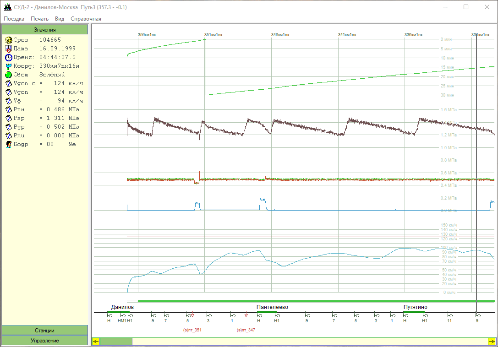

# Railway Black Box Data Viewer

[:point_left: Back to tthe main page](../../README.md)

**Development period:** 1999.

**Practical application:** Never[^1].

**Project purpose:** Just to learn how to deal with graphical data reppresentation, print functionality, chm context help manipulation and desktop application infrastructure.

**Implementation technologies:** MFC SDI Application, ATL COM data management level, half division based data search, draw images in memory, copy data to video memory, CHM Help.

**Developer tools:** Microsoft Developer Studio v.6 for C++

[^1]: The initial project was in use but I can't show it here
