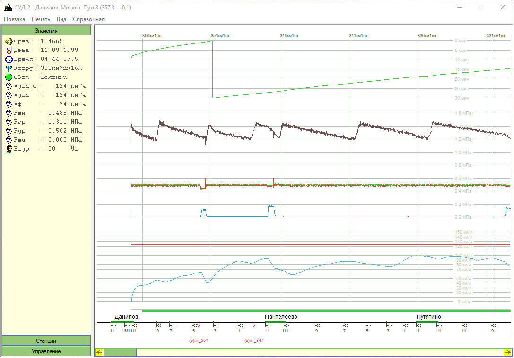

# Railway Black Box Data Viewer

[Back to the main page](../../README.md)

**Development period:** 1999.

**Practical application:** Never[^1].

**Project purpose:** To learn how to deal with graphical data representation, print functionality, [CHM](https://learn.microsoft.com/en-us/dynamicsax-2012/appuser-itpro/deprecated-chm-help-files) context help manipulation, and desktop application infrastructure.

**Implementation technologies:** MFC SDI Application, ATL COM data management level, a half-division based data search, drawing images in memory, copying data to video memory, [CHM Help](https://learn.microsoft.com/en-us/dynamicsax-2012/appuser-itpro/deprecated-chm-help-files).

**Developer tools:** Microsoft Developer Studio v.6 for C++

The black box recorded 46 parameters at two readings per second: speed, braking signals from multiple subsystems, pneumatic pressures, track signals, and the driver's electrical skin impedance — measured via a special wristband to detect fatigue or stress. Working with this data revealed how the railway signaling system actually works: the rails carry a low-frequency current, and the first wheel axle to enter a track segment short-circuits it, marking it occupied — no radio, no electronics, just physics and cascading signal lights across fragments 2–5 km long. The system also monitors brake tests before downhill sections and compares actual deceleration against the expected curve for the train's weight, a safety check is mandatory. It was a huge collision in the past, when a driver skipped the procedure.

  
Figure 1. Trip log navigation.

[^1]: The initial project was in use, but I don't have its images to show.
