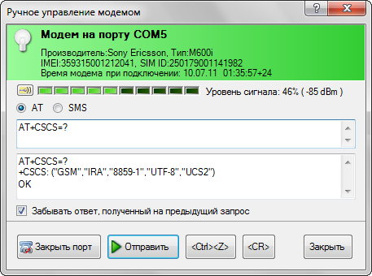
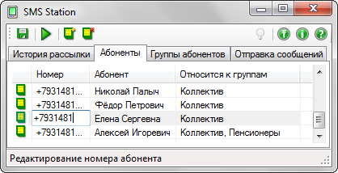
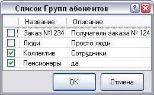
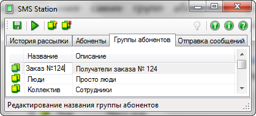
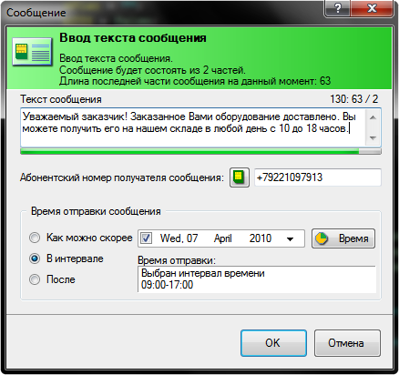
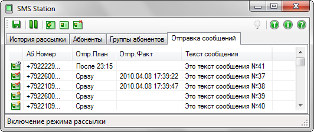
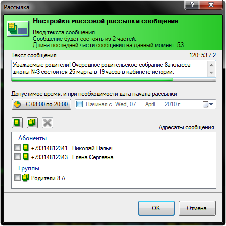
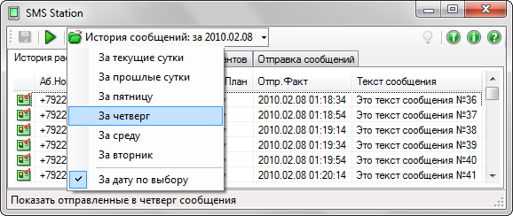

# SMS Station

[Back to the main page](../../README.md)

**Development period:** 2009-2010.

**Practical application:** Commercial[^1].

#### Project purpose. There are two of them:
- To create a simple, intuitively understandable desktop SMS-sending manager inspired by the Outlook Express application;
- To create my first .Net / C# application. I read a big book about .Net and C# in those days.

#### The initial requirements of the project were:
- Application must connect to the user terminal (GSM modem or cell phone);
- Application must be able to send particular SMS, as well as SMS corteges, encoded in PDU form;
- Application must be able to send particular SMS, as well as message broadcasting;
- Application must have a user-friendly interactive SMS editor;
- Application must provide a possibility to create a recipient library;
- Application must provide a possibility to aggregate recipients to groups;
- Application must provide a clear monitoring of the current state and  sending log;
- The application must send messages according to the configured schedule.

**Implementation technologies:** .Net, C#, Windows Forms.

**Developer tools:** Microsoft Visual Studio.

The first thing a User must do is to configure and check the connection to the user terminal (cell phone or GSM modem)

 
Fig. 1. Check terminal connection and functionality

To deal with the broadcasting plan, the user must register recipients in the program.

 
Fig. 2. Edit the Recipients list

It is helpful to aggregate recipients into groups to simplify the broadcasting of common information.

 
Fig. 3. Check Recipients Groups

The recipient groups must be preliminary created.

 
Fig. 4. Edit the Recipients Groups

Now, we can edit messages to be sent. In the Message editor, the User can see the total message length,
the amount of partial SMS in the SMS cortege and the amount of letters to fill the current SMS of the cortege.

 
Fig. 5. The Message Editor

After that, the User can see and modify the Message sending plan.

 
Fig. 6. The Message sending plan

If the user needs to create a broadcast, he can use the Message broadcast editor.
The messages planned to broadcast are waiting in the message-sending plan
together with individual messages.

 
Fig. 7. The Message Broadcast Editor

The history of message sending can be seen in the Message log.

 
Fig. 8. The Message log

[^1]: A couple of dozens of licenses were sold. After that, I found an attractive job and closed this project.
