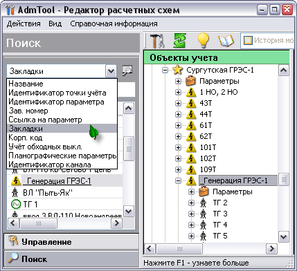
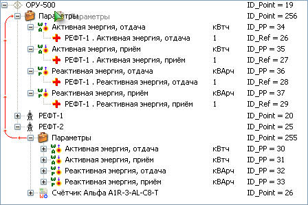

# Electric power billing project

[Back to the main page](../../README.md)

**Development period:** 2001-2007.

**Practical application:** In Production[^1].

**Project purpose:** Electric power meters can exchange data by different hardware and software APIs. 
The server application collects data from the power meters and puts data into the SQL Server database. 
SQL Server Agent executes jobs that calculate result data from the primary data with measurement transformer 
factor and power grid topology history (bypass switches commutation history, measurement transformers replacement history e, etc.)

**Project description:** 
My application allows proper data storage corresponding to the place on the power grid where measures were collected. In other words, my application is the editor for creating the power network model in the database to store data in the right way to process data by jobs and retrieve data for the reporting. My application contains a T-SQL script that can actualize any version of the database to the actual version with all necessary data conversions, COM object which provides API and UI controls for the data structure editor, and for the different applications that work with data: viewers, report generators, etc., and desktop editor for the tree-shaped representation of the electric energy system.

**My part in this project:** Requirements preparation, integration with existing architecture, development of the architecture, implementing, testing, deployment to the first customer, technical support, collecting and implementing additional customer requirements after they got some user experience.

**Implementation technologies:** MFC SDI Application, ATL COM object for data management level, OLE DB, Windows API, [CHM Help](https://learn.microsoft.com/en-us/dynamicsax-2012/appuser-itpro/deprecated-chm-help-files), T-SQL, and some domain knowledge.

Fig. 1 The manual binding of the Power meter to the scheme[^2]. 

Fig. 2 The measurement complex explanation. 

Fig. 3 Search scheme element by its name. 

Fig. 4 Search scheme element previously added to Favorites. 

Fig. 5 Sum calculating scheme building procedure. 

Fig. 6 Bypass switch binding procedure. 

Fig. 7 Bypass switch binding explanation. 

Fig. 8 Bypass switch history editor (we use history to calculate the energy for consumers working through the bypass switch). 

Fig. 9 Current Measurement Transformer Replacement History. 

[^1]: The first deployment was in TumenEnergo, about 26 thousand metering points. Now, it is a great, successful project.
[^2]: All pictures were taken from the help subsystem and contained no sensitive data.
