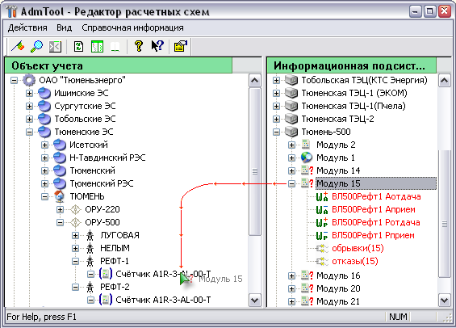
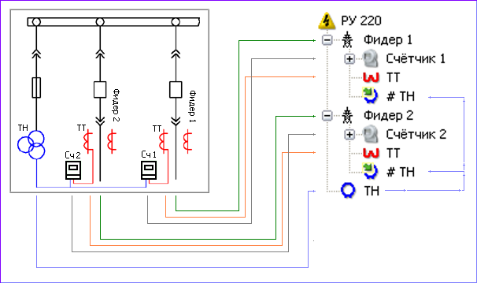
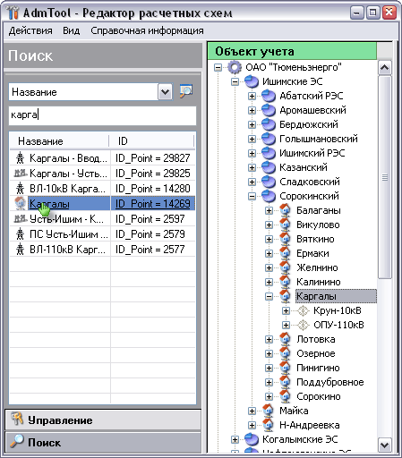
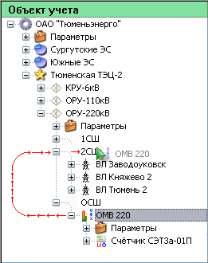
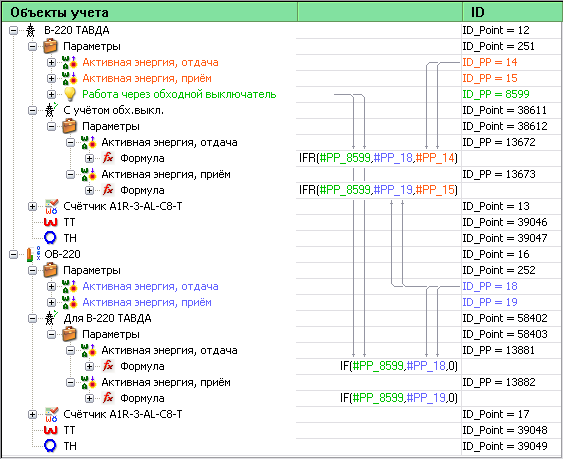
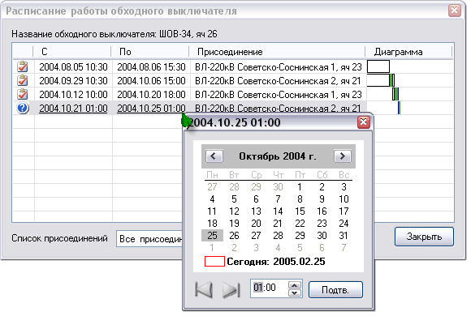
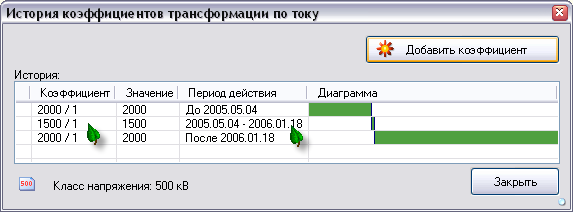

# Electric power billing project

[:point_left: Back to tthe main page](../../README.md)

**Development period:** 2001-2007.

**Practical application:** In Production[^1].

**Project purpose:** Electric power meters can provide data exchange by different hardware and software APIs. 
The server application collects data from the power meters and puts data into the SQL Server database. 
SQL Server Agent executes jobs which calculate result data from the primary data with measurement transformer 
factor and power grid topology history (bypass switches commutation history, measurement transformers replacement history e t.c.).

**Project description:** 
My application provides the possibility of proper data storing corresponding to the place on the power grid where measures were collected from. In other terms, my application is the editor for the creation of the power network model in the database to store data in the right way to process data by jobs and to retrieve data for the reporting. My application contains a T-SQL script that can actualize any version of the database to the actual version with all necessary data conversions, COM object which provides API and UI controls for the data structure editor, and for the different applications which work with data: viewers, report generators, etc, and desktop editor for the tree-shaped representation of the electric energy system.

**Implementation technologies:** MFC SDI Application, ATL COM object for data management level, OLE DB, CHM Help, T-SQL, and some subject area knowledge.

Fig. 1 The procedure of manual binding of the Power meter to the scheme.

Fig. 2 Themeasurement complex explanation.

Fig. 3 Search scheme element by its name.

Fig. 4 Search scheme element previously added to Favorites.

Fig. 5 Summa calculating scheme building procedure.

Fig. 6 Bypass switch binding procedure.

Fig. 7 Bypass switch binding explanation.

Fig. 8 Bypass switch history editor (we use history to calculate the energy for consumers working through bypass switch).

Fig. 9 Current Measurement Transformer Replacement History.

[^1]: First deployment was in TumenEnergo, about 26 thousands of metering points. Now it is great successful project.
