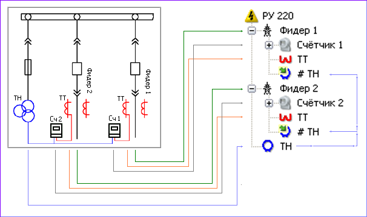
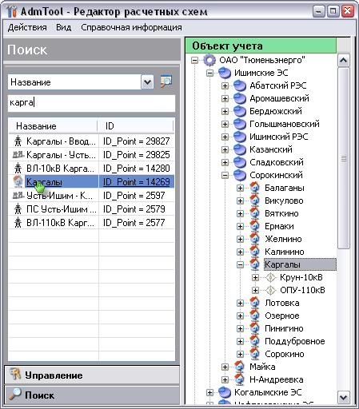
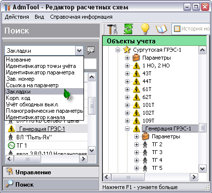
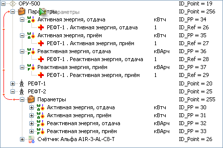
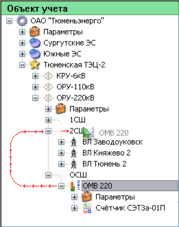
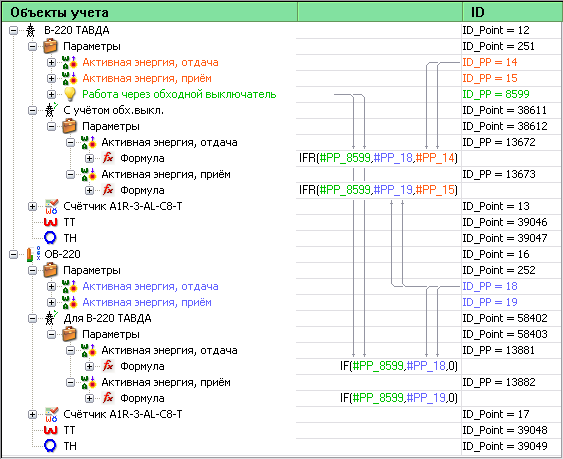
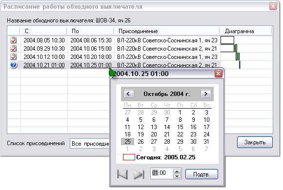
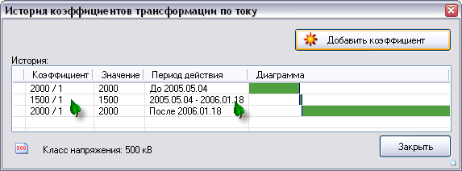

# Electric Energy Billing Project

[Back to the main page](../../README.md)

**Development period:** 2001–2007.

## Starting from the physics

My university degree is in Electric Energy System Automated Control. Engineering education — at least in that discipline — trains you to see software models as representations of physical reality, not as abstractions that happen to be convenient. A substation is not a node in a graph. A meter reading is not a data point. The relationship between them is governed by hardware with calibrated properties, and if your model doesn't encode those properties, your calculations are wrong — not in the way that causes crashes, but in the way that produces confident-looking incorrect numbers.

Before I wrote a line of code for this project, I already understood what a measurement transformer does, why a bypass switch exists, and what happens to energy accounting when either one changes. That grounding was the prerequisite for the data model.

## What was there before

The predecessor system was a flat list: measurement points, raw values from the meters, some chart plotting, some CSV export for reports. Technically functional. Physically meaningless.

The point is that a 500 kV transmission line does not connect directly to a 100 V / 5 A meter. Between them sits a measurement transformer — a piece of hardware that steps down both voltage and current by specific, calibrated ratios. Every raw meter reading is multiplied by those transformer factors to recover the actual energy value on the transmission side. Without that step, the numbers are not energy measurements. They are instrument readings.

The old system stored instrument readings and called them data.

There was also no concept of bypass switches. When a bypass switch is engaged, current takes an alternate path through the grid — and the measurements that were flowing through one point now flow through another. If you want to know how much energy a factory consumed last month, you need to know which meters were measuring it at every moment of that month. The switch commutation history is part of the record.

Same with transformer replacements. If the 200:5 A transformer on a line is swapped for a 250:5 A unit, every historical reading from that point needs to be recomputed with the new factor for dates after the swap, and the old factor for dates before. The replacement history is not metadata. It is the calculation.

None of this was modeled. The system could not produce correct figures, because it had no representation of the physical reality that generated the figures.

## Building the model

The core of what I built was a tree-structured representation of the power network — substations, busbars, lines, measurement complexes, meters — with the transformer factors, bypass configurations, and replacement histories attached at the right nodes.

SQL Server Agent jobs walk this structure to transform raw meter readings into real energy values, apply the current transformer factor for each time period, re-route measurements through bypass paths when the switch history says so, and aggregate the results upward: this substation's load, this power plant's output, this factory's consumption.

The editor I built lets engineers navigate and modify this model — bind a meter to a grid position, record a transformer replacement, log a bypass switch event, define a sum-calculation scheme across multiple points. At 26,000 metering points in the first major deployment, navigation and correctness matter equally: the UI has to make it tractable to find any meter in a large regional network, and the model has to ensure that every recalculation propagates correctly when something changes.

## What was built

**My contributions:**

- Requirements preparation and domain analysis
- Data model architecture (tree-structured grid representation with full measurement history)
- Integration with existing system architecture
- Implementation, testing, and deployment to first customer
- T-SQL versioned migration script (actualize any database version to current, with full data conversion)
- ATL COM object providing API and UI controls for the data management layer
- Desktop editor for power network model (MFC SDI application)
- Technical support and iterative requirements after customer field experience

**Implementation technologies:** MFC SDI Application, ATL COM object, OLE DB, Windows API, CHM Help, T-SQL, SQL Server Agent

## Some illustrations from the project

**Fig. 1** Manual binding of a power meter to the network scheme.

**Fig. 2** Measurement point structure — the physical chain from high-voltage line to meter.

**Fig. 3** Searching a scheme element by name.

**Fig. 4** Searching a previously bookmarked scheme element.

**Fig. 5** Sum calculation scheme — aggregating energy across multiple measurement points.

**Fig. 6** Bypass switch binding procedure.

**Fig. 7** Bypass switch topology — why the commutation history is part of the energy record.

**Fig. 8** Bypass switch history editor — used to retroactively route measurements through the correct path.

**Fig. 9** Measurement transformer replacement history — factor changes that affect all subsequent calculations.

