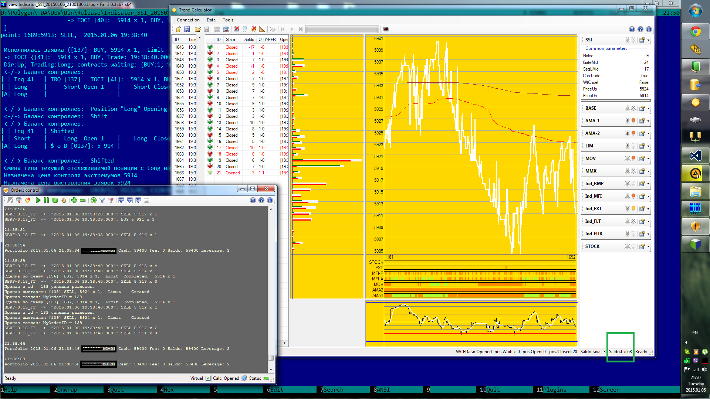
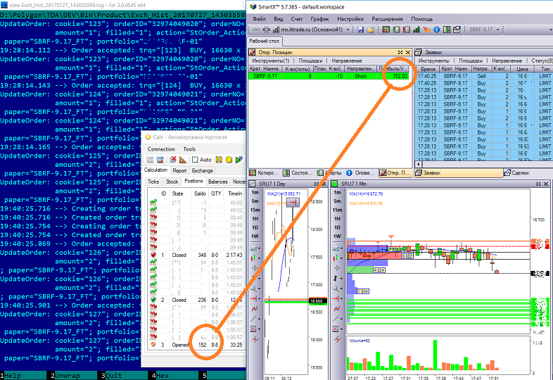
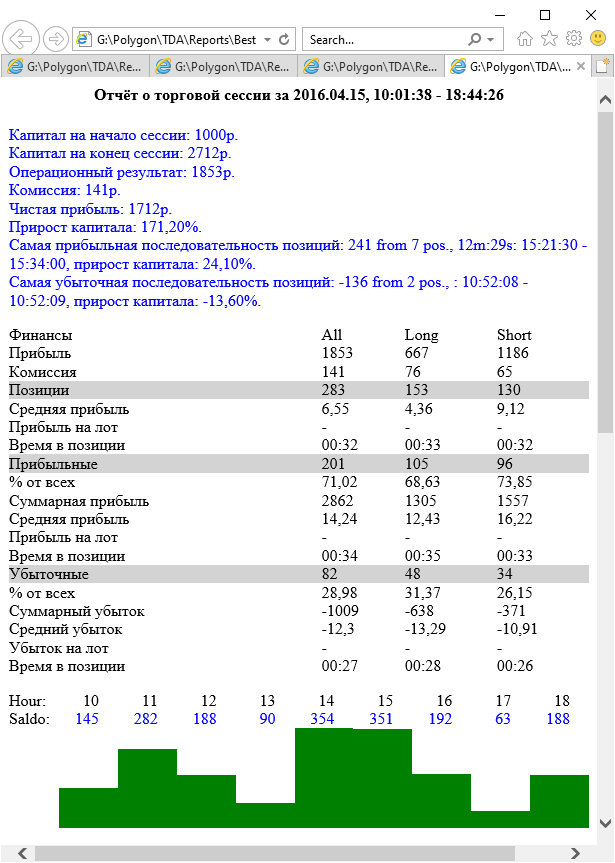

# Automated Trading system

[:point_left: Back to the main page](../../README.md)

**Development period:** 2011.10-2019.11.

**Practical application:** Research and development[^1].

**Project purpose:** Automated trading research. Testing and tuning of the trading approaches.

**Project description:** 
The final project contains these components:
- The SQL Server database with trading history data in ticks;
- The Import tool for filling the database with trading history data from .qsh files;
- The Exchange Emulator;
- The Exchange Connector (connector to SmartCOM connector) which can transparently restore the context after the broken connection was restored;
- The Trading Engine wich can be connected to the Exchange Connector or to the Exchange Emulator;
- The set of different Indicators which can be connected to the Trading Engine by configuration;
- The schedule module whith swiching the indicator configurations on the schedule base;
- The Desktop Application with the UI that allow to monitor and configure the trading process;
- The quick calculations tool that allows to run trade sessions quickly without visualization simultaniously for different configurations on the historical data to make experiments with alghorytms and their configurations;
- The reporting module;
- The New UI module on WPF, was started to be  implemented but it was never completed;
- A lot of small tools for different experiments.

**My part in this project:** Requirements collecting, development of the architecture, software development, experiments, analysis, discussions, etc.

**Implementation technologies:** .Net Framework, Windows Forms, SmartCOM COM Connector, QScalp qsh format import library.

**Fig.1 The Trading Experiment**

**Fig.2 The Trading Testing** on the live Exchange connection. Comparing the positions representation with representation in the official thading tool.

**Fig.3 The Trading Session Report** with common results information and hourly earn diagramm.

[^1]: It was a great journey. My partner is experienced in trading an I is experienced in software development.  During eight years we experimented with different trading alghorytms and got some success, great exciting and a lot of experience. After that our partnership was completed because of personal reasons but we achieved a great knowledges and awareness in our ability to do such things.
