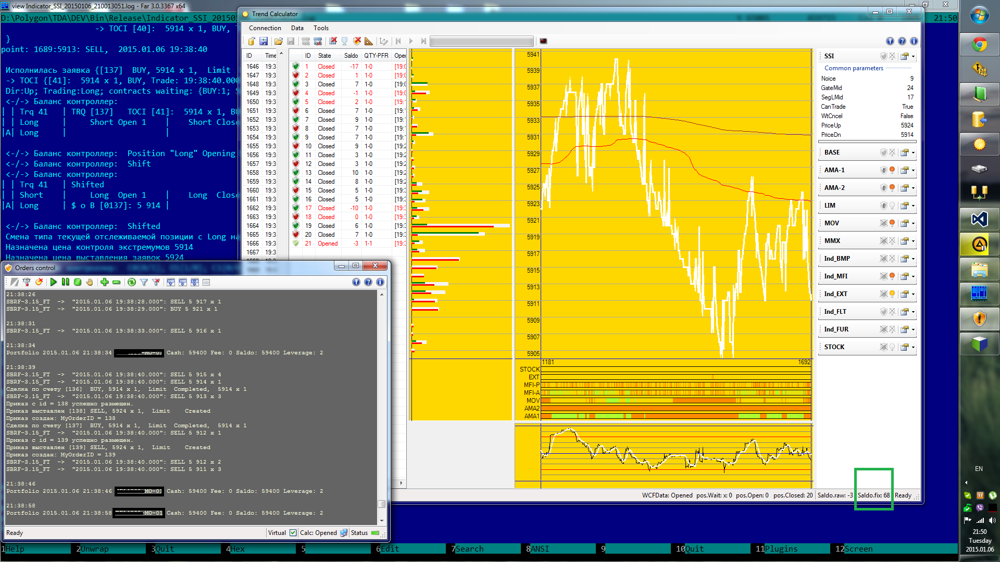
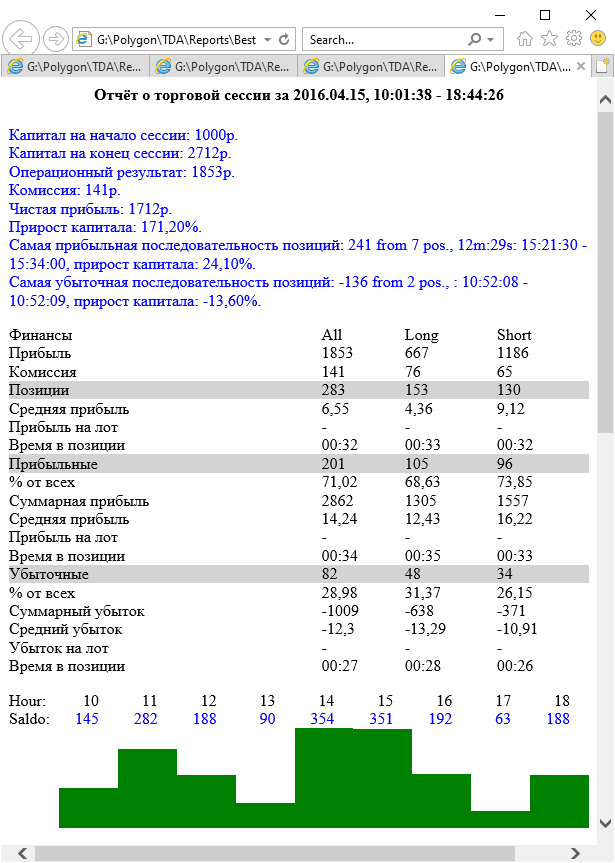

# Automated Trading System

[Back to the main page](../../README.md)

**Development period:** 2017.10-2022.01.

**Practical application:** Research and development[^1].

**Project purpose:** Automated trading research. Testing and tuning of the trading approaches.

## Project description

The final project contains these components:

- The SQL Server database with trading history data in ticks;
- The Import tool for filling the database with trading history data from .qsh files;
- The Exchange Emulator;
- The Exchange Connector (connector to SmartCOM connector), which can transparently restore the context after the broken connection is restored;
- The Trading Engine, which can be connected to the Exchange Connector or the Exchange Emulator;
- The set of different indicators that can be connected to the Trading Engine by configuration;
- The scheduling module with switching the indicator configurations on a schedule basis;
- The Desktop Application with the UI that allows for monitoring and configuring the trading process;
- The quick calculations tool that is used to emulate trade sessions quickly without visualization, simultaneously for different configurations on the historical data to do experiments with algorithms and their configurations;
- The reporting module;
- The New UI module on WPF was started to be  implemented, but it was never completed;
- A lot of small tools for different experiments.

**My part in this project.** It was generally only two people involved: me as developer and my project partner as domain expert. Sometimes, a few connected people share a research job. My duties on the project were following:

- Requirement collection and analysis.
- Making architectural decisions.
- Implementing all main modules.
- Delegating some research job to another developer.
- Execute the system on the tenant server
- Maintenance production, evolution of the project

**Implementation technologies:** .NET Framework, Windows Forms, SmartCOM COM Connector, QScalp qsh format import library.

## Some illustrations from the project

**Fig.1 The Trading Experiment** on the live Exchange connection with virtual order processing. Displays the connector log

**Fig.2 The Trading Testing** on the live Exchange connection with real order processing. Comparing the representation of positions with the representation in the official trading tool.

**Fig.3 The Trading Session Report** with common results information and hourly earnings diagram.

**Fig.4 The Trading Session WPF UI**, which can show price graphs, clusters, and trends.

The copy of the video on [YouTube](https://www.youtube.com/watch?v=7lW273PTbGI).

[^1]: It was an incredible journey. My partner is experienced in trading, and I am experienced in software development. During the eight years, we experimented with different trading algorithms and got some success, great excitement, and a lot of experience. After that, our partnership ended for personal reasons, but we gained valuable insight into our ability to do such things.
