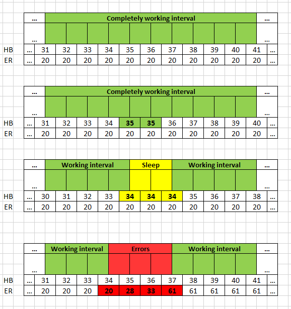
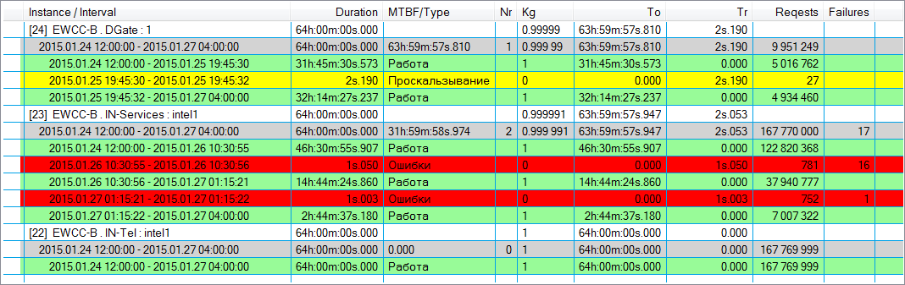
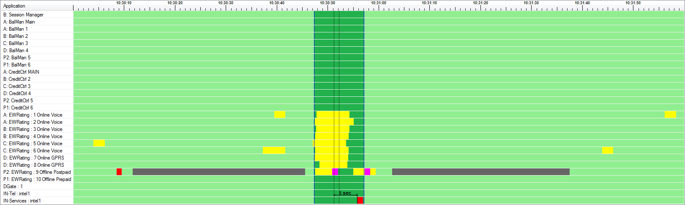
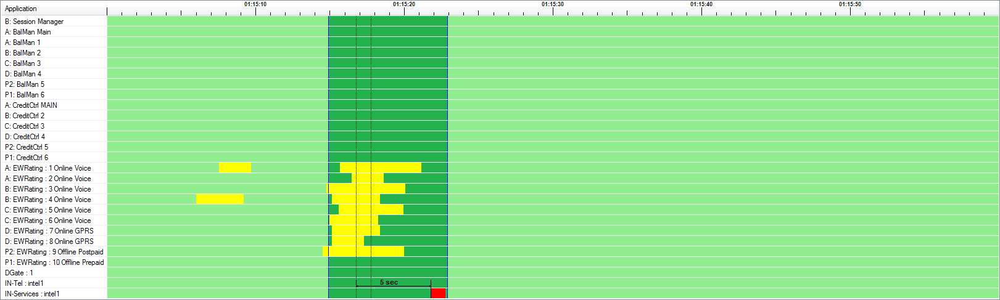
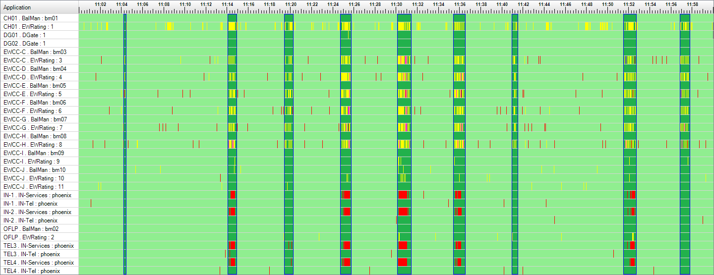
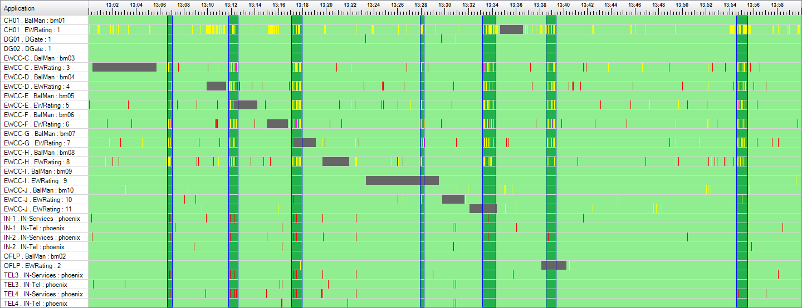
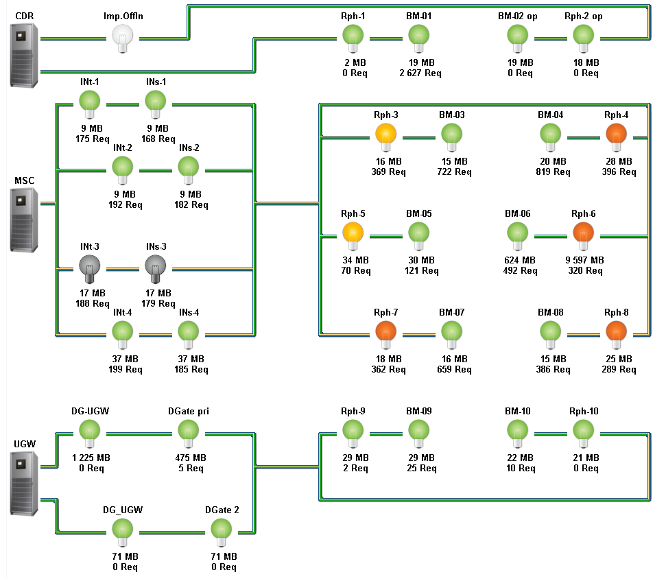

# Reliability Analysis System

[:point_left: Back to tthe main page](../../README.md)

**Development period:** 2012.08-2017.05.

**Practical application:** In use in the production and in the CI cycle[^1].

**Project purpose:** The program complex reliability parameters and status analisys.

**Project description:** 
Initially we had one point of interrest: to measure availability factor of our software (the cell operator billing system) to be sure we can provide requirements for our customer (cell operator). They asked us to provide availability factor = 0.99995.
We have research methodology for measuring the time we can qualify as "worknig interval" and time we can call "not working interval"
The relation between the amout working duration and whole observation time is the availability factor we  need. 

**My part in this project:** 
- Theory research;
- RND (different experiments with collecting and analisys of the measures);
- The project architecture development;
- Creating of the initial version of testing software deployment subsystem;
- Creating the first several traffic modeles
- Creating the cell commutator emulator (with traffic generator schedulers and responce time and content analysers)
- Creating the state reporting component for the software components which must be measured;
- Creating the scanner component to collect data from the observed applications and scanner itself to collect the data to the SQL Server;
- Creating the first data analisys implementation;
- Creating the desktop software tool to view the reliability information in the different representation forms;
- Creating the desktop tool to control the work ot the reliability data collecting system remotely over the cluster (start and stop, choose the version of measuring software to be working on the node, configure data collecting on every mode);
- Sharing the work between several members of our team.

**Evolving stages of the project we implemented with wonderfull people I work with:** 
- Configurable delpoyment over claster subsystem;
- Many different traffic modeles for the load testing subsystem;
- Suspendable measures queue to survive the database server unavailability periods without keeping all measures in the operating memory (sometimes it was extremelly necessary); 
- Several additional measuring subsystems like SQLServer availability observation component and MongoDB Health minitoring component which cennot provide data we need to observ them naturally;
- Reliability Interval Marking on DB subsystem which is running on SQL Server by the SQL Server Agent and makes ready to use intervals of work for the every observing software instance;
- Tree-like table interval representation for the UI and for the reports;
- The Reliability diagramm - scalable graphical representation of the reliability intervals on the one time scale for the visusal manual analisys of the emergency situations evolve process;
- The Dangerous situations detector on the database side - the module which founds the periods when applications are overloaded simultaniously (so colled "Pillars") to show them on the Reliability diagramms and in the report tables;
- The emailing subsystem which hourly sends reports with reliability diagramms and dangerous situations tables;
- The Online Diagramm - the visualisation of the real time state of the observing applications.

**Implementation technologies:** .Net Framework, Windows Forms, Performance Counters, MS SQL Server, Windows Servicess, Application Domains, Desktop Applications.

**Fig.1 The Theory - the meanings of the Reliability Intervals**

**Fig.2 The Reliability Intervals Table**

**Fig.3 The Reliability Intervals Diagramm - Emergency investigation view**

**Fig.4 The Reliability Intervals Diagramm - Emergency investigation view**

**Fig.5 The Reliability Intervals Diagramm - Emergency Intervals**
This diagram highlights emergency situations. Actually, red intervals are critical errors. Yellow intervals are emergency situations. Dark green intervals are emergency time intervals. If we receive many fat green intervals in means the system does not supply the load. The same image appears in the UI and in the automated hourly report

**Fig.6 The Reliability Intervals Diagramm - That's how the software update looks like**

**Fig.7 The Reliability Online Monitor shows the actual state of every configured application**

[^1]: The project is in use in the cell operator billing system to preditc emergency cituations and to analyse the evolving of damages and failures. Also the project is in use in the billing system life cycle to measure and to compare the reliability parameters as MTBF and Availability factor or every release during load testing.
