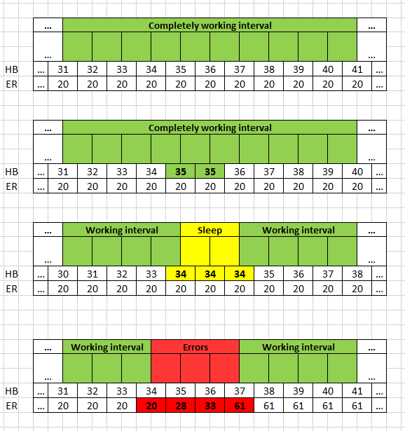
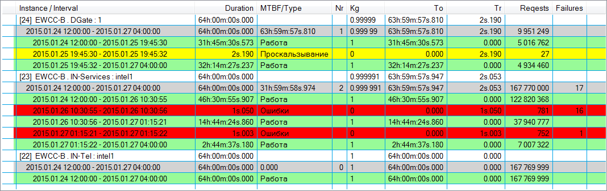
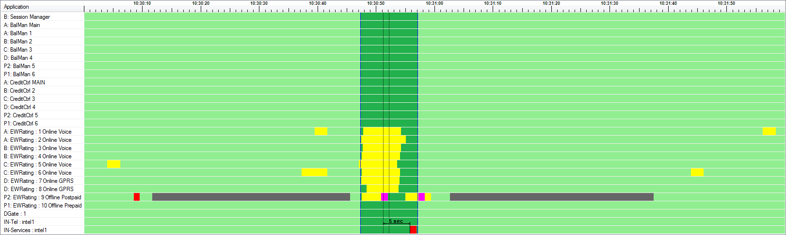
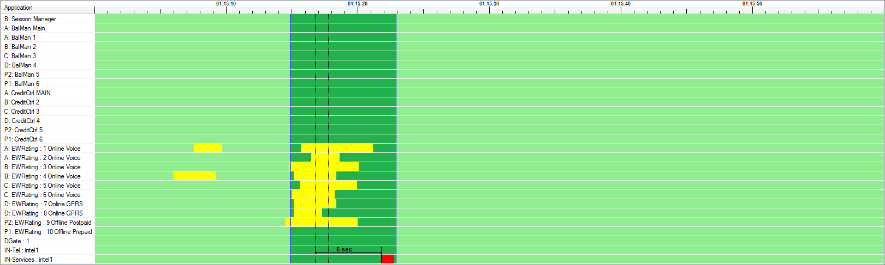
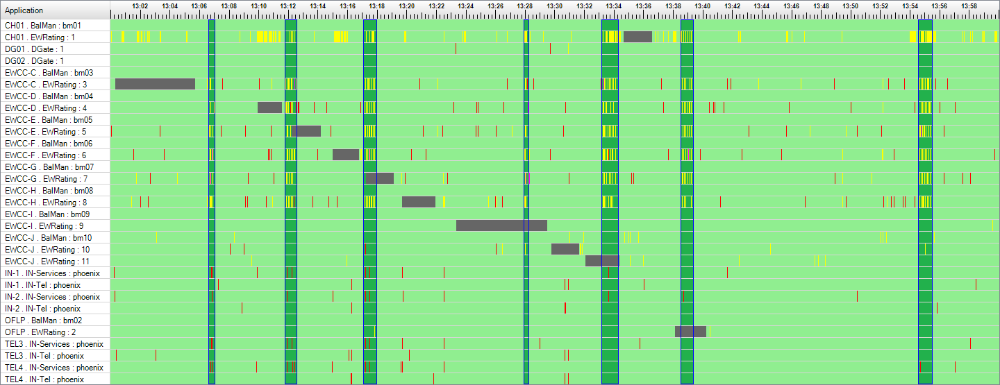
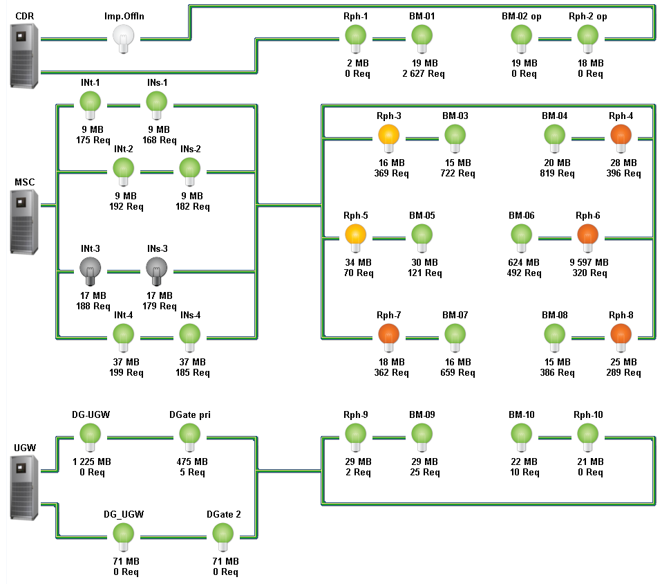

# Reliability Analysis System

[Back to the main page](../../README.md)

**Development period:** August 2012 - May 2017.

## The problem

A cell operator billing system had to meet a regulatory requirement: availability factor ≥ 0.99995. This was not an ambition — it was a legal certification threshold. Below it, the system could not be officially operated in that country.

The economic reality behind the number was concrete. When a billing system is unavailable and a charging request times out, the subscriber receives the service for free. The operator continues paying — for electricity, for other network charges, for infrastructure — while collecting nothing. Every minute of downtime is a leak. The certification requirement existed to put a legal floor under that leak.

We were asked: *can we actually measure this?*

## The research gap

The answer, initially, was that the industry didn't know how to. Every reference I found said the same thing: *our software is tested.* There were reliability figures for hardware — circuit boards, network equipment — but for the software layer, there was no methodology. Testing was treated as a substitute for measurement.

As a software developer I knew exactly how hollow that was. Testing can miss requirements gaps, deployment edge cases, interaction effects, memory behavior under load. Saying "it's tested" tells you nothing about what the system does in production over time.

So I went outside the software literature entirely and into reliability theory — the discipline that measures availability of everything from industrial equipment to service operations. I found academic papers from an economics university, took the foundational model, and applied it to software: define working intervals and non-working intervals, sum them over observation time, compute the ratio. The concept transfers cleanly. The difficulty is in what counts as "not working."

## The hard edge case: when silence isn't failure

Once the methodology was validated and all services were assembled on the test cluster for load testing, we encountered something none of us had seen before. An application would go silent — no metrics published. Then, after some period, it would resume as if nothing had happened.

Was the application down? Not exactly. It was the .NET garbage collector in "stop the world" mode.

In .NET Framework 3 — before server GC mode existed — collecting 100 GB of RAM could pause all application threads for up to 30 seconds. The service timeout was 5 seconds. From the outside, the application looked closed. But it wasn't — it was frozen, and it would recover.

I introduced a new interval type for this state: *apparent stop, continued operation*. This distinction mattered for the availability calculation, but it also became actionable for the developers. They could now see exactly when and how long these freezes were occurring in production. The development team then optimized memory allocation patterns specifically to reduce GC pressure — and brought those pause times down to within the service timeout. The observability created the feedback loop that drove the optimization.

## What the system revealed: the Pillars

As the system matured, we built a "dangerous situations detector" — a module that finds time periods when multiple observed applications are simultaneously overloaded. We called these patterns *Pillars*: vertical alignments across components on the reliability diagram that indicate a cluster-wide event rather than an isolated failure.

The Pillars revealed two things.

First, a fixable hardware problem. The reporting service's snapshot process was saturating a disk bus on the cluster. Replacing the hardware eliminated that category of Pillar entirely.

After the fix, we increased sensitivity and found a second, subtler pattern — periodic overloads synchronized with traffic waves from the cell commutator. The commutator doesn't send subscriber session requests smoothly; it sends them in bursts. The Pillars showed this wave structure clearly. And unlike the disk bottleneck, this was not fixable: it was the behavior of the equipment the billing system had to serve. The team's response was to design around it — treat it as a known, unavoidable characteristic of the environment.

The distinction between *fixable* and *inherent* was only visible because the system could show simultaneous stress across all components on a common time axis. Per-component monitoring would have shown symptoms; the reliability diagram showed the pattern.

## What was built

**My contributions:**

- Theory research and methodology design
- R&D and experimentation (defining the interval model, validating the prototype)
- System architecture
- Initial deployment subsystem
- Cell commutator emulator with traffic generator, response time, and content analyzers (Voice and SMS traffic models)
- State reporting component for observed applications
- Scanner component for data collection to SQL Server
- First version of availability factor calculation
- Desktop tool for reliability data visualization (table and diagram views)
- Remote cluster control desktop tool (start/stop, version selection, per-node configuration)

**Features built with the team:**

- Configurable cluster deployment
- Extended traffic models for load testing
- Suspendable measurement queue (survives database unavailability without memory overflow)
- SQL Server and MongoDB health monitoring components (neither provides the data needed out of the box)
- Reliability Interval Marking: a SQL Server Agent job that pre-computes ready-to-use intervals for each observed application
- Tree-structured interval view for UI and reports
- Reliability diagram: scalable graphical view of intervals on a common time axis, designed for visual investigation of emergency evolution
- Dangerous situations detector (Pillars): finds simultaneous overload periods across components
- Hourly automated email reports with diagrams and Pillars tables
- Online monitor: real-time state of all observed applications

**Implementation technologies:** .NET Framework, Windows Forms, Performance Counters, MS SQL Server, Windows Services, Application Domains

## Some illustrations from the project

**Fig.1 The Theory.** Meaning of the Reliability Intervals

**Fig.2 The Reliability Intervals Table.** Tree-list view for expanding the recorded working intervals history for each observed application.

**Fig.3 The Reliability Intervals Diagram.** Expanded view during emergency situation investigation.

**Fig.4 The Reliability Intervals Diagram.** Another emergency situation investigation view.

**Fig.5 The Reliability Intervals Diagram — Emergency Intervals.**
Red intervals are critical errors. Yellow intervals are emergency situations. Dark green intervals are emergency time intervals. Dense green intervals mean the system is not supplying the load. The Pillars — simultaneous overloads — are visible as vertical alignments across components. This image appears in the UI and in the automated hourly report.

**Fig.6 The Reliability Intervals Diagram — Software update signature.**

**Fig.7 The Reliability Online Monitor.** Actual state of every configured application.

