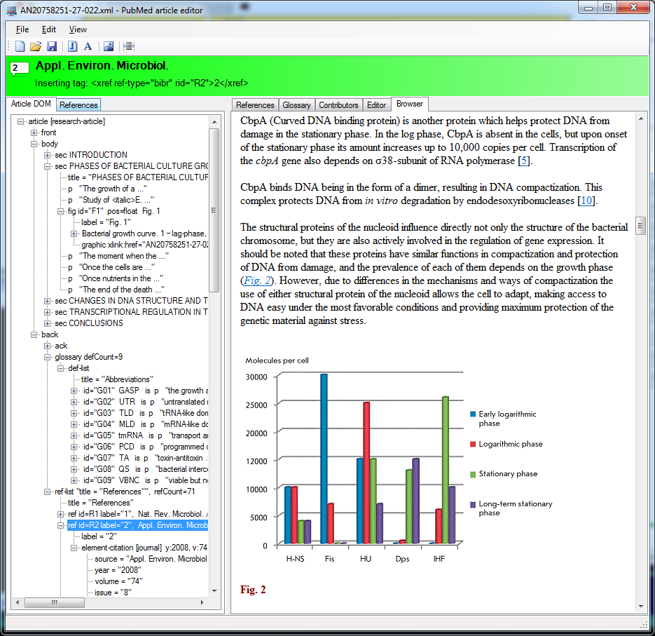
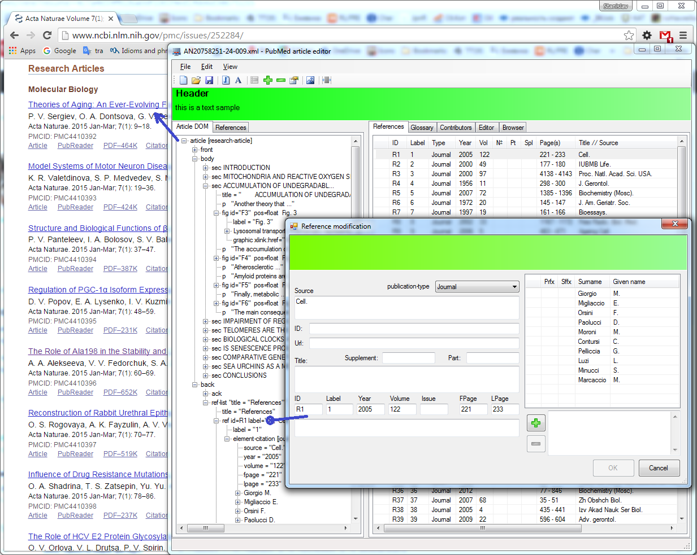

# Pubmed article editor

[Back to the main page](../../README.md)

**Development period:** 20015-2024.

**Practical application:** quarterly[^1].

**Project purpose:** To prepare journal articles to be published in PubMed. Creating the article DOM compatible with PubMed requirements.

**Implementation technologies:** .Net Framework, C#, Windows Forms, XML.

**Developer tools:** Microsoft Visual Studio.

The preview of the article in the editor 

The published article on the PubMed site 

[^1]: Every four months, I publish the magazine's next issue to Pubmed.
