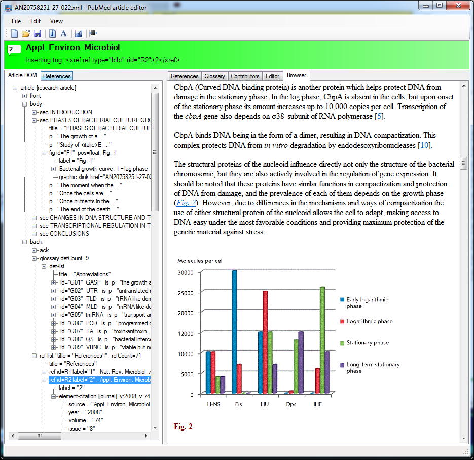

# Pubmed article editor

[Back to the main page](../../README.md)

**Development period:** 2010-2011.

**Practical application:** quarterly[^1].

**Project purpose:** To prepare journal articles for publication in PubMed, creating an article DOM compatible with PubMed requirements.

**Implementation technologies:** .Net Framework, C#, Windows Forms, XML.

**Developer tools:** Microsoft Visual Studio.

PubMed's XML schema has strict sequence requirements and rejects certain Unicode characters — manageable once you know the rules. The harder problem was the source content. Articles arrived as PDFs produced by tools that generate malformed markup: tags opened in the wrong order, `o` where `&deg;` was intended, Cyrillic characters in place of Latin symbols, chemical formulas encoded inconsistently. Over the years I built a large dictionary of anomaly conversions, but the supply of new surprises never stopped. The authors are brilliant researchers in their domain; the toolchain around them is not. So I treated it as a job — part automated, part corrected manually — and documented each new case as it arrived.

The preview of the article in the editor  

The published article on the PubMed site  

[^1]: I publish the magazine's next issue to PubMed every four months.
