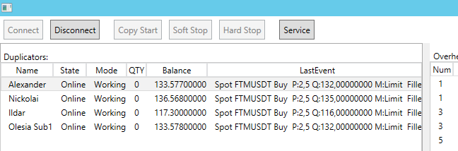
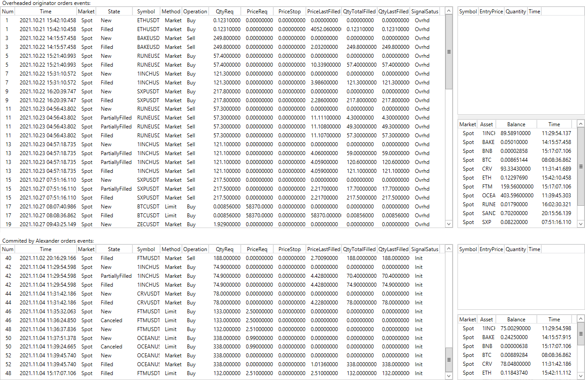

# Binance Copy Trading

[Back to the main page](../../README.md)

**Development period:** August 2021 - November 2021.

**Practical application:** In use and evolving new features[^1].

**Project purpose:** Copy Trading automation.

## Project description

This project automatically copies Originator trader positions for the Follower trader accounts on the Binance Cryptocurrency Exchange.

Technically, it is a Windows Service that contains a listener module and a set of trader modules.

- The listener module connects to the Exchange with the Originator Trader account. It listens to the signals that Originator Traders make from their trade terminal during their normal trading activity. The listener publishes these signals in the application's message multiplexer.

- Each of the Trader modules connects to the Exchange with the particular Follower account and subscribes to the Listener's signals and adds them to its own incoming signal queue. When it precedes the signal, it makes the same trading position as the Originator trader makes, but adjusts the size of the position according to the Follower's asset amount.

This is the whole idea. The service owner has some fees from the Follower traders as a percentage of their effort.

**My part in this project.** I was involved from the very beginning of the project. So I've done the following:

- Collecting the primary requirements from the Customer.
- RND - Check the viability of the idea (secondary connecting to the exchange by tool with the Originator trader account, listening to the echo of trading orders and order update signals, creating the same orders for the Follower's account).
- Proposing the MVP architecture specification, discuss its stages with the Customer.
- Creating the MVP, deploying to the tenant server, and transferring it to the Customer.
- Customer support, collect Customer experience and wishes for the first version.
- Collecting the requirements from the Customer after their first experience with the tool.
- Planning the sprints for the first working version development.
- Implementation.
- Technical support
- Transferred the project to my colleague, code review during several following sprints.

**Implementation technologies:** .NET 5, WPF, Binance.Net library by JKorf, and some subject area knowledge.

## Some illustrations from the project

Fig.1 The Follower trader list with their states and last operation results

Fig.2 The Originator and selected Follower order events

[^1]: The project is in the commercial use.
