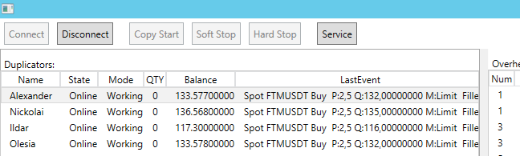
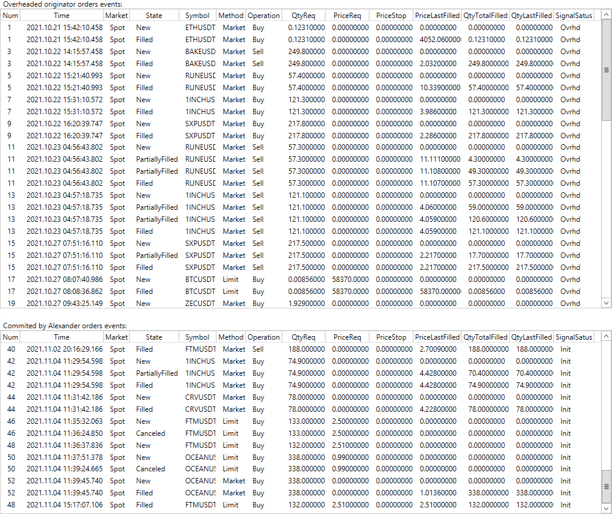

# Binance Copy Trading

[Back to the main page](../../README.md)

**Development period:** August 2021 - November 2021.

**Practical application:** In use and evolving new features[^1].

**Project purpose:** Copy Trading automation.

**Project description:** 
This project automatically copies Originator trader positions for the Duplicator trader accounts on the Binance Cryptocurrency Exchange.

**My part in this project:** Requirements collecting from the customer, RND, development of the architecture, implementing, testing, deployment to the cloud server for experimental use, technical support, 
ongoing project evolving.

**Implementation technologies:** .Net5, WPF, Binance.Net library by JKorf, and some subject area knowledge.

Fig.1 The Duplicator trader list with their states and last operation results 

Fig.2 The Originator and selected Duplicator order events 

[^1]: The project is in use with commercial clients.
