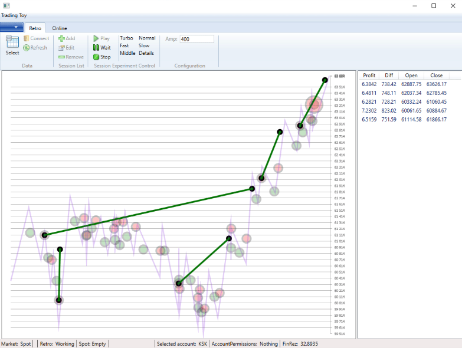

# Trading Toy tool

[:point_left: Back to tthe main page](../../README.md)

**Development period:** 2021.11-2021.11.

**Practical application:** The weekend project[^1].

**Project purpose:** Reseach some trading alghoritms

**Project description:** 
The program is able to connect to the exchznge, listen trade signals, analyse price trends, emulate buy and sell operations.
Also it is able to download the real time trading history and collect it in the SQL database.
Also it is able to emulate the exchange for itself to play trading session on the historical data.
Actually it allows to choose wheither user want to connect: the Binance exchange or built-in emulator.

**Implementation technologies:** .Net5, WPF, Binance.Net library by JKorf, T-SQL and some subject area knowledge.

[^1]: It is needed sometimes to program something for youself. To keep the knoledge in the actual state. To have something "good made" mecause it's made by youself for yourself on the computer. To avoid a hateness evffolving to the profession. And of course just for fan.
