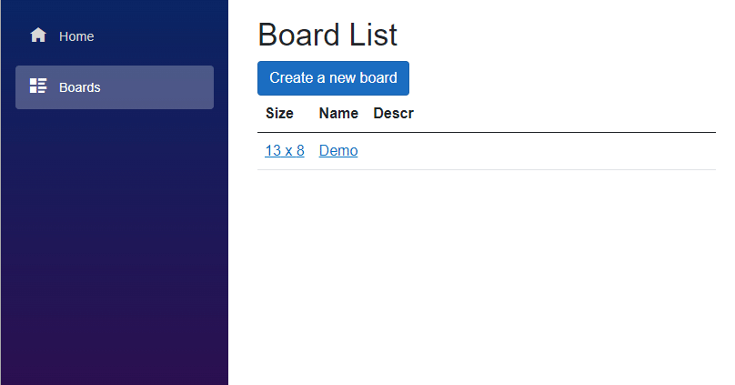
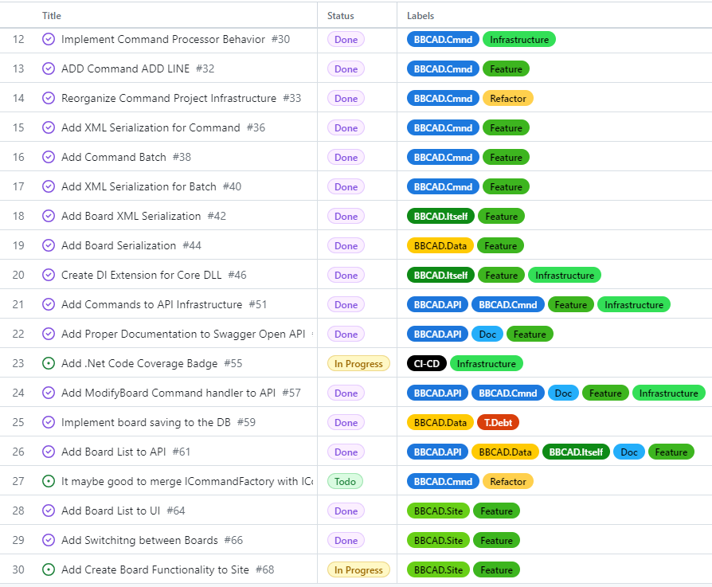
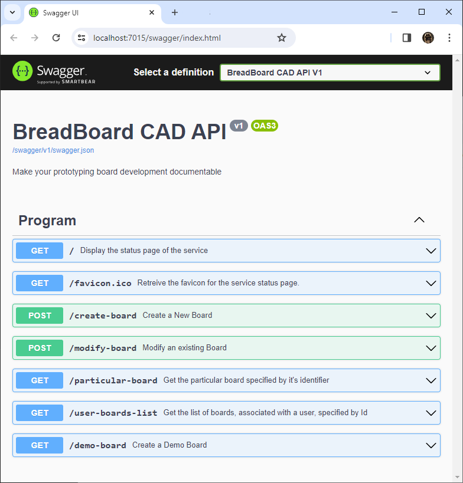

# Prototype Board Editor

[Back to the main page](../../README.md)

**Development period:** 2023-2024.

**Practical application:** The idea testing[^1].

**Project purpose:** To create a simple editor for the prototyping board wiring planning with effective storage files in a version-management-friendly format.

**Implementation technologies:** .Net Core, C#, Blazor.

**Developer tools:** Microsoft Visual Studio.

**Current status:** The idea is tested, and looking interesting for me but is not in the priority now. So it is currently on pause.

## How it works.
#### The Model
- There is a **Prototype Board Model**. It contains the board metadata (like dimensions, name, description, etc.) and the collection of wires in the multiline-like coordinate form.
- The model can be represented as an SVG image or serialized to an XML file.
- The Model has methods and properties that allow the user class to control its state.

#### Commands
- Commands are objects with a Name (like, for instance, CREATE BOARD or RESIZE BOARD) and command arguments.
- Each command has a deserialization constructor to be created by.
- The commands are immutable.

#### The Batch
- The Batch is an object that can accept the script with several **Command** statements in the text form and deserialize it to the collection of commands.
- The batch splits the input script to particular statements like "**COMMAND NAME ARG1 = Value1, ARG2 = Value2, ...**"
- After that, **Batch** fills its statement collection with **Commands** deserialized from the statements.

#### The Behavior Controller
- The Behavior Controller accepts **Batches** and applies **Commands** from **Batches** to the **Model**.

#### The Data Storage Service
- It implements the Board Projects Storage in the database (currently, it is In-Memory DB).
- It provides the requested Prototype Board Project for the **Behavior Controller** and applies changes to the particular project selected by its identifier.

#### The API Server
- The API Server is a Minimal API Web Application.
- It hosts the **Behavior Controller**.
- It also hosts the Data **Storage Service** and all other necessary services to provide the whole functionality.

#### The WEB Server
- The WEB Server is the simple Blazor application that provides UI for the API server.
- It provides a CRUD UI for the **API Server**.
- It displays the board schema as the SVG image.

## The most significant updates

#### 2023.12.10. All commands are in the common textual UI now 

#### 2023.12.07. Connecting UI with API by commands 

#### 2023.11.20. An exciting way to life 

#### 2023.10.20. It is important to feel the breath of the product 

#### 2023.10.15. The Swagger is a helpful tool for testing and debugging (but not the only tool, certainly) 

#### 2023.07.20. The first steps of the concept development 

[^1]: The idea came when I worked on my hardware project.
