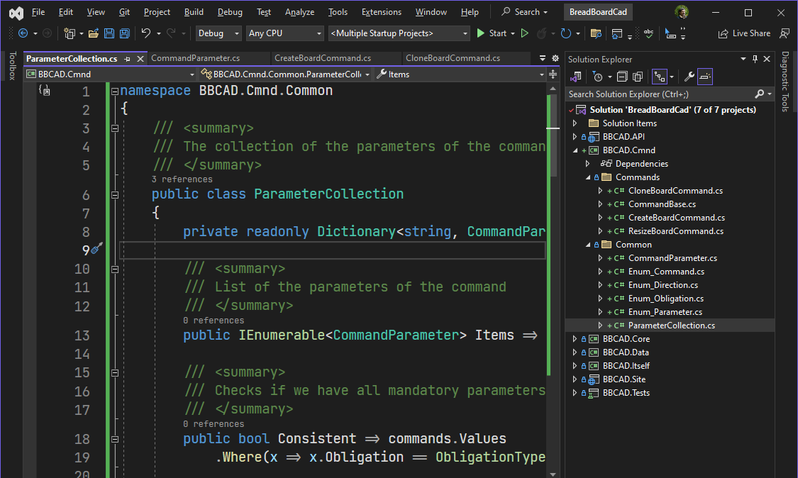
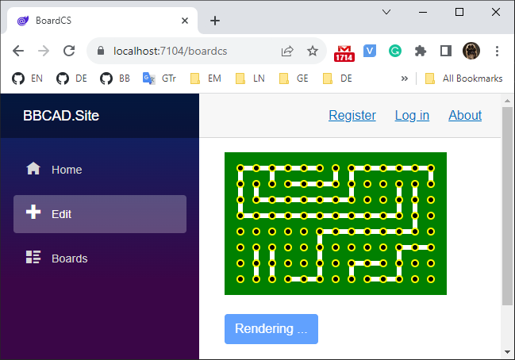

# Bread Board Editor

[Back to the main page](../../README.md)

**Development period:** 20023-?.

**Practical application:** The idea testing[^1].

**Project purpose:** To create a simple editor for breadboard wiring planning with effective storage files in version management-friendly format.

**Implementation technologies:** .Net Core, C#, Blazor.

**Developer tools:** Microsoft Visual Studio.

Just started the concept development 

It is important to feel the breath of the product 

[^1]: The idea came when I worked on my hardware project.
