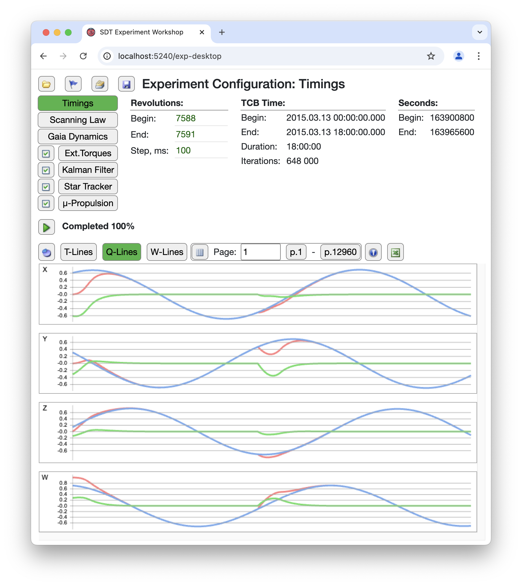

# Software Digital Twin

[Back to the main page](../../README.md)

**Development period:** 2024-2025.

**Practical application:** The Algorhytms testing and debuggging.

**Project purpose:** It is a scientific tool in C# for testing and tuning spacecraft attitude control algorithms, originally prototyped in Python and Java by the scientists in the Astronomisches Rechen-Institut. Gathering all these algorithms togather, we got a fast, configurable, and production-ready framework tailored for the development and adjust the algorithms for of the next generation of spacecraft.

**Implementation technologies:** .Net Core, C#, Blazor.

**Developer tools:** Microsoft Visual Studio Code.

**Current status:** The development is in progress.

## How it works

## How it looks like

### The UI 

