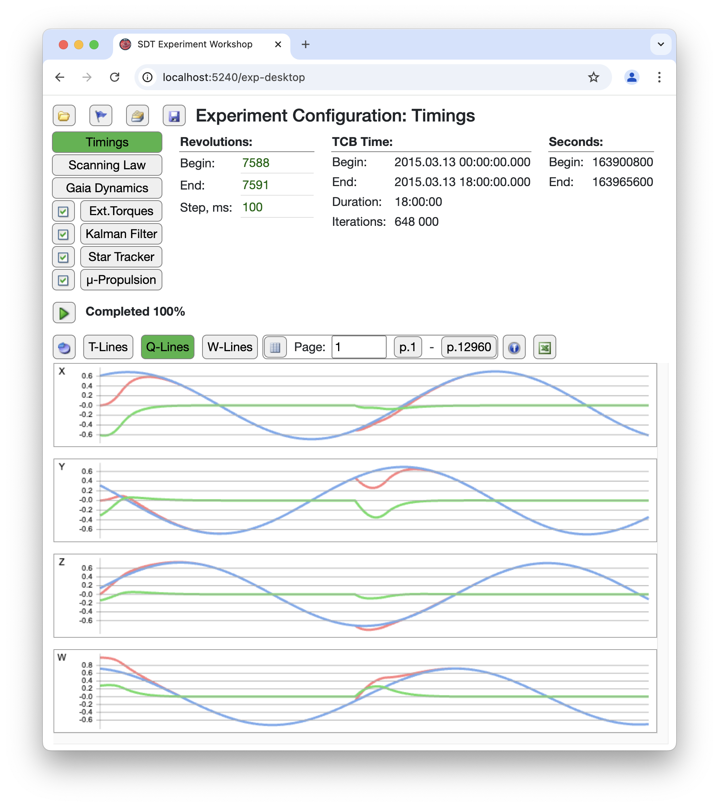

# Gaia telescope Software Digital Twin

[Back to the main page](../../README.md)

**Development period:** 2024.05-...

**Practical application:** Testing the innovative approaches of the attitude control[^1].

**Project purpose:** Research of some physics algorithms

**Project description:**
Creating a software model of the attitude control of the next probable version of the Gaia telescope.
The project itself is a physics-based software digital twin of Gaia telescope Attitude and Orbit Control System for testing and tuning spacecraft attitude control algorithms, originally prototyped in Python and Java by my colleagues. Building on these foundational implementations, we're creating a fast, configurable, and production-ready framework tailored for the proving of algorithms for the next generation of the telescope.

**Implementation technologies:**
Technically, it is a .NET Core development for Linux-based platforms, including:

- Scientific applications with a lot of calculations;
- Partially monolithic and partially distributed architecture;
- Applications that can work on the developer machine, in the local Docker network, and also distributed between several machines in Docker as well, naturally.

On the picture represented the Computational Experiment.
Approximately in the middle of the experiment, the micrometeorite hits the spacecraft. The model detects it and uses thrusters to return the spacecraft to the planned flight plan.

[^1]: It is a research in the my main job at the Astronomisches Rechen-Institut, a branch of Heidelberg University.
