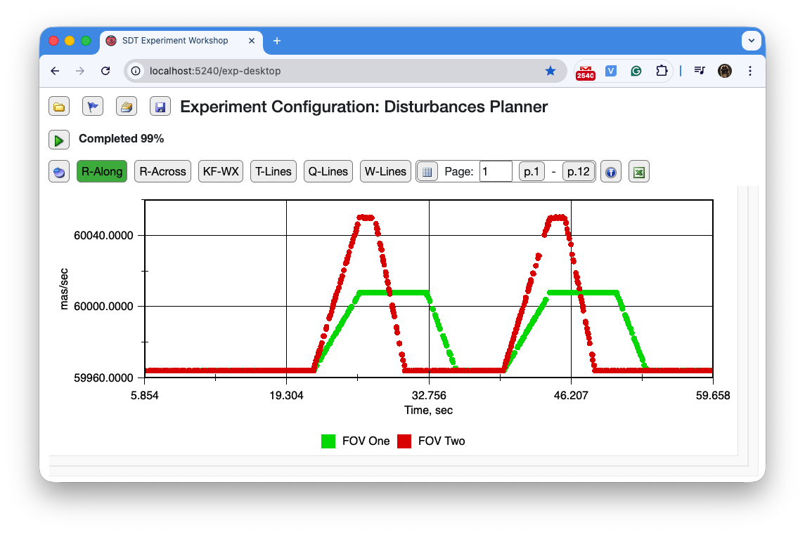

# Gaia telescope Software Digital Twin

[Back to the main page](../../README.md)

**Development period:** 2024.05-2026.04

**Practical application:** Testing the innovative approaches of the attitude control[^1].

**Project purpose:** Research on some physics algorithms

## Common Project description

The project itself is a physics-based software digital twin of the Gaia telescope Attitude and Orbit Control System. It is a scientific tool for testing and tuning spacecraft attitude control algorithms, originally prototyped in Python and Java by the scientists in the Astronomisches Rechen-Institut. Building on these foundational implementations, we're creating a fast, configurable, and production-ready framework tailored for the proving of algorithms for the next generation of the telescope.

**Fig. 1 The picture represents the Computational Experiment.** Approximately in the middle of the experiment, the micrometeorite hits the spacecraft. The model detects it and uses thrusters to return the spacecraft to the planned flight plan.

**Fig. 1 The picture represents two sequential Clank detection during the Computational Experiment.** We can see propagations of the clank effects to the detectable velocity change.

## Technical project description

The project was organized as a cross-platform .NET Core development, including:

- Scientific applications with a lot of calculations;
- Partially monolithic and partially distributed architecture;
- Applications that can work on the developer machine, in the local Docker network, and also distributed between several machines in Docker as well, naturally.
- Everything works on MacOS, Linux, and Windows.

The whole project is organized into the following components, which can be used separately, and can be connected as an end-user tool:

- The set of “Library” assemblies with common mathematical abstractions and infrastructure tools.
- The set of “Modules” – assemblies with implementations of different spacecraft equipment parts.
- The “Laboratory” – a special module that holds all the different modules together and provides communication between them.
- UI Service, which allows users to configure experiments, see the progress, browse the results, and download experiment data in CSV form.
- Rest API based service that holds the Laboratory module.
- Optional separately executable service for Star Catalog, which, in some experiments, consumes more memory than normally can be allocated on the workstation.

## Project Roadmap

While working on the project, the following duties were performed:

- Translating various concepts and requirements into a format appropriate for software product development.
- Organizing the development flow for bringing models and prototypes to a usable instrument.
- Development of the modules from the ideas was originally prototyped in Python and Java by astronomers and mathematicians, and adjusted after primary implementations due to compatibility and performance requirements.
- Designed the full architecture and implemented a physics-based software digital twin of the Gaia telescope Attitude and Orbit Control System. It is a tool for testing and tuning spacecraft attitude control algorithms - the fast, configurable, production-ready framework to prove algorithms for the next-generation telescope. The parts of the product are following:
- - Different time systems models and conversions between them.
- - The inertial rotating Dynamic/Kinematic model, which can be affected by torques.
- - Two nominal attitude plans, one of them is based on the inertial rotation for testing and calibration purposes, another on the mission schedule for the computational experiments. Attitude contains orientation and angular velocity for every moment of mission time.
- - The Disturbances (micro meteoroids, clanks, and solar pressure) model.
- - The Star Catalog to handle the Sky Map. It can receive direction and window size and provide a list of stars in the window with those coordinates.
- - The Star Tracker Module, which simulates taking a photo of stars in the specified direction, recognizes constellation patterns, and returns the “measured” orientation with hardware-specific errors.
- - The Focal Plane Module, which simulates star movement over the telescope CCDs, and performs angular velocity measurements with hardware-specific delays and deviations. We tried several different approaches, the finally accepted version was developed by my colleague, who joined to the project recently.
- - The Kalman Filter implementation, for verifying the “measured” orientation and angular velocity.
- - The Controller model, which compares verified attitude with nominal attitude and calculates, if necessary, a torque that is needed to correct the actual attitude.
- - The Micro Propulsion System model, which accepts a required torque, and, knowing the geometry and power of thrusters, produces an “applied torque”, which is going to the Dynamic/Kinematic model at the next iteration of the computational experiment.
- - The User Interface for configuring and executing the computational experiments, observing results in graphical and tabular form, and exporting experimental data for further analysis.

## Common project details

**Implementation technologies:** .Net 10, C#, Blazor.

**Developer tools:** Microsoft Visual Studio Code.

**Current status:** The development is in progress.

[^1]: It is research in my main job at the Astronomisches Rechen-Institut, a branch of Heidelberg University.
