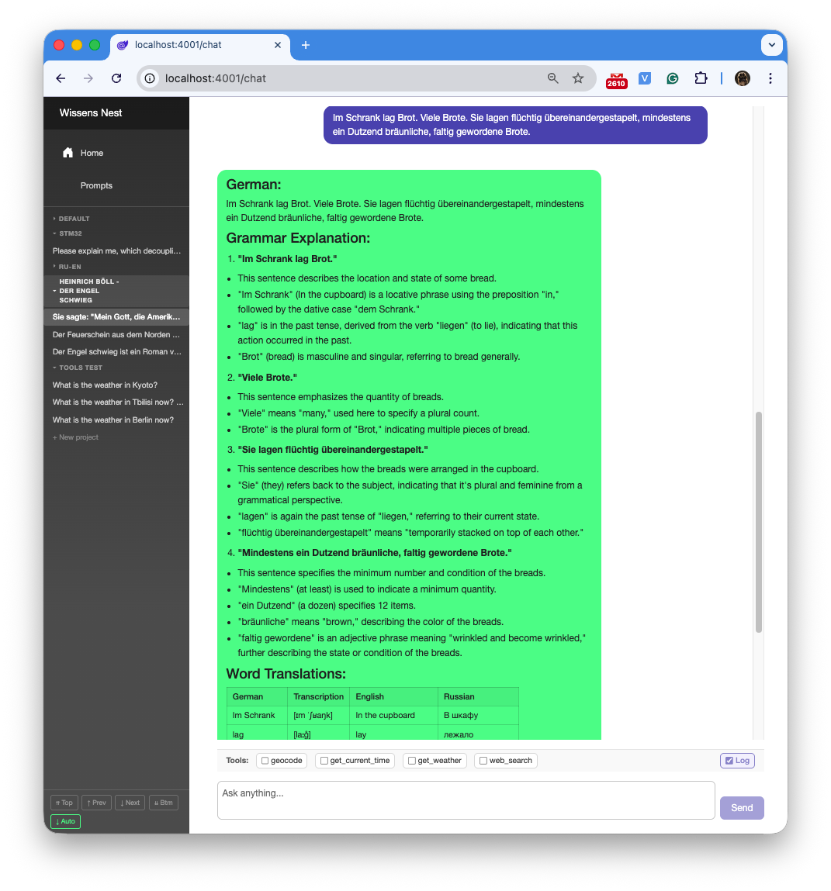
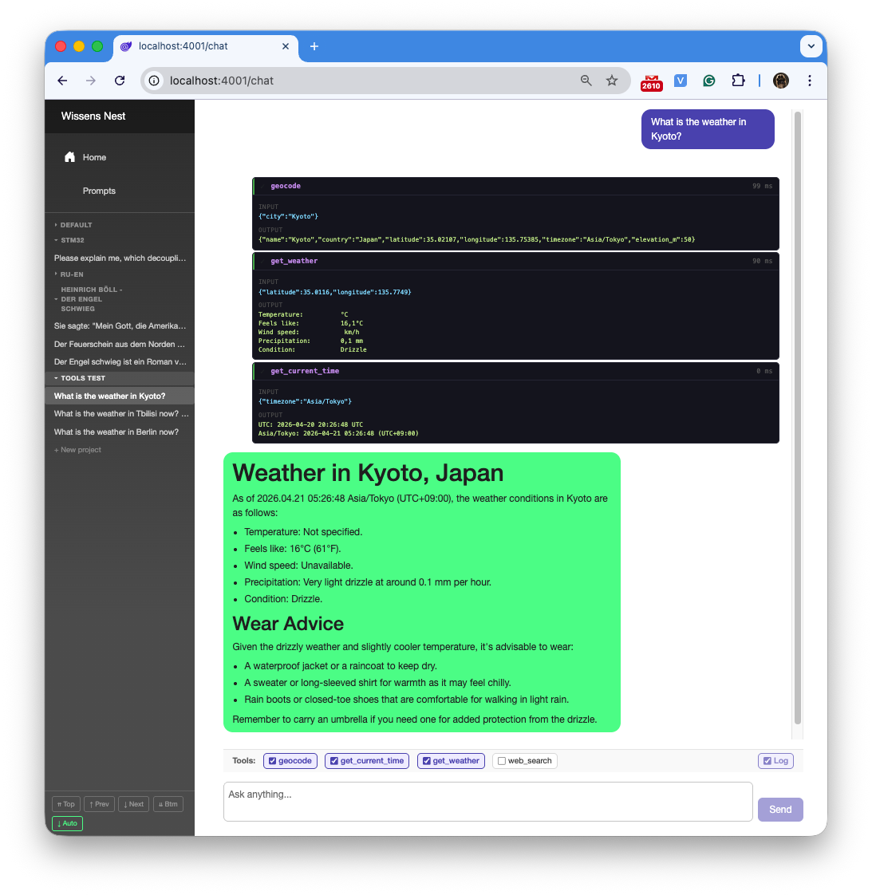
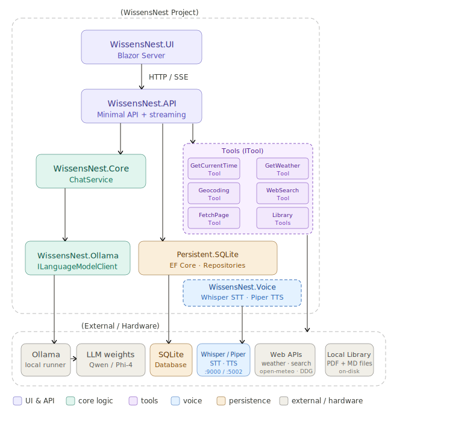

# AI Assistant

[Back to the main page](../../README.md)

**Development period:** 2026.04-...

**Practical application:** Having all LLM tools locally without regular fees, registration, and SMS.

**Project purpose:** Researching and testing the possibilities of language models in learning, web searching, engineering activities, etc[^1].

## Project description

### Why is it "WissensNest"

WissensNest is a combination of "Wissen" (knowledge) with "Nest" (nest), suggesting a cozy, home-like repository of knowledge.

### What Is WissensNest

WissensNest is a **personal AI assistant that runs entirely locally** on a standard computer (a MacBook Pro M3 with 36 GB RAM). No cloud, no subscriptions. No data leakage, no risk of disconnection from the tool, and no data loss just because the service owner changed their plans. All conversation history is stored in a local SQLite database; models run through Ollama.

The interface is a web app accessible in any browser. I introduced the concept of Projects in the domain model. Projects separate contexts. Each project has its own set of system instructions (prompts) and its own conversation history.

### Use Cases

#### Use Case 1 — Reading Literature in a Foreign Language

You are reading a book in German (or any other language). You encounter an unfamiliar phrase or a complex sentence. Paste the excerpt into the chat — the assistant:

- builds a mini-glossary of all words in the phrase with translations and usage examples
- explains the grammatical constructions used (Konjunktiv II, Passiv, Modalpartikeln, etc.)
- Displays different tenses of verbs from the phrase.

The entire breakdown is saved in the local database under the relevant grouping structures called "projects" — you can return and review the material at any time.

**Fig. 1 The picture represents the UI of the chat with the German Book Reader prompt.** It accepts phrases in German and answers by explanation and translation immediately, without any additional commands, because the behavior of this particular project was described in the prompt, assigned to the project. The prompt can be configured for any other language.

#### Use Case 2 — General-Purpose Local Knowledge Base

Unlike ChatGPT or Google, WissensNest:

- requires no internet and sends nothing to external servers
- stores all history locally, browseable by project and conversation
- responds in a configured format: Markdown tables, lists, code blocks — rendered and readable
- retains context: multi-turn dialogue allows you to refine and rephrase

Example uses: personal project-related information, history and biology questions for schoolchildren, recipe scaling, and help drafting letters and documents.

**Fig. 2 The assistant helps in the engineering job.** It uses data hidden in the model trained by the LLM base provider. This approach is less reliable than RAG, but RAG is a subject for future versions. For now, it is just a concept.

#### Use Case 3 — Assistant That Reaches Into the Real World

A language model knows only what it was trained on. WissensNest goes further — it automatically calls external services when a question requires live data.

Ask *"What's the weather like in Munich right now?"* — the assistant:

1. Calls **GeocodingTool** → resolves "Munich" to coordinates (lat/lon/timezone) from geocoding-api.open-meteo.com
2. Calls **GetWeatherTool** → fetches current temperature, wind, and precipitation from open-meteo.com
3. Answers in natural language with the live data embedded

Ask *"What time is it in Tokyo?"* — **GetCurrentTimeTool** is called immediately, returns UTC time, requested by the model, and the model, knowing how to calculate Tokyo local time, does it and returns the time to the user.

**The model decides** when a tool is needed and silently invokes it. There is no *"Should I check the weather for you?"* — it just does it. The tool's results flow back into the response as naturally as if the model had always had that information.

From an architecture perspective, adding a new tool requires only implementing the `ITool` interface and registering it in DI. The ChatService, streaming layer, and UI pick it up with zero additional changes.

**Fig. 3 External tools calling sequence.**

## Common Project description

The project itself is a service that stands between Ollama and Blazor Web UI. This service should provide assistance in daily life, at work, and in learning. Currently, it is just a chat model, but in the future, it can be connected to sensors, actuators, and whatever.

**Fig. 2 The picture represents a sequence diagram of the first version of the Assistant.** It was the simplest chat that proved the viability of the idea. It prepares the chat request, then, sends it to the model, then, collects parts of the answer, and, finally, renders it at the UI.

## Technical project description

**Fig. 3 The current project structure.** I'm trying to keep architecture clean, self-explanatory, and easy to maintain.

## Technical project details

### Applied Software Development Technologies

- **.NET Application Architecture** — multi-layer solution following Clean Architecture principles: Contracts / Core / Infrastructure / UI with strict dependency boundaries (dependency inversion, no leaky abstractions)
- **.NET Core Minimal API** — REST API design and implementation: routing, response streaming (`IAsyncEnumerable`), middleware, DI container
- **Blazor Server** — interactive web UI: component model, circuit-scoped state, server-side rendering, real-time token streaming via SignalR
- **Entity Framework Core + SQLite** — Code-First migrations, soft-delete, separation of domain entities from EF entities (DBEntity ↔ Domain), SQLite limitation workarounds (DateTimeOffset)
- **LLM Integration** — Ollama API via OllamaSharp, conversation history management, multi-layer system prompt composition (global / project/conversation)
- **Tool / Function Calling** — ITool abstraction, DI-based tool registration, Ollama function-calling protocol, streaming discriminated union (TextToken / ToolCallRequest / ToolResult / Completion / Error); implemented tools: GetCurrentTime, GetWeather (open-meteo.com), Geocoding
- **Domain Model Design** — Projects, Conversations, Messages, PromptCollections; soft delete, message editing, response regeneration, context modes (MultiTurn / SingleTurn)
- **Testing** — unit tests (xUnit), test-driven development for Markdown response formatter
- **AI-Assisted Development** — production use of Claude Code (Anthropic) as a primary pair-programmer: architecture review, multi-file refactoring, migration generation, continuous codebase documentation via CLAUDE.md
- **Local DevOps** — deployment scripts.

**Developer tools:** Microsoft Visual Studio Code, Claude Code, DB Browser for SQLite.

**Current status:** The development is in progress.

[^1]: It is my own research for educational and curiosity purposes. Ideally, I will automate some home staff, KiCad design, software development, and documentation formatting.
