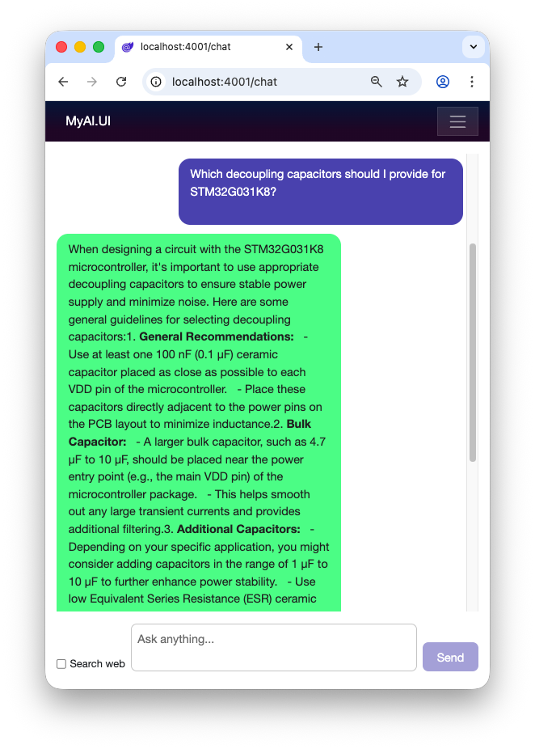

# AI Assistant

[Back to the main page](../../README.md)

**Development period:** 2026.04-...

**Practical application:** Researching and testing the possibilities of language models in learning, web searching, engineering activities, etc[^1].

**Project purpose:** Having all LLM tools locally without regular fee, registration and SMS.

## Common Project description

The project itself is a service which stands between Ollama and Blazor Web UI. This service should provide assistance in daily life and job and learning. Currently it is just chat model, but in future it can be connected to sensors, actuators, and whatever.

**Fig. 1 The picture represents the current state of the UI.** It can answer on any question in any language. Amazing. Now we're learning how to format MD properly - the model tries to economy traffic and rejects to put empty lines between paragraphs.

## Technical project description

**Fig. 2 The current project structure.** I'm trying to keep architecture clean, self-explainable and easy maintainable.

## Common project details

**Implementation technologies:** .Net 10, C#, Blazor, Ollama.

**Developer tools:** Microsoft Visual Studio Code.

**Current status:** The development is in progress.

[^1]: It is my own research in educational and curiosity purposes. Ideally, I will automate some home staff, KiCad design, software development and documentation formatting.
