# AI Assistant

[Back to the main page](../../README.md)

**Development period:** 2026.04-...

**Practical application:** Having all LLM tools locally without regular fees, registration, and SMS.

**Project purpose:** Researching and testing the possibilities of language models in learning, web searching, engineering activities, etc[^1].

## Common Project description

The project itself is a service that stands between Ollama and Blazor Web UI. This service should provide assistance in daily life, job, and learning. Currently, it is just a chat model, but in the future, it can be connected to sensors, actuators, and whatever.

**Fig. 1 The picture represents sequence diagram of the first version of the Assistant.** It was the simplest chat that proves the viability of the idea. It prepares the chat request, then, sends it to the model, then, collects parts of the answer, and, finally, renders it at the UI.

**Fig. 2 The picture represents UI of the chat.** It can answer any question in any language. Amazing. Since we're made the agreement with the model, how to format MD properly, the answers became more readable than just plain text.

## Technical project description

**Fig. 3 The current project structure.** I'm trying to keep architecture clean, self-explanatory, and easy to maintain.

## Common project details

**Implementation technologies:** .Net 10, C#, Blazor, Ollama.

**Developer tools:** Microsoft Visual Studio Code.

**Current status:** The development is in progress.

[^1]: It is my own research for educational and curiosity purposes. Ideally, I will automate some home staff, KiCad design, software development, and documentation formatting.
