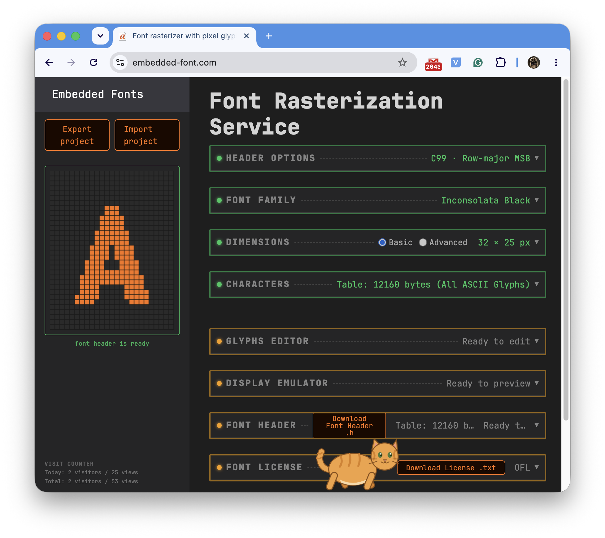
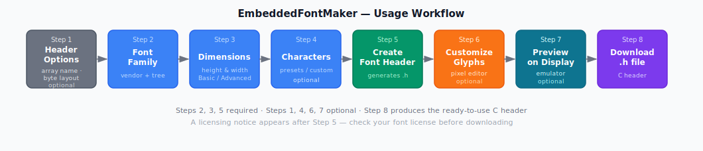
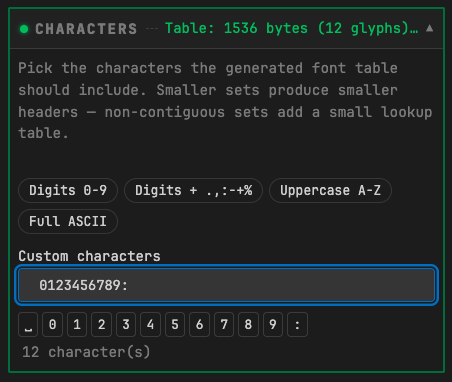
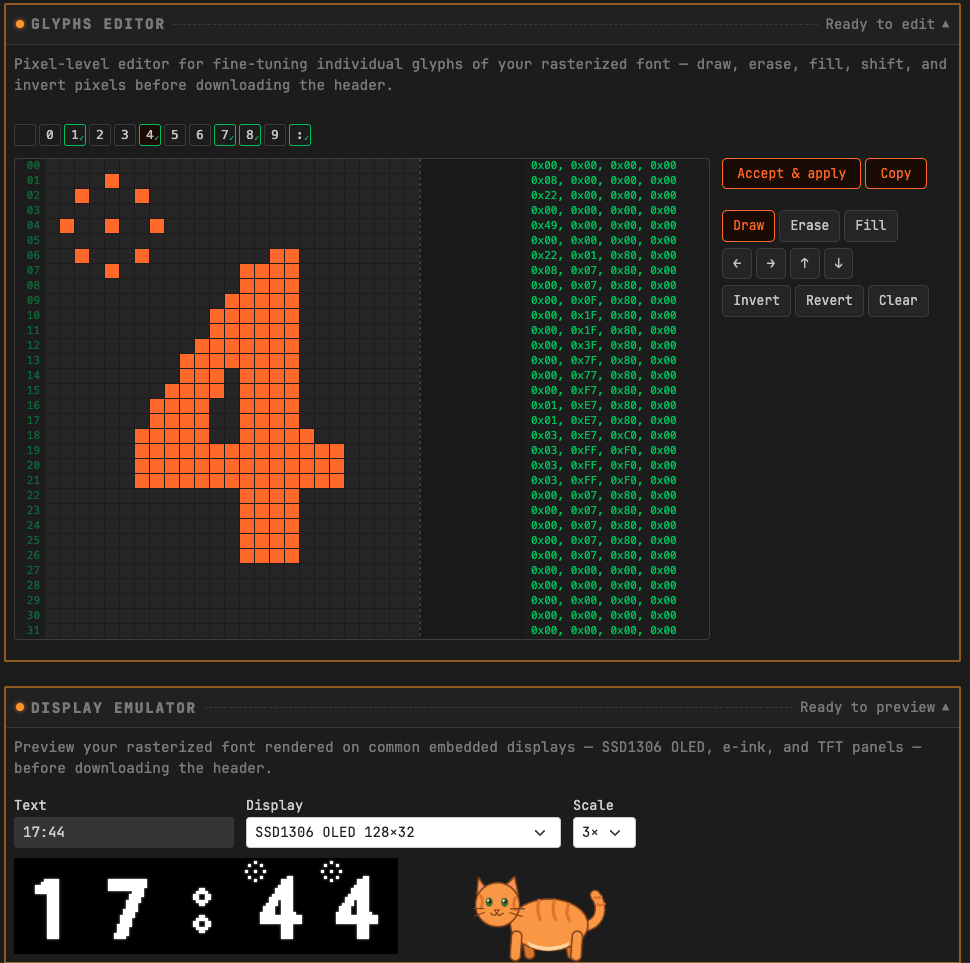
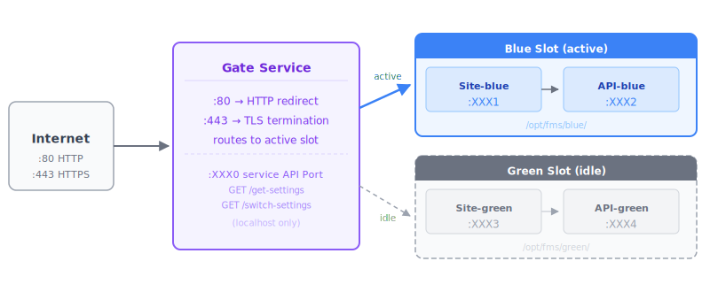
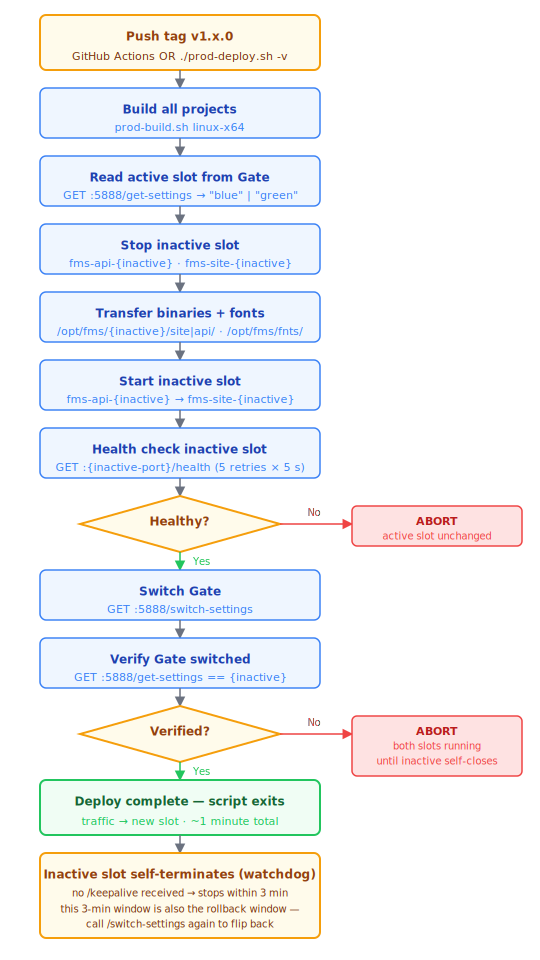

# Font Rasterization Service

## A site that serves some of embedded developer needs

[Back to the main page](../../README.md)

**Development period:** 2026.06.01–2026.06.15

**Current state:** Complete, maybe random improvements sometimes.

**Practical application:** Publicly available free of charge SaaS. **[embedded-font.com](https://embedded-font.com/)** — free, runs in the browser, no account needed.[^1]

It's a narrow niche — but if a person has ever spent an afternoon fighting bitmap fonts for an OLED display, they know exactly why this exists.

---

## The history

A while back I needed a bitmap font for a small embedded project — specific dimensions, clean pixels, ready to drop into a C header. Turns out there's no straightforward way to do that. I ended up writing a console tool and cycling through fonts one by one until something looked acceptable.

Recently I decided to learn SaaS development and turned that script into a proper browser tool: pick an OFL font from the built-yn library, set the glyph cell size, trim the character set to what the firmware actually needs, fix individual glyphs pixel by pixel, preview on an emulated SSD1306 or e-ink display, and download a ready-to-compile .h file.

## The Use Case

**Font Rasterization Service** generates a C header file (*.h) containing a bitmap font ready to embed in microcontroller firmware. The output is a single Font_Table[] byte array plus a comment-embedded license, compatible with any C/C++ project.

### Charset Filtering

For some tiny devices it is not necessary, and too expensive to hold the full charset font. For this reason the Charset Subset Selector exists.

For instance, for the Clock device, engineer can create reduced Font with 12 symbols.

### Glyph Fine Tuning and Display-specific Preview

Sometimes symbols need to be corrected after scaling to the necessary dimensions. For this purpose the service has **Glyph Editor** tool. This tool allows to tune how the particular symbol should look. In this example picture the circle with the dot is added to the symbol of "4", just to illustrate the editing idea.

In the **Display Emulator** tool the view of edited symbols in the user-defined string can be seen as it will be shown at the real display.

## The Architecture (in the General Terms)

The **Font Rasterization Service** itself wraps the .NET assembly which implements the magic of the rasterization process. Technically it is Minimal API console application.

The **Site Service** is the Blazor Pages application which implements all UI logic and calls the Font Rasterization service for the domain functionality.

The **Gate Service** is a reverse proxy service that transfers all browser calls to the Site service, and also, provides the load switch functionality in the CI/CD process by implementing of Blue/Green Deployment process.

## Blue/Green Deployment

The Blue/Green Deployment provides zero-downtime deploys work as follows:

1. The Gate Service has not only the business ports (80 and 443) for the ongoing user traffic, but also a service, only local available port for the maintenance calls which are made by the CI/CD script calls.
2. CI/CD Process reads the active slot from Gate's service API.
3. Than, CI/CD Process ensures that the idle slot is stopped; than, it deploys new binaries of the site and API to the idle slot directories.
4. Than,  it starts the idle slot and health-check it via the dedicated service health-checking commands.
5. After that, it switches the Gate to the newly started slot by the service API command.
6. At the end of it's gob, the CI/CD script verifies the switch took effect.

7. When the **Gate** receives the switch command, it updates the state in the configuration and forwards all new requests to the now-active slot.

8. The old (now-inactive) slot keeps running. But it receives no further /keepalive pings from Gate anymore, so its WatchdogService self-terminates within
3 minutes. This 3-minute window
also doubles as the rollback window: calling /switch-settings again flips Gate back to
the old slot and resumes its keep-alive pings, keeping it alive indefinitely. In-flight
WebSocket connections on the old slot drain within the 30-second shutdown timeout once it
does self-terminate.

Sometimes people ask me: Why don't you use nginx and couple of scripts around, but implement all this stuff yourself? My answer is simply: Because it's funny. Because of my curiosity. It was interesting to me to implement this approach on myself, as I want to have it done and working.

**Development tools:** VS Code, Claude Code, GitHub Actions.

[^1]: The niche is so narrow that this subject looks impossible to be considered as something that could be useful for making money.
