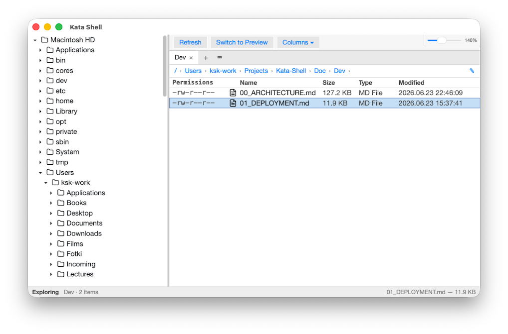
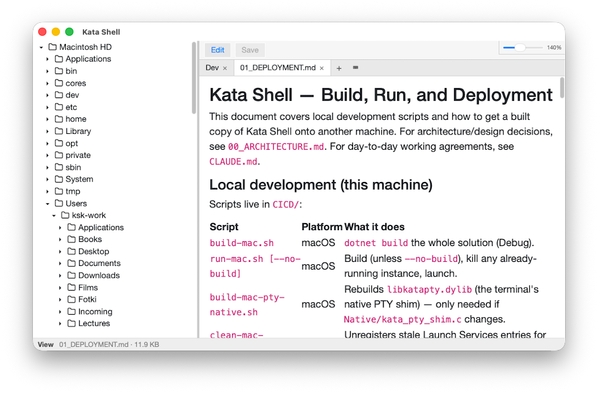
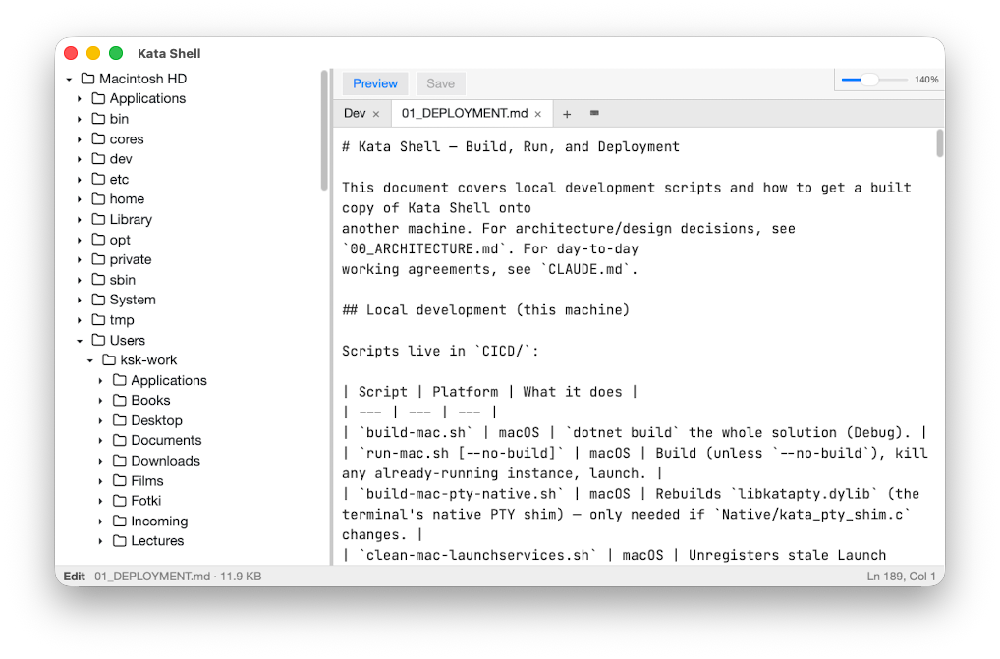
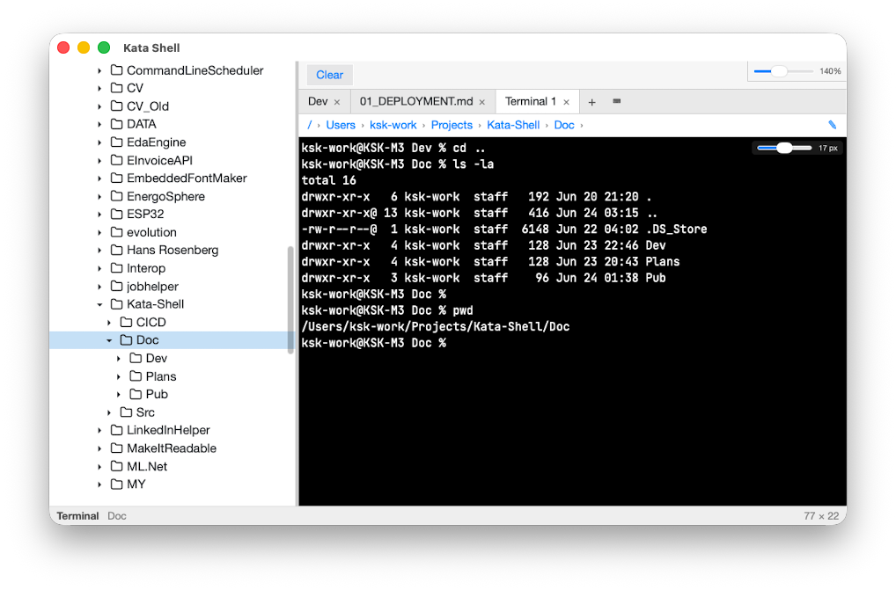

# Kata Shell - Useful File Manager for macOs

I worked on Windows as a software developer for more than 25 years.

During this time, I inevitably developed the particular habitus associated with working with the file system tree and files themselves. To put it simply, I used to use Windows Explorer. It was not bad. I didn't feel it; I just saw the file system through it. I consider it a good characteristic of a tool.

Three years ago, I started to use a Mac. Because I was invited to the project where the target system was Linux-based, and because the team's culture was Linux-oriented. It wasn't mandatory, but I decided to be on the same page as my colleagues.

Three years with Finder. Which is completely different. The horizontal directory three, the absence of the adders bar, editing with the Enter key, and other things I didn't get used to over three years, and cannot feel at home with. Or, more clearly, without the tool with the functions I need. And I looked back. To the Windows. But I became different. As well as Windows. The 11th version of Windows has Explorer that I cannot recognize or use as I did in the past. So, there is no way back. There is no previous me, and there is no previous environment.

And I've made a decision. If I'm a real software developer. I will make my own File Explorer for macOS. If not, it's a proper time to learn how to drive a tram.

And I started to work on it. And I found it possible - to make it. So now I have the MVP, which makes me feel more at home on macOS.

---

Primarily, I've created a Windows Explorer like window with the File System Tree and Directory Content View in the table form.

Then, I've added an inline MD / txt File Preview.

Then, I've added an inline MD / txt File Editor.

And, finally, I've added the Terminal window, which is in sync with File Structure Tree.

