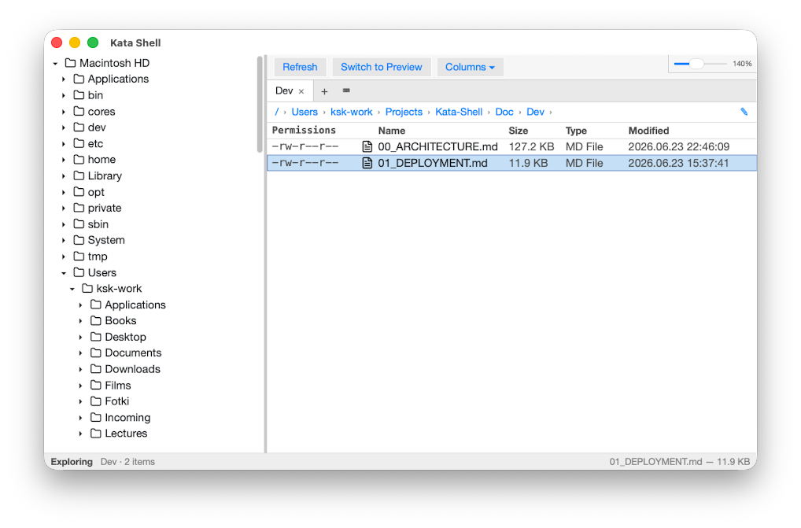
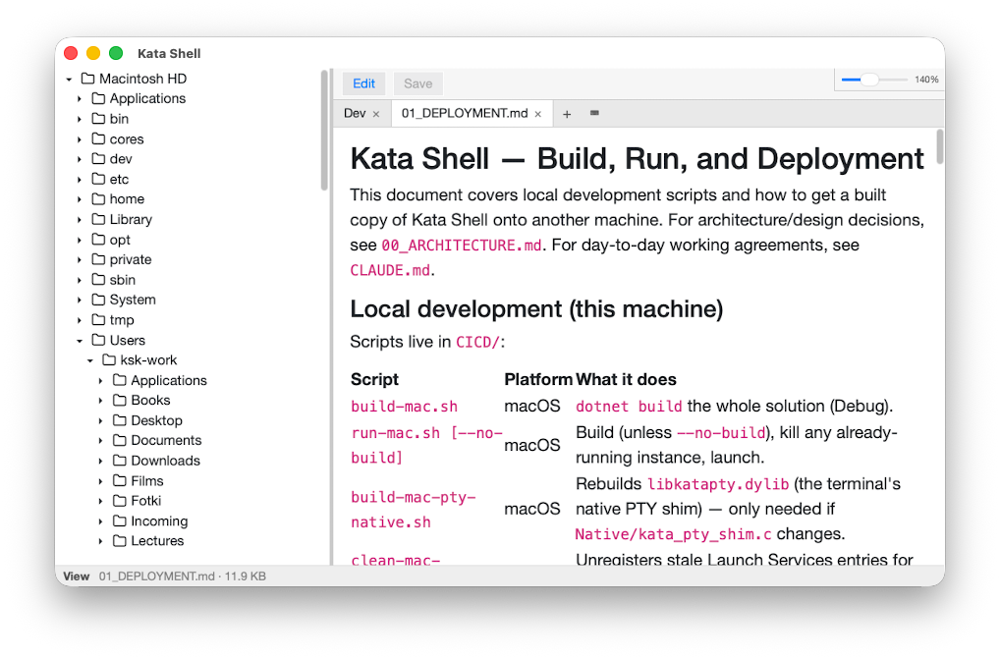
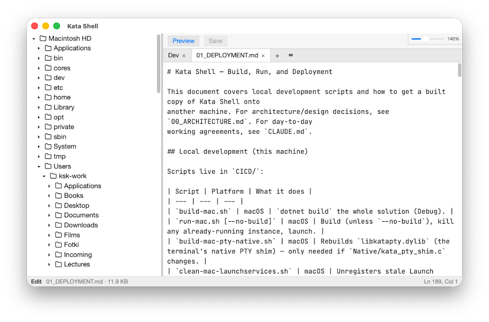
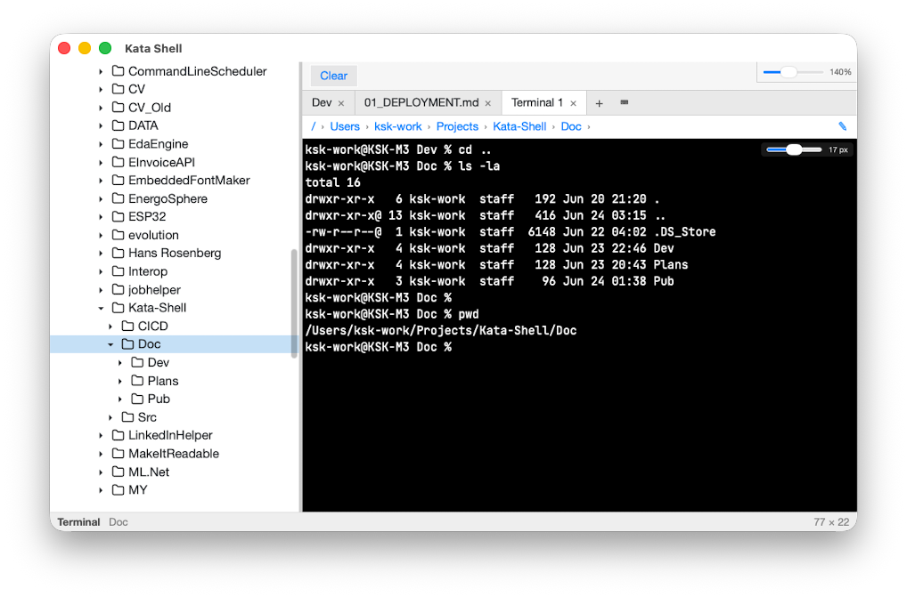

# Kata Shell - Useful File Manager for macOS

I worked on Windows as a software developer for more than 25 years.

During that time, I inevitably developed the particular habitus associated with working with the file system tree and files themselves. To put it simply, I used to use Windows Explorer. It was not bad. I didn't feel it; I just saw the file system through it. I consider it a good characteristic of a tool.

Three years ago, I started to use a Mac. I did so because I was invited to a project where the target system was Linux-based, and because the team's culture was Linux-oriented. It wasn't mandatory, but I decided to be on the same page as my colleagues.

Three years with Finder. Which is completely different. The horizontal directory tree, the absence of the address bar, editing with the Enter key, and other things I didn't get used to over three years and cannot feel at home with. Or, more clearly, without the tool with the functions I need. And I looked back. To Windows. But I became different. As well as Windows. The 11th version of Windows has an Explorer I cannot recognize or use the way I did in the past. So, there is no way back. There is no previous me, and there is no previous environment.

And I've made a decision. If I'm a real software developer. I will make my own File Explorer for macOS. If not, it's a good time to learn how to drive a tram.

And I started to work on it. And I found it possible to make it. So now I have the MVP, which makes me feel more at home on macOS.

---

Primarily, I created a Windows Explorer-like window with a File System Tree and a Directory Content View in table form.

Then, I added an inline MD/txt File Preview.

Then, I added an inline MD/txt File Editor.

Finally, I added the Terminal window, which syncs with the File Structure Tree.

Finally, i've git a ready-to-use product:

And if you're interested, you can download and play with it from the products site [katashell.app](https://www.katashell.app/)
