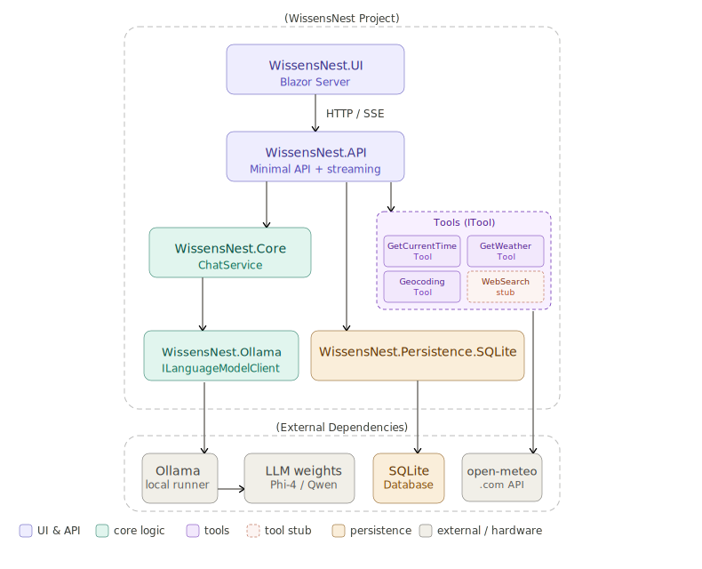

# My AI

## Architecture

## 1. Functional diagram

The system architecture diagram showing layered components:

WissensNest.UI Blazor Server at the top communicates via HTTP and SignalR to WissensNest.API: Minimal API layer that connects to WissensNest.Core business logic containing ChatService and scheduler. From WissensNest.Core, two paths branch downward: the left path to WissensNest.Ollama ILanguageModelClient adapter connecting to external Ollama local runner, which connects to LLM weights running Phi-4 or Qwen models; right path to SQLite persistence database. A dashed future component labeled "Web and search tool layer" is shown to the right, with a planned connection from WissensNest.Core. All WissensNest service components are contained within a dashed boundary. Legend indicates color coding: purple for UI and API, green for core logic, tan for persistence, and gray for external hardware components.

Fig.1 The top abstraction level architecture diagram

The Blazor UI talks to the API exclusively — it never touches the model or database directly. The API receives requests and delegates to Core. Core contains your actual business logic and knows nothing about Ollama or SQLite — it only speaks to interfaces defined in Contracts. Below Core, two adapters implement those interfaces: WissensNest.Ollama translates your types into OllamaSharp calls, and the SQLite assembly handles persistence. Ollama itself sits outside your code boundary — it's a separate process running on your machine that loads and runs the LLM weights.

The future Web/Search module will provide internet connectivity for search and whatever.

The concept: the Core never knows what model it's talking to, what database stores the data, or how the UI is built. All of those are swappable below it. All this stuff is implemented in other modules for context and responsibility separation.

## 2. Sequence diagram

Fig.2 The chat data exchange sequence diagram.
