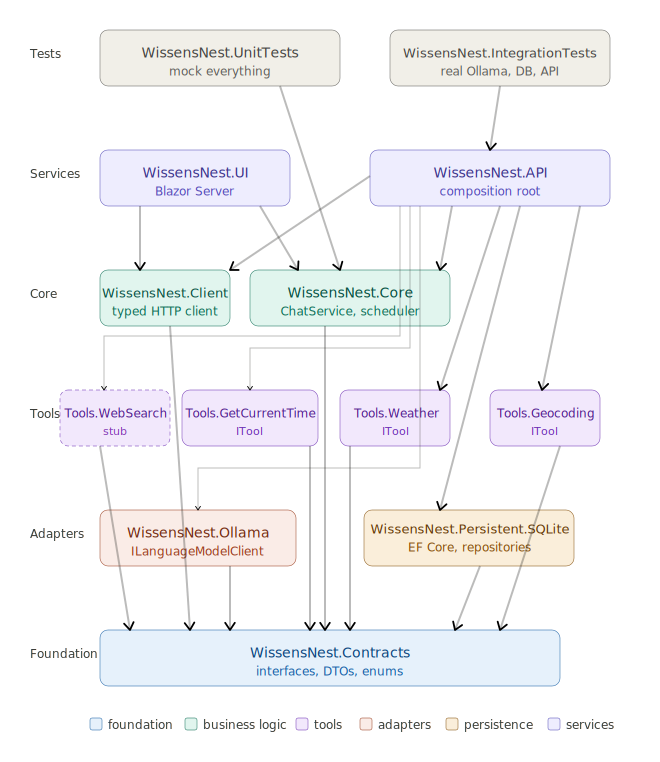

# My AI

## Assemblies

## 1. Assemblies list

The brief list of the deployment units of the project:

| Assembly                    | Description                                      |
|-----------------------------|--------------------------------------------------|
| WissensNest.Contracts.dll          | Interfaces, IRepository, DTOs, base abstractions |
| WissensNest.Persistent.SQLite.dll  | SQLite implementation                            |
| WissensNest.Ollama.dll             | ILanguageModelClient implementation              |
| WissensNest.Core.dll               | Business logic, scheduler, BackgroundService     |
| WissensNest.Client.dll             | Typed HTTP client wrapping the API               |
| WissensNest.API.exe                | Minimal API, DI wiring, thin handlers            |
| WissensNest.UI.exe                 | Blazor Server, consumes WissensNest.Client.dll          |

## 2. The description of all assemblies

Assemblies are grouped by their functional purpose into three groups: Libraries, Services, and Tests.

### Libraries

**WissensNest.Contracts** is the foundation that everything else stands on. It contains only interfaces, DTOs, records, and enums — zero implementation, zero external dependencies. Its purpose is to define _what the system can do_ without saying _how_. Because every other assembly depends on it, it must never depend on anything else. If you find yourself wanting to add implementation logic here, that's a signal that something belongs elsewhere.

Also it contains base abstractions that are slightly more concrete than Contracts but still implementation-free — things like generic repository base classes, _IUnitOfWork_, common exception types, base entity classes with _Id_ and timestamps. It depends on Contracts because it works with the types defined there. The reason it's separate from Contracts is that it carries structural opinions about _how_ persistence and cross-cutting concerns are shaped, without being tied to any specific technology such as SQLite or EF Core.

**WissensNest.Persistent.SQLite** is the only assembly that knows SQLite exists. It implements the repository interfaces from Contracts using EF Core. When you later want to experiment with a different storage system — LiteDB, PostgreSQL, even plain JSON files — you create a new assembly implementing the same interfaces, change one line in the API's DI registration, and nothing else in the solution changes. This is the entire reason for isolating persistence here.

**WissensNest.Ollama** is the only assembly that knows OllamaSharp exists. It implements _ILanguageModelClient_ by translating your Contracts types into OllamaSharp calls and back. If you later want to run llama.cpp directly or support a cloud fallback, you create a new assembly with the same interface and the same DI swap. Core never knows which model runner it's talking to.

**WissensNest.Tools.WebSearch** is the only assembly that knows anything about web search providers. Currently a stub throwing _NotImplementedException_, it will eventually implement _IWebSearchTool_ using SearXNG, DuckDuckGo, or whatever you choose. Same isolation principle as Ollama and SQLite — the provider is a detail hidden behind a Contracts interface.

**WissensNest.Core** is the heart of the system. It contains all business logic — _ChatService_, the scheduler, _BackgroundService_ for reminders, context assembly, and tool orchestration. Crucially, it depends only on _WissensNest.Contracts_ — never on Ollama, SQLite, or WebSearch directly. It speaks only to interfaces. This makes it fully testable in isolation by mocking those interfaces, and it means the business rules are never coupled to any infrastructure technology.

**WissensNest.Client** is a typed HTTP client wrapping your API's endpoints. Any future UI — a MAUI mobile app, an Avalonia desktop app, a CLI tool — references only this assembly to communicate with the backend. It depends only on Contracts for the shared types. The UI never writes raw _HttpClient_ calls — it goes through this typed layer.

### Services

**WissensNest.API** is the composition root — the place where everything is wired together via dependency injection. It references all the implementation assemblies (Ollama, SQLite, WebSearch, Core, Client) and registers them against their interfaces. Its endpoint handlers are intentionally thin: receive an HTTP request, call Core, and stream the result back. No business logic lives here. It also owns EF Core migrations because it's the process that runs the database.

**WissensNest.UI** is the Blazor Server application. It references _WissensNest.Client_ for API communication and _WissensNest.Contracts_ for shared types. Ideally, it should reference only those two, which leads to an important observation below.

It also contains two circuit-scoped services registered in DI:

- **`ChatState`** — shared navigation state (active conversation, active project) that both `ConversationSidebar` and `Chat.razor` observe via an `OnChange` event.
- **`StreamingService`** — owns in-flight LLM streams keyed by `Guid` conversation ID. `Chat.razor` subscribes to a stream's updates via a callback; switching conversations unsubscribes without cancelling the stream, so responses continue to accumulate in the background and are visible when the user returns.

### Tests

**WissensNest.UnitTests** tests Core logic in complete isolation. Every dependency of _ChatService_, the scheduler, and other Core components is mocked. No real Ollama, no real database, no real HTTP. Fast, deterministic, runs anywhere.

**WissensNest.IntegrationTests** tests the real implementations against each other — the actual SQLite database, the actual Ollama instance, the actual API endpoints via _WebApplicationFactory_. Slower, requires the local environment, but validates that the wired-up system actually works end to end.

## 3. The relationships and dependencies



Fig. 3.1 Assemblies Dependencies Diagram

The most important thing the diagram expresses: arrows that show dependency directions only point downward. Nothing in the lower layers knows anything about the upper layers. _WissensNest.Contracts_ at the bottom has no arrows pointing away from it — it is a pure dependency approach. _WissensNest.API_ at the top is the only place where all the wires meet.

## 4. To build an empty solution from scratch

Execute script [crt.sh](../Others/crt.sh)

If it complains about permissions, do the following:

```bash
chmod +x crt.sh
```

## 4. Nice to have

_Directory.Build.props_ file

```XML
<Project>
  <PropertyGroup>
    <BaseOutputPath>$(SolutionDir)../_Bin/$(MSBuildProjectName)/</BaseOutputPath>
    <BaseIntermediateOutputPath>$(SolutionDir)../_Obj/$(MSBuildProjectName)/</BaseIntermediateOutputPath>
  </PropertyGroup>
</Project>
```

It works for building everything but doesn't work for tests so test projects should override these settings locally.
