# My AI

## ChatService

## 1. What ChatService will do at this stage

A single _ChatRequest_ carries a flag _UseWebSearch_. When true, _ChatService_ calls _IWebSearchTool_ first, injects results as context, then streams from the model. When false, it streams directly. No persistence, no system prompt — pure orchestration.

The new request contract goes in _WissensNest.Contracts_:

```CSharp
// WissensNest.Contracts/Models/ChatRequest.cs
namespace WissensNest.Contracts.Models;

public record ChatRequest(
    IReadOnlyList<ChatMessage> History,
    string UserMessage,
    bool UseWebSearch = false);
```

**WissensNest.Client**
This assembly has one job: wrap the API's HTTP endpoint in a typed, strongly-typed client so the UI never writes raw HttpClient calls.

Note on the implementation in _WissensNest.Client_:

The key is _HttpCompletionOption.ResponseHeadersRead_ — this tells _HttpClient_ not to buffer the entire response, but to start reading as soon as headers arrive. Without this, streaming doesn't work.

**WissensNest.UI** - The Blazor chat page.
Now the fun part. Add a chat page that streams tokens directly into the UI as they arrive.

## 2. Add MD

Add Nuget Package:

```bash
dotnet add Services/WissensNest.UI package Markdig
```

Add MarkdownContent.razor to accept MD;

Replace the bubble content in the message rendering:

```CSharp
@* Before — plain text *@
<div class="bubble">@message.Content</div>

@* After — rendered Markdown *@
<div class="bubble">
    <MarkdownContent Source="@message.Content"/>
</div>
```

Replace the bubble content in the streaming bubble:

```CSharp
@* Before *@
<div class="bubble streaming">@_streamingBuffer</div>

@* After *@
<div class="bubble streaming">
    <MarkdownContent Source="@_streamingBuffer"/>
</div>
```

Add CSS for the rendered HTML elements to _app.css_.

## 3. Ask Model to format MD properly

Add the system prompt slot into _ChatRequest_ to guide the AI's behavior.

## 4. How data is preparing for the MD Rendering



Fig. 3.1 Response Preparations for MD Formatter Dependencies Diagram
