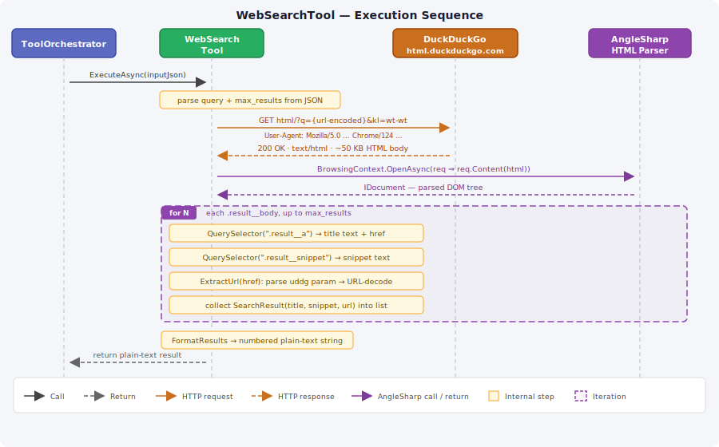
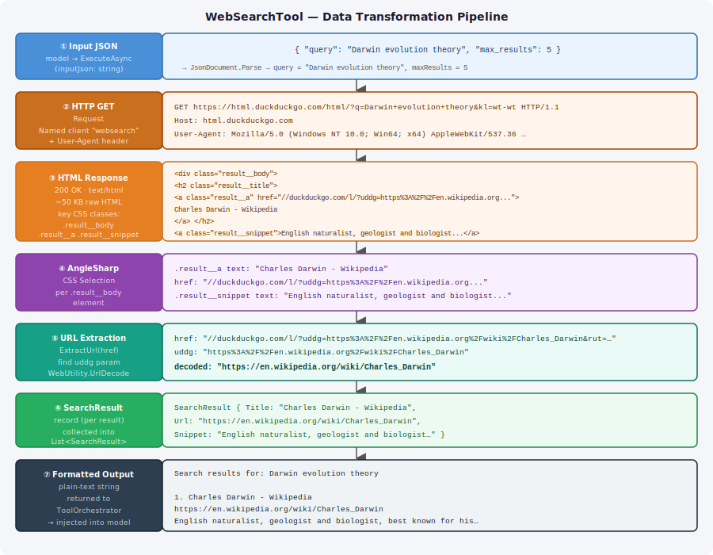

# WissensNest

## WebSearchTool — DuckDuckGo HTML Search

`WebSearchTool` gives the model access to live web search results. The user enables the `web_search` tool via the UI checkbox; the model decides when a query is appropriate and calls the tool with a JSON argument. This article covers how the tool is built — from the HTTP request it sends, through the HTML it receives, the AngleSharp parsing step, and the text it returns.

---

### Why DuckDuckGo HTML, Not an API

DuckDuckGo offers a public **Instant Answer API** (`api.duckduckgo.com`) that returns structured JSON. Its limitation is that it only covers Wikipedia-style infoboxes — it returns nothing for most factual queries and returns nothing at all for non-English content. The actual search results the browser displays come from a separate HTML page (`html.duckduckgo.com/html/`), which carries real SERP results for any language and any query. The tool scrapes that page.

---

### Execution Sequence



The four participants are:

| Participant | Role |
| --- | --- |
| `ToolOrchestrator` | Calls `ExecuteAsync` with the model's argument JSON; feeds the result back into conversation history |
| `WebSearchTool` | Parses input, builds the HTTP request, drives the AngleSharp parse, formats output |
| `DuckDuckGo html.duckduckgo.com` | Returns ~50 KB of HTML search results |
| `AngleSharp HTML Parser` | Turns the raw HTML string into a queryable DOM |

---

### Step 1 — Input Parsing

`ToolOrchestrator` calls `ExecuteAsync` with a raw JSON string that the model produced:

```json
{ "query": "Darwin evolution theory", "max_results": 5 }
```

`WebSearchTool` parses this with `System.Text.Json.JsonDocument`:

```csharp
query = root.GetProperty("query").GetString();
if (root.TryGetProperty("max_results", out var maxElem))
    maxResults = Math.Clamp(maxElem.GetInt32(), 1, 10);
```

`max_results` is optional (defaults to `5`), capped at `10` to keep output size manageable.

---

### Step 2 — HTTP Request

The tool uses a named `IHttpClientFactory` client called `"websearch"`. The client is pre-configured in `ServiceCollectionExtensions` with a real browser `User-Agent`:

```csharp
services.AddHttpClient("websearch", client =>
{
    client.DefaultRequestHeaders.UserAgent.ParseAdd(
        "Mozilla/5.0 (Windows NT 10.0; Win64; x64) AppleWebKit/537.36 (KHTML, like Gecko) Chrome/124.0.0.0 Safari/537.36");
});
```

The User-Agent is required. Without it, DuckDuckGo serves a degraded response or a CAPTCHA page.

The request URL is constructed as:

```csharp
$"https://html.duckduckgo.com/html/?q={WebUtility.UrlEncode(query)}&kl=wt-wt"
```

`kl=wt-wt` disables region bias so results are global rather than region-specific.

---

### Step 3 — The HTML Response

DuckDuckGo returns `200 OK` with `text/html` content — typically 40–80 KB of HTML. Each search result is structured like this in the DOM:

```html
<div class="result__body">
  <h2 class="result__title">
    <a class="result__a" href="//duckduckgo.com/l/?uddg=https%3A%2F%2Fen.wikipedia.org...">
      Charles Darwin - Wikipedia
    </a>
  </h2>
  <a class="result__snippet" href="...">
    English naturalist, geologist and biologist, best known for his contributions...
  </a>
</div>
```

Key observations:

- `.result__body` is the container for each result. `QuerySelectorAll(".result__body")` returns all results on the page.
- `.result__a` is the title anchor. Its `TextContent` is the display title.
- `.result__snippet` is the description anchor. Its `TextContent` is the snippet.
- The `href` on `.result__a` is **not the actual URL**. DuckDuckGo wraps every outgoing link through a redirect at `//duckduckgo.com/l/?uddg={url-encoded-real-url}&rut=…`. The actual URL is in the `uddg` query parameter.

---

### Step 4 — AngleSharp Parsing

The raw HTML string is passed to AngleSharp:

```csharp
var config = Configuration.Default;
using var context = BrowsingContext.New(config);
var document = await context.OpenAsync(req => req.Content(html), ct);
```

`Configuration.Default` creates a headless browser context — no network access, no JavaScript execution, pure HTML/CSS parsing. `OpenAsync` with `req.Content(html)` parses the string in-memory without making any HTTP calls.

The returned `IDocument` supports standard CSS selector queries. For each result element:

```csharp
foreach (var el in document.QuerySelectorAll(".result__body").Take(maxResults))
{
    var titleEl   = el.QuerySelector(".result__a");
    var snippetEl = el.QuerySelector(".result__snippet");

    var title   = titleEl.TextContent.Trim();
    var snippet = snippetEl?.TextContent.Trim() ?? "";
    var href    = (titleEl as IHtmlAnchorElement)?.Href
               ?? titleEl.GetAttribute("href") ?? "";
```

`IHtmlAnchorElement.Href` returns the fully resolved URL (AngleSharp normalizes `//duckduckgo.com/…` to `https://duckduckgo.com/…`), which simplifies the redirect-decoding step.

---

### Step 5 — URL Extraction

Every link in DuckDuckGo HTML goes through their redirect tracker:

```txt
https://duckduckgo.com/l/?uddg=https%3A%2F%2Fen.wikipedia.org%2Fwiki%2FCharles_Darwin&rut=…
```

`ExtractUrl` recovers the real URL:

```csharp
private static string ExtractUrl(string href)
{
    if (!href.Contains("duckduckgo.com/l/")) return href;

    var uri = new Uri(href);
    foreach (var segment in uri.Query.TrimStart('?').Split('&'))
    {
        var eq = segment.IndexOf('=');
        if (eq < 0) continue;
        if (WebUtility.UrlDecode(segment[..eq]) == "uddg")
            return WebUtility.UrlDecode(segment[(eq + 1)..]);
    }
    return href;
}
```

The function:

1. Short-circuits if the href doesn't look like a DDG redirect.
2. Parses the `Uri` to isolate the query string.
3. Splits on `&` and iterates key/value pairs.
4. Returns the URL-decoded value of the `uddg` parameter.

No third-party query-string parser is used — `System.Net.WebUtility.UrlDecode` is sufficient.

---

### Step 6 — Result Formatting

The collected `SearchResult` records are formatted into a plain-text string:

```csharp
private static string FormatResults(string query, List<SearchResult> results)
{
    var sb = new StringBuilder();
    sb.AppendLine($"Search results for: {query}");
    sb.AppendLine();

    for (int i = 0; i < results.Count; i++)
    {
        var r = results[i];
        sb.AppendLine($"{i + 1}. {r.Title}");
        if (!string.IsNullOrWhiteSpace(r.Url))
            sb.AppendLine($"   {r.Url}");
        if (!string.IsNullOrWhiteSpace(r.Snippet))
            sb.AppendLine($"   {r.Snippet}");
        sb.AppendLine();
    }
    return sb.ToString().TrimEnd();
}
```

The output is intentionally plain text — no Markdown, no HTML. Tool results are intermediate messages consumed by the model, not rendered for the user. Markdown in tool output adds formatting noise that can confuse the model when it tries to extract information.

**Example output:**

```text
Search results for: Darwin evolution theory

1. Charles Darwin - Wikipedia
   https://en.wikipedia.org/wiki/Charles_Darwin
   English naturalist, geologist and biologist, best known for his contributions...

2. Evolution - Wikipedia
   https://en.wikipedia.org/wiki/Evolution
   Evolution is the change in the heritable characteristics of biological populations...
```

---

### Data Transformation at a Glance

The diagram below shows what the data looks like at each stage of the pipeline, from the model's JSON input to the formatted string the model reads back.



---

### Registration

```csharp
// WissensNest.Tools.WebSearch/ServiceCollectionExtensions.cs
public static IServiceCollection AddWebSearch(this IServiceCollection services)
{
    services.AddHttpClient("websearch", client =>
    {
        client.DefaultRequestHeaders.UserAgent.ParseAdd(
            "Mozilla/5.0 (Windows NT 10.0; Win64; x64) AppleWebKit/537.36 …");
    });
    services.AddSingleton<ITool, WebSearchTool>();
    return services;
}
```

`WebSearchTool` is registered as a singleton. The `IHttpClientFactory` is injected via constructor. The named client `"websearch"` is created on each request via `_httpFactory.CreateClient("websearch")` — the factory manages connection pooling and lifetime automatically.

---

### Known Limitations and Future Work

| Concern | Detail |
| --- | --- |
| HTML structure fragility | CSS class names (`.result__body`, `.result__a`, `.result__snippet`) can change without notice if DuckDuckGo redesigns their HTML page. Fix: update the selectors. |
| No ranking signal | Results are returned in DuckDuckGo's ranking order; there is no way to ask for more results than one page returns. |
| `max_results` cap | Capped at 10 to prevent excessive context growth in the model's next turn. |
| SearXNG alternative | A self-hosted SearXNG instance can replace DuckDuckGo as the backend. It returns JSON (no scraping), supports multiple engines, and is fully private. The `ExecuteAsync` body would be swapped; the ITool interface, registration, and output format remain unchanged. |

---

### Referenced Files

| File | Role |
| --- | --- |
| [WebSearchTool.cs](../../Src/Tools/WissensNest.Tools.WebSearch/WebSearchTool.cs) | Full implementation |
| [ServiceCollectionExtensions.cs](../../Src/Tools/WissensNest.Tools.WebSearch/ServiceCollectionExtensions.cs) | DI registration + named client config |
| [WissensNest.Tools.WebSearch.csproj](../../Src/Tools/WissensNest.Tools.WebSearch/WissensNest.Tools.WebSearch.csproj) | Project file — `AngleSharp 1.4.0`, `Microsoft.Extensions.Http` |
| [16_Tools.md](./16_Tools.md) | Tool framework — ITool, ParametersSchema, output formatting rules |
