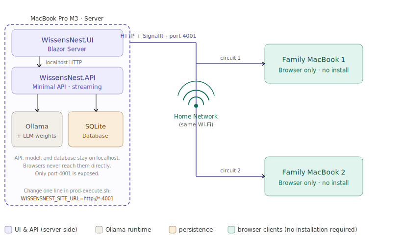

# WissensNest

## Family Network Access — Share the Assistant Without Installing Anything

WissensNest runs on a single MacBook Pro. Family members on other Macs in the same home network can use it by opening a browser — no model, no database, no code required on their side. This article explains why that works and how to set it up in five steps.

---

### Why Blazor Server Makes This Possible

`WissensNest.UI` is a **Blazor Server** application. Blazor Server runs all component logic on the server. The browser receives HTML and communicates back over a persistent WebSocket (SignalR). The browser is a thin display terminal — it renders what the server sends and reports UI events back.

This means a family member's browser connects to the MacBook's UI service and gets a fully functional chat interface. The browser makes no direct calls to the API, Ollama, or the database — all of that happens server-side, over localhost connections that never leave the machine.

Each browser session gets an independent **Blazor circuit**: a dedicated SignalR connection backed by its own `ChatState` and `StreamingService` instances. Two family members chatting simultaneously do not interfere with each other.



---

### What Runs Where

| Component | Runs on | Accessed by |
| --- | --- | --- |
| Ollama + LLM weights | MacBook Pro | API — server-side only, over localhost |
| SQLite database | MacBook Pro | API — server-side only, over localhost |
| `WissensNest.API` | MacBook Pro | UI server — server-side only, over localhost |
| `WissensNest.UI` (Blazor Server) | MacBook Pro | Browsers on the local network, port 4001 |
| Browser | Each family Mac | Connects to the UI server on port 4001 |

Only port 4001 (the UI) needs to be reachable from the network. The API on port 4000 stays on localhost and is contacted exclusively by the UI server process running on the same machine.

---

### Step-by-Step Setup

#### Step 1 — Find the MacBook's local address

Open Terminal and run:

```bash
ipconfig getifaddr en0     # Wi-Fi (most common on Apple Silicon)
ipconfig getifaddr en1     # Ethernet
```

This returns the local IP, e.g. `192.168.1.42`.

Alternatively, macOS Bonjour provides a stable hostname that doesn't change when the router reassigns the IP:

```bash
hostname -s                # e.g. "myname-macbook"
# family accesses via: http://myname-macbook.local:4001
```

Find the full local hostname in **System Settings → General → Sharing → Local hostname**. The `.local` hostname is recommended — it stays stable across DHCP renewals without needing a router reservation.

---

#### Step 2 — Change the URL binding in `prod-execute.sh`

Open [`CICD/prod-execute.sh`](../../CICD/prod-execute.sh) and change one line:

```bash
# Before — listens only on the loopback interface
export WISSENSNEST_SITE_URL="http://localhost:4001"

# After — listens on all network interfaces
export WISSENSNEST_SITE_URL="http://*:4001"
```

`*` tells Kestrel to accept connections on every network interface, not just the loopback. ASP.NET Core passes this value directly to `app.Urls.Add(...)` in `WissensNest.UI/Program.cs`.

Leave `WISSENSNEST_API_URL` unchanged at `http://localhost:4000`. The API is only contacted by the UI server process (running on the same Mac) and does not need to be reachable from other machines.

---

#### Step 3 — Allow the port in macOS Firewall

macOS shows a network permission dialog the first time an app listens on a port reachable from the network. When the dialog appears, click **Allow**.

If the dialog does not appear or the firewall blocks connections silently:

1. Open **System Settings → Network → Firewall**.
2. Click **Options…** and verify that the WissensNest UI binary is listed and set to **Allow incoming connections**.
3. If the firewall is off entirely, no action is needed.

---

#### Step 4 — Start the services

```bash
./CICD/prod-run-osx.sh --no-browser
```

The `--no-browser` flag prevents the script from opening a local browser window on the server Mac (optional). The services start as usual. Confirm in the startup output that the UI shows `http://*:4001` rather than `http://localhost:4001`.

---

#### Step 5 — Family opens the browser

On any Mac connected to the same Wi-Fi, open:

```
http://myname-macbook.local:4001
```

or using the IP address directly:

```
http://192.168.1.42:4001
```

No installation required. The full chat interface loads in the browser. Conversations, projects, and prompt collections are shared from the same database.

---

### Concurrent Sessions

Each browser session is an independent Blazor circuit. The relevant services are registered as `AddScoped<>` — one instance per circuit — so two family members chatting simultaneously will not interfere:

| Service | Scope | Effect |
| --- | --- | --- |
| `ChatState` | Per-circuit | Each user has their own active project and conversation |
| `StreamingService` | Per-circuit | Each user has their own in-flight stream state |
| SQLite database | Shared | Conversations and messages from all users land in the same DB |
| Ollama | Shared | Requests queue; one response streams at a time |

For a family of 3–5 people, the single Ollama instance queuing requests is not a problem in practice.

---

### Limitations

| Concern | Detail |
| --- | --- |
| Ollama concurrency | A single Ollama instance handles one generation at a time. Concurrent requests queue. Acceptable for home use. |
| SQLite writes | SQLite serializes writes at the WAL layer. Concurrent reads are fine. Acceptable for family scale. |
| No authentication | Anyone on the home network can access the UI. Acceptable for a trusted LAN; not suitable for public exposure. |
| LAN only | No port forwarding is set up or recommended. Access works only within the home network. |

---

### What Does Not Change

- `WISSENSNEST_API_URL` stays `http://localhost:4000` — the API is never contacted directly by browsers.
- No code changes are required anywhere in the solution.
- The database path, Ollama configuration, and all other settings remain the same.
- Existing conversations and projects continue to work normally for the local user on the server Mac.

---

### Referenced Files

| File | Role |
| --- | --- |
| [`CICD/prod-execute.sh`](../../CICD/prod-execute.sh) | The one line to change: `WISSENSNEST_SITE_URL` |
| [`Src/Services/WissensNest.UI/Program.cs`](../../Src/Services/WissensNest.UI/Program.cs) | Reads `WISSENSNEST_SITE_URL` and passes it to `app.Urls.Add(...)` |
| [`Src/Foundation/WissensNest.Contracts/CommonUtils/UrlInfo.cs`](../../Src/Foundation/WissensNest.Contracts/CommonUtils/UrlInfo.cs) | Parses the URL string; supports `*` as a wildcard host |
