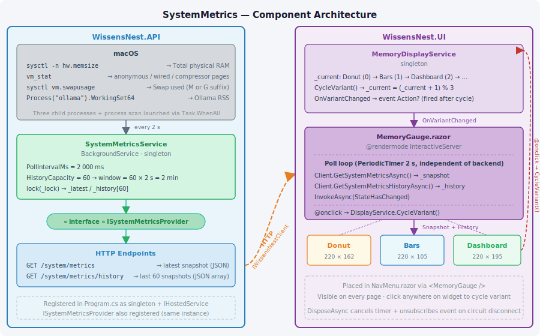
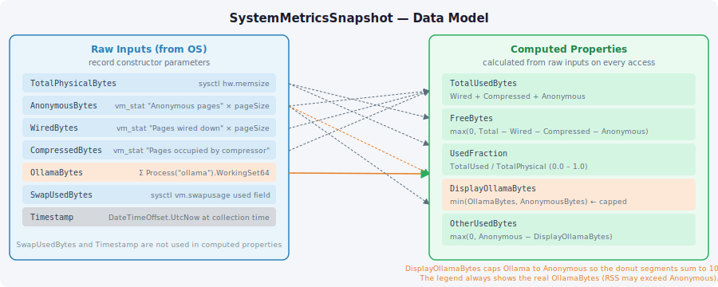
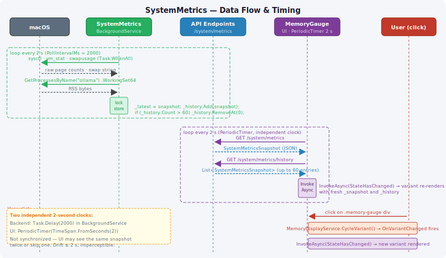
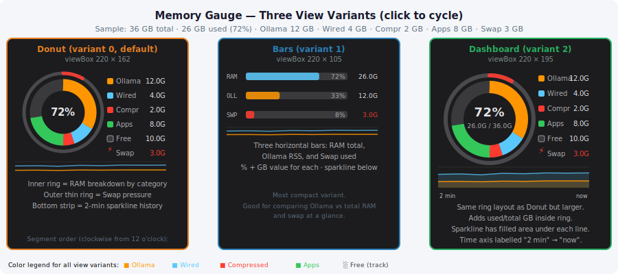

# WissensNest

## Resource Monitor — SystemMetrics

The resource monitor is a live memory widget that lives in the navigation sidebar and updates every 2 seconds. It shows how the MacBook Pro's 36 GB of RAM is split between Ollama's model weights, the kernel, compressed pages, other apps, and free space — plus a rolling 2-minute sparkline history. Clicking the widget cycles through three visual variants.

---

### Architecture



The feature spans two processes. `WissensNest.API` owns all data collection — a `BackgroundService` polls macOS every 2 seconds and exposes the results via two HTTP endpoints. `WissensNest.UI` owns all display — a Blazor component polls those endpoints on its own 2-second timer and renders the chosen variant. A singleton `MemoryDisplayService` tracks which variant is currently active and fires an event when it changes.

| Assembly | Role |
| --- | --- |
| `WissensNest.API` | Collects metrics, stores history, serves two GET endpoints |
| `WissensNest.Contracts` | `SystemMetricsSnapshot` record shared across both sides |
| `WissensNest.Client` | `IWissensNestClient` typed HTTP client used by the UI |
| `WissensNest.UI` | `MemoryDisplayService` singleton + `MemoryGauge` component + three variant components |

---

### SystemMetricsService

**File:** `Src/Services/WissensNest.API/Services/SystemMetricsService.cs`

A `BackgroundService` that runs a continuous poll loop. On every tick it launches three child processes in parallel via `Task.WhenAll`, then performs one in-process scan:

| Source | Command | Data |
| --- | --- | --- |
| Total RAM | `sysctl -n hw.memsize` | Total physical bytes |
| Page breakdown | `vm_stat` | Page size, anonymous pages, wired pages, compressor pages |
| Swap | `sysctl vm.swapusage` | Swap used (parses `M` or `G` suffix) |
| Ollama RSS | `Process.GetProcessesByName("ollama")` | Sum of `.WorkingSet64` across all Ollama processes |

Results are assembled into a `SystemMetricsSnapshot` and stored under a `lock`. The history list is a sliding window: when it exceeds `HistoryCapacity`, the oldest entry is removed.

The service is registered three ways so one instance serves all roles:

```csharp
builder.Services.AddSingleton<SystemMetricsService>();
builder.Services.AddSingleton<ISystemMetricsProvider>(sp =>
    sp.GetRequiredService<SystemMetricsService>());
builder.Services.AddHostedService(sp =>
    sp.GetRequiredService<SystemMetricsService>());
```

Two HTTP endpoints expose the stored data:

```
GET  /system/metrics          →  ISystemMetricsProvider.Latest  (single snapshot)
GET  /system/metrics/history  →  ISystemMetricsProvider.History (up to 60 snapshots)
```

---

### SystemMetricsSnapshot — Data Model



**File:** `Src/Foundation/WissensNest.Contracts/Models/SystemMetricsSnapshot.cs`

The record holds seven raw inputs and five computed properties:

```csharp
public record SystemMetricsSnapshot(
    long TotalPhysicalBytes,
    long AnonymousBytes,       // = Activity Monitor "App Memory"
    long WiredBytes,
    long CompressedBytes,
    long OllamaBytes,          // raw RSS from process inspection
    long SwapUsedBytes,
    DateTimeOffset Timestamp)
{
    public long TotalUsedBytes     => WiredBytes + CompressedBytes + AnonymousBytes;
    public long FreeBytes          => Max(0, Total - Wired - Compressed - Anonymous);
    public double UsedFraction     => TotalUsed / TotalPhysical;
    public long DisplayOllamaBytes => Min(OllamaBytes, AnonymousBytes);  // capped
    public long OtherUsedBytes     => Max(0, AnonymousBytes - DisplayOllamaBytes);
}
```

**Why `DisplayOllamaBytes` exists:** Ollama maps its model weights as memory-mapped file-backed pages (`mmap`). These pages do not appear in `vm_stat`'s "Anonymous pages" count, so `OllamaBytes` (from process RSS) can be larger than `AnonymousBytes`. Without the cap, the Ollama segment in the donut ring would overflow the App Memory arc and the segments would not sum to 100%. `DisplayOllamaBytes` is used only for the visual ring geometry; the legend always shows the real `OllamaBytes`.

---

### MemoryDisplayService

**File:** `Src/Services/WissensNest.UI/Services/MemoryDisplayService.cs`

A lightweight singleton that owns the active variant and fires an event on change:

```csharp
public enum MemoryGaugeVariant { Donut, Bars, Dashboard }

public sealed class MemoryDisplayService
{
    private MemoryGaugeVariant _current = MemoryGaugeVariant.Donut;
    public MemoryGaugeVariant Current => _current;
    public event Action? OnVariantChanged;

    public void CycleVariant()
    {
        _current = (MemoryGaugeVariant)(((int)_current + 1) % 3);
        OnVariantChanged?.Invoke();
    }
}
```

The cycle is: `Donut → Bars → Dashboard → Donut → …`

`MemoryGauge.razor` subscribes to `OnVariantChanged` in `OnInitialized` and calls `InvokeAsync(StateHasChanged)` inside the handler to re-render on the Blazor circuit thread. It unsubscribes in `DisposeAsync` when the circuit disconnects.

---

### MemoryGauge — Container Component

**File:** `Src/Services/WissensNest.UI/Components/Layout/MemoryGauge.razor`

The container owns the poll loop and passes `_snapshot` and `_history` down as parameters to whichever variant is active. Startup sequence:

```
OnInitialized()          → subscribe to MemoryDisplayService.OnVariantChanged
OnAfterRenderAsync(true) → create PeriodicTimer(2 s), launch PollAsync() background Task

PollAsync():
  do {
    _snapshot = await Client.GetSystemMetricsAsync()
    _history  = await Client.GetSystemMetricsHistoryAsync()
    await InvokeAsync(StateHasChanged)
  } while (await _timer.WaitForNextTickAsync(ct))

DisposeAsync():
  unsubscribe OnVariantChanged
  _cts.Cancel()   →  PollAsync exits at next WaitForNextTickAsync
  _timer.Dispose()
```

The `<div class="memory-gauge">` wrapper carries `@onclick="CycleVariant"`, so clicking anywhere on the widget advances the variant.

---

### Data Flow & Timing



There are **two independent 2-second clocks**. The backend `Task.Delay(2000)` and the UI `PeriodicTimer(2 s)` are not synchronized. The UI may receive the same snapshot twice between backend ticks, or skip one if its tick arrives just before the backend stores a new snapshot. The drift is at most 2 seconds and is imperceptible in practice.

---

### Gauge Variants



All three variants render as inline SVGs using `class="mg-svg"` and receive the same two parameters: `Snapshot` (current snapshot) and `History` (up to 60 snapshots for the sparkline).

#### Donut (variant 0, default)

**File:** `Src/Services/WissensNest.UI/Components/Layout/MemoryGaugeDonut.razor` — `viewBox="0 0 220 162"`

The inner donut ring (radius 40, stroke-width 17) is divided into four arc segments using `stroke-dasharray` on overlapping `<circle>` elements, each rotated to its start angle. Segments are ordered clockwise from 12 o'clock:

| Segment | Color | Value |
| --- | --- | --- |
| Ollama | Amber `#FF9500` | `DisplayOllamaBytes` |
| Wired | Cyan `#5AC8FA` | `WiredBytes` |
| Compressed | Red `#FF3B30` | `CompressedBytes` |
| Apps | Green `#34C759` | `OtherUsedBytes` |
| Free | Dark track `#3a3a3c` | Remainder (no element drawn) |

A thinner outer ring (radius 57, stroke-width 5) shows Swap pressure. The centre displays the used-RAM percentage. A legend occupies the right half. A 18 px-tall sparkline strip runs across the full width at the bottom, showing total-used (cyan) and Ollama (amber) over the 2-minute history window.

#### Bars (variant 1)

**File:** `Src/Services/WissensNest.UI/Components/Layout/MemoryGaugeBars.razor` — `viewBox="0 0 220 105"`

Three horizontal bars for RAM total (cyan), Ollama RSS (amber), and Swap (red). Each bar shows a monospace label on the left, a percentage inside the bar, and a GB value on the right. A 15 px-tall sparkline runs below all three bars.

#### Dashboard (variant 2)

**File:** `Src/Services/WissensNest.UI/Components/Layout/MemoryGaugeDashboard.razor` — `viewBox="0 0 220 195"`

The largest variant. Same donut ring as Donut but with larger geometry (radius 47, stroke-width 18, swap ring radius 64). The centre shows both the percentage and `used / total` in GB. The sparkline is 30 px tall with filled area under each line (opacity 0.15 / 0.2). The time axis carries labels `"2 min"` (left) and `"now"` (right).

#### Sparkline rendering

All three variants build their sparkline polylines in `BuildPolyline()`. The method maps each history entry to an `(x, y)` point:

```csharp
double x = (double)i / (History.Count - 1) * width;
double y = baseY - selector(snapshot) * height;
```

`Dashboard` additionally builds a closed `BuildAreaPath()` that adds `M x0,baseY … L xN,baseY Z` to fill the area under the line.

---

### Tuning Refresh Speed

There are exactly **three constants and one label** to change.

#### Backend collection interval

**File:** `Src/Services/WissensNest.API/Services/SystemMetricsService.cs` — line 17

```csharp
private const int PollIntervalMs = 2000;
```

Controls how often the OS is queried. Each tick spawns three child processes. Going below 500 ms is not recommended — the process-launch overhead on macOS ARM becomes significant.

#### History window depth

**File:** `Src/Services/WissensNest.API/Services/SystemMetricsService.cs` — line 16

```csharp
private const int HistoryCapacity = 60;
```

The sparkline always spans exactly `HistoryCapacity` samples. Total time covered = `HistoryCapacity × PollIntervalMs`. Current defaults: 60 × 2 s = **120 s = 2 min**.

If you change `PollIntervalMs` or `HistoryCapacity`, update the Dashboard time label to match:

**File:** `Src/Services/WissensNest.UI/Components/Layout/MemoryGaugeDashboard.razor` — line 104

```razor
@ST(2, 193, "2 min", 8, "#c4c4c6")   ← update this string
```

#### UI poll interval

**File:** `Src/Services/WissensNest.UI/Components/Layout/MemoryGauge.razor` — line 48

```csharp
_timer = new PeriodicTimer(TimeSpan.FromSeconds(2));
```

Controls how often the Blazor component fetches from the API. Setting it faster than `PollIntervalMs` makes extra HTTP calls that return the same data. Setting it slower makes the UI lag behind reality by up to `UI interval` seconds.

#### Summary

| Constant | File | Line | Default | Effect |
| --- | --- | --- | --- | --- |
| `PollIntervalMs` | `SystemMetricsService.cs` | 17 | 2000 ms | How often macOS is queried |
| `HistoryCapacity` | `SystemMetricsService.cs` | 16 | 60 entries | Sparkline window = depth × poll rate |
| Dashboard time label | `MemoryGaugeDashboard.razor` | 104 | `"2 min"` | Keep in sync with the two above |
| UI timer | `MemoryGauge.razor` | 48 | 2 s | How often the UI fetches from the API |
