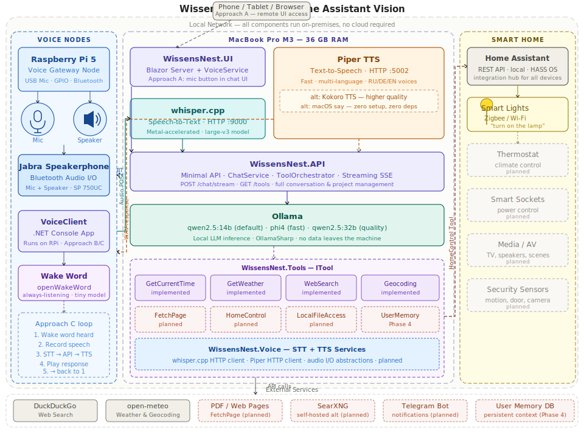
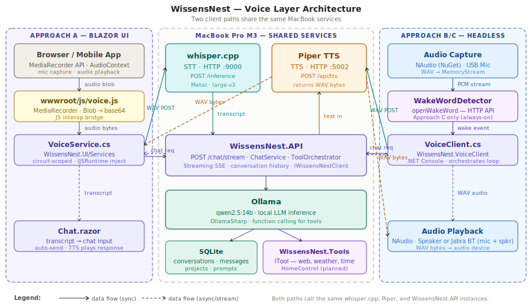
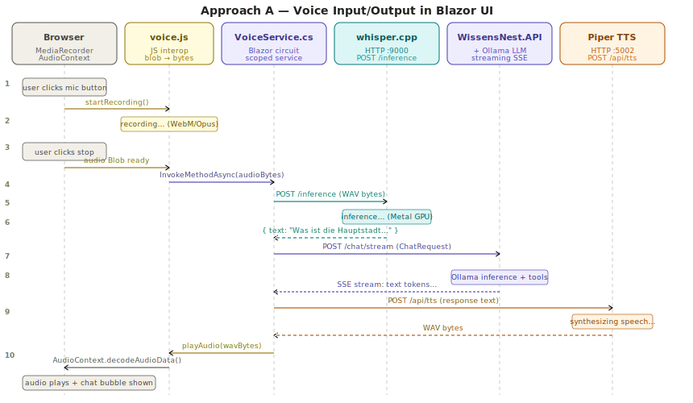
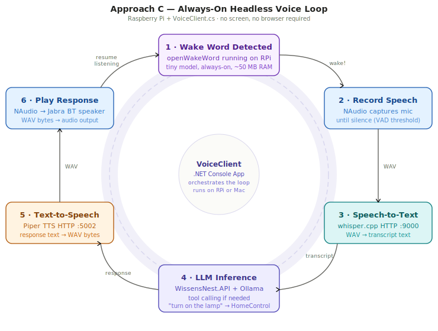
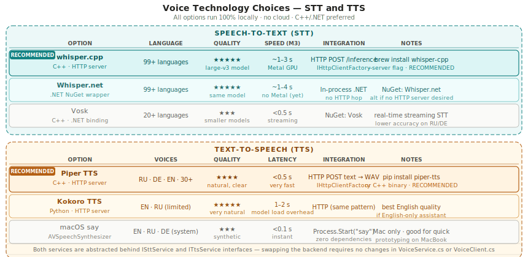

# WissensNest

## Voice Interface — STT, TTS, and the Home Assistant Vision

WissensNest can grow beyond a chat window. This article covers how to give the system ears and a voice — letting family members speak to it naturally, from inside the Blazor UI or from anywhere in the home through a dedicated voice node. The same infrastructure also enables home automation: the model calls a `HomeControlTool` and a lamp turns on.

Everything runs locally. No cloud. No subscription. No audio ever leaves the network.

---

### The Ideal System



The diagram above shows the complete picture. Three zones connect over the local network:

| Zone | Hardware | Role |
| --- | --- | --- |
| **Voice Nodes** | Raspberry Pi 5 + USB mic + speaker | Captures and plays voice in the room |
| **Brain** | MacBook Pro M3 36 GB | All software: WissensNest, Ollama, whisper, Piper |
| **Smart Home** | Zigbee/Wi-Fi devices via Home Assistant | Devices the model can control |

A phone or browser can also reach `WissensNest.UI` directly for the Blazor chat interface. The Jabra is a bidirectional Bluetooth speakerphone — it provides both microphone input and speaker output. It can be paired with either the MacBook (replacing or supplementing the built-in mic/speakers) or with the Raspberry Pi as a standalone room audio device.

---

### Prerequisites

#### Audio Services (run on the MacBook)

Both services run as long-lived HTTP servers. They start once and stay running.

##### whisper.cpp — Speech-to-Text

```bash
brew install whisper-cpp

# Download the large-v3 model — preferred: built-in downloader (~3.1 GB)
whisper-cpp-download-ggml-model large-v3
# model lands at ~/.cache/whisper/ggml-large-v3.bin

# Alternative: download directly to ~/Models/ (used by prod-execute.sh)
curl -L -o ~/Models/ggml-large-v3.bin \
  https://huggingface.co/ggerganov/whisper.cpp/resolve/main/ggml-large-v3.bin

# Start the HTTP server (Metal-accelerated on Apple Silicon)
whisper-server --model ~/Models/ggml-large-v3.bin --host 0.0.0.0 --port 9000 --language auto
```

The server exposes `POST /inference`. Send a WAV file as `multipart/form-data`; receive a JSON object with a `text` field.

##### Piper TTS — Text-to-Speech

```bash
pip install piper-tts

# Download voices (example: Russian, German, English)
python -m piper --download-dir ~/.local/share/piper-voices ru_RU-irina-medium
python -m piper --download-dir ~/.local/share/piper-voices de_DE-thorsten_emotional-medium
python -m piper --download-dir ~/.local/share/piper-voices en_US-bryce-medium

# Piper does not ship a built-in HTTP server; wrap it with a small FastAPI:
# see piper-server.py below
```

The list of available voices can be found at the [Piper Voice site](https://rhasspy.github.io/piper-samples/).

The FastAPI wrapper lives at `CICD/piper-server.py` (implemented in Stage 5.2). It exposes:

- `GET /voices` — returns `{ "voices": ["en_US-bryce-medium", ...] }` — sorted stems of all installed `.onnx` models
- `POST /api/tts` — JSON body `{ "text": "...", "voice": "en_US-bryce-medium" }`; returns `audio/wav`
- `GET /health` — returns current config (models dir, default voice)

Voices are resolved against `~/Models/piper/` (override with `PIPER_MODELS_DIR`). Default voice is configurable via `PIPER_DEFAULT_VOICE`. Port via `PIPER_PORT` (default 5002).

Start it with:

```bash
python3 CICD/piper-server.py
```

Dependencies: `pip install fastapi uvicorn` (piper itself must be on PATH via `pipx`).

Alternative: use the community `wyoming-piper` server which implements the Wyoming voice protocol.

#### Hardware

| Item | Purpose | Notes |
| --- | --- | --- |
| Raspberry Pi 5 (4 GB+) | Voice gateway node | Approach B/C only |
| USB microphone | Audio input on RPi | Any USB mic; directional is better |
| Jabra SP 750UC | Bluetooth speakerphone (mic + speaker) | Paired to MacBook or RPi — replaces separate mic + speaker |
| Zigbee USB stick (SkyConnect etc.) | Smart home devices | Home Assistant integration |

#### NuGet Packages (for .NET voice components)

| Package | Purpose |
| --- | --- |
| `NAudio` | Microphone capture and audio playback on macOS/Windows/Linux |
| `Whisper.net` | Optional: in-process Whisper without a separate HTTP server |
| `Microsoft.Extensions.Http` | Already present — `IHttpClientFactory` for whisper and Piper calls |

---

### Three Integration Approaches

#### Approach A — Voice in the Blazor UI

Add a mic button to `Chat.razor`. The user clicks to speak; the transcript fills the chat input automatically; the response is synthesized and played back through the browser.



Both Approach A (Blazor UI) and Approach B/C (headless) share the same whisper.cpp and Piper servers on the MacBook. The only difference is the client path.

**New files:**

| File | Role |
| --- | --- |
| `WissensNest.UI/Services/VoiceService.cs` | Circuit-scoped service; calls whisper and Piper over HTTP; uses `IJSRuntime` for audio I/O |
| `WissensNest.UI/wwwroot/js/voice.js` | `MediaRecorder` start/stop; sends audio blob to .NET; decodes and plays WAV via `AudioContext` |
| `WissensNest.Voice/Interfaces/ISttService.cs` | `Task<string> TranscribeAsync(byte[] audio, string? language = null, CancellationToken)` — **DONE** (Stage 5.2) |
| `WissensNest.Voice/Interfaces/ITtsService.cs` | `SynthesizeAsync(text, voice?, ct)` + `GetVoicesAsync(ct)` — **DONE** (Stage 5.2 / 5.3) |

Interfaces and their HTTP implementations live in the shared `WissensNest.Voice` assembly (Stage 5.2).
`VoiceService` will delegate to them; named clients `"stt"` and `"tts"` are already registered via `AddVoice(config)` in `IHttpClientFactory`.

**Sequence:**



1. User clicks mic → `MediaRecorder` starts capturing (WebM/Opus in browser).
2. User clicks stop → JS sends audio blob bytes to `VoiceService.cs` via `InvokeMethodAsync`.
3. `VoiceService` converts to WAV and POSTs to whisper.cpp `:9000/inference`.
4. whisper returns the transcript text.
5. `VoiceService` injects the transcript into the chat input and auto-submits.
6. `WissensNest.API` processes the chat request, streams the response.
7. `VoiceService` collects the full response text and POSTs to Piper `:5002/api/tts`.
8. Piper returns WAV bytes; `VoiceService` calls JS to play them via `AudioContext`.

**Key implementation note:** `MediaRecorder` in Chrome/Edge produces WebM/Opus, not WAV. whisper.cpp accepts WAV (PCM). `VoiceService` must convert: either use `NAudio` in-process or call a small FFMPEG shim. The simplest path is `ffmpeg -i input.webm -ar 16000 -ac 1 -f wav output.wav` via `Process.Start` — ffmpeg is available via Homebrew.

**HTTPS requirement:** `MediaRecorder` requires a secure context (HTTPS or `localhost`). For LAN access from a phone, the API and UI must be served over HTTPS or via a local reverse proxy (Caddy with a self-signed cert).

---

#### Approach B — Standalone Headless Voice Client

A `.NET` console app (`WissensNest.VoiceClient`) that runs on the MacBook or on the Raspberry Pi. No browser, no screen required. Speak → get an answer through the speaker.

**Assembly:** `Src/Tools/WissensNest.VoiceClient/` — references `WissensNest.Client` (for `IWissensNestClient`) and `WissensNest.Contracts`.

**Core loop:**

```csharp
while (!ct.IsCancellationRequested)
{
    var audio = await _audioCapture.RecordUntilSilenceAsync(ct);   // NAudio
    var text  = await _stt.TranscribeAsync(audio, ct);             // whisper.cpp HTTP
    if (string.IsNullOrWhiteSpace(text)) continue;

    var response = await _client.StreamChatAsync(                  // WissensNest.API SSE
        BuildRequest(text), ct).CollectAsync();
    var wav = await _tts.SynthesizeAsync(response, voice: "ru_RU-irina-medium", ct); // Piper
    await _audioPlayback.PlayAsync(wav, ct);                        // NAudio
}
```

`ISttService` and `ITtsService` are injected — the same interfaces used by `VoiceService.cs` in the UI. The implementations (`WhisperSttService`, `PiperTtsService`) live in a shared `WissensNest.Voice` assembly and are reused by both paths.

---

#### Approach C — Always-On Smart Speaker

Extends Approach B with a wake word detector. The device listens passively all the time; a trigger phrase starts the conversation.



The loop has six stages:

| Stage | What happens |
| --- | --- |
| **1 · Wake word** | `openWakeWord` (tiny ML model, ~50 MB RAM) listens on the audio stream continuously |
| **2 · Record** | Voice Activity Detection (VAD) captures speech until silence (~0.8 s gap) |
| **3 · STT** | WAV → whisper.cpp → transcript |
| **4 · LLM** | Transcript → `WissensNest.API` → Ollama + tools |
| **5 · TTS** | Response text → Piper → WAV bytes |
| **6 · Play** | WAV → NAudio → speaker/Jabra |

Then back to stage 1.

**Wake word options:**

| Option | Language | Accuracy | Setup |
| --- | --- | --- | --- |
| `openWakeWord` | Python HTTP server | High | `pip install openwakeword`; expose via HTTP |
| `Porcupine` (Picovoice) | .NET SDK available | Very high | Free tier; custom keywords |
| Custom keyword phrase | Whisper (no wake word) | N/A | Use silence-triggered recording only |

For the Raspberry Pi deployment, `openWakeWord` runs as a sidecar HTTP service. `VoiceClient` polls its endpoint on each audio chunk.

---

### Home Control via Tools

Voice control of smart devices plugs directly into the existing `ITool` framework. No changes to `WissensNest.API` are needed — just add a new tool assembly.

**Assembly:** `WissensNest.Tools.HomeControl` → references `WissensNest.Contracts` only.

**Tool name:** `home_control`

**Parameters:**

```json
{
  "action": { "type": "string", "enum": ["turn_on", "turn_off", "toggle", "set_brightness", "set_temperature"] },
  "entity": { "type": "string", "description": "Home Assistant entity ID, e.g. light.living_room" },
  "value": { "type": "number", "description": "Brightness 0-100 or temperature in °C (optional)" }
}
```

**Execution:** POSTs to Home Assistant's REST API:

```http
POST http://homeassistant.local:8123/api/services/light/turn_on
Authorization: Bearer <long-lived-token>
{ "entity_id": "light.living_room", "brightness_pct": 80 }
```

**Example conversation:**

> User: "Включи лампу в гостиной на 80 процентов"
>
> Model: *(calls `home_control` with `action=turn_on`, `entity=light.living_room`, `value=80`)*
>
> Model: "Лампа в гостиной включена на 80%."

Home Assistant supports 3,000+ device integrations (Zigbee, Z-Wave, Wi-Fi, MQTT). The tool does not need to know about device protocols — it talks to Home Assistant's single REST API.

---

### Technology Decision Matrix



The recommended combination is **whisper.cpp + Piper**, both exposed as HTTP servers. This keeps the .NET code clean (`IHttpClientFactory` calls) and lets any future client — RPi, phone app, MAUI desktop — use the same services without an in-process dependency.

Both services are abstracted behind `ISttService` and `ITtsService`. Swapping Piper for Kokoro TTS requires changing one registration line; nothing in `VoiceService.cs` or `VoiceClient.cs` changes.

---

### New Solution Structure

```text
Src/
  Foundation/
    WissensNest.Voice/           ← DONE — ISttService, ITtsService, WhisperSttService, PiperTtsService
  Services/
    WissensNest.UI/
      Services/
        VoiceService.cs          ← planned (Stage 5.3) — circuit-scoped, uses WissensNest.Voice
      wwwroot/js/
        voice.js                 ← planned (Stage 5.3) — MediaRecorder, AudioContext
  Tools/
    WissensNest.Tools.HomeControl/   ← planned (Stage 5.6) — HomeControlTool, HASS REST client
  Clients/
    WissensNest.VoiceClient/     ← planned (Stage 5.4) — .NET console app for headless mode (Approach B/C)
CICD/
    piper-server.py              ← DONE — FastAPI wrapper for Piper TTS
```

**Dependency rules:**

```text
WissensNest.Voice          → WissensNest.Contracts, Microsoft.Extensions.Http
WissensNest.UI             → WissensNest.Voice (add)
WissensNest.VoiceClient    → WissensNest.Voice, WissensNest.Client, WissensNest.Contracts
WissensNest.Tools.HomeControl → WissensNest.Contracts
WissensNest.API            → WissensNest.Tools.HomeControl (add when ready)
```

---

### Hardware Topology — Raspberry Pi as Voice Node

The Raspberry Pi runs `WissensNest.VoiceClient` and optionally the wake word detector. It needs only HTTP access to the MacBook — no GPU, no Ollama, no database.

```text
RPi 5 (voice node)                  MacBook Pro M3 (brain)
┌───────────────────---───┐            ┌───────────────────────────┐
│  USB mic → NAudio       │            │  whisper.cpp :9000 (STT)  │
│  openWakeWord sidecar   │ ─ HTTP ──► │  WissensNest.API :5000    │
│  NAudio → speaker       │ ◄─ HTTP ── │  Piper TTS :5002          │
│  Jabra BT (mic+speaker) │            │  Ollama + LLM             │
└────────────────────---──┘            └───────────────────────────┘
```

The RPi can also host a second instance of Home Assistant or a Zigbee USB coordinator — making it a full smart home hub that happens to also be the voice gateway.

---

### Implementation Order

1. ~~**Start the two audio servers** — whisper.cpp and Piper as launchd daemons or terminal processes. Validate with `curl`.~~ **DONE** (Stage 5.1)
2. ~~**Build `WissensNest.Voice`** — `ISttService`, `ITtsService`, and their HTTP implementations using named `IHttpClientFactory` clients.~~ **DONE** (Stage 5.2) — also includes `CICD/piper-server.py` FastAPI wrapper.
3. **Integrate into Blazor UI (Approach A)** — `VoiceService.cs` + `voice.js` + mic button in `Chat.razor`. Validate on localhost.
4. **Build `WissensNest.VoiceClient` console app (Approach B)** — the simple non-wake-word loop. Run on MacBook first, then deploy to RPi.
5. **Add wake word (Approach C)** — integrate `openWakeWord` sidecar; add `WakeWordDetector` client to `VoiceClient`.
6. **Add `HomeControlTool`** — register with `WissensNest.API`; test via chat first ("turn on the lamp"), then test via voice.

---

### Referenced Files

| File | Role |
| --- | --- |
| [16_Tools.md](./16_Tools.md) | ITool interface — how HomeControlTool fits into the tool framework |
| [18_StreamingService.md](./18_StreamingService.md) | StreamingService — VoiceClient reuses the same streaming SSE pattern |
| [19_WebSearch.md](./19_WebSearch.md) | Named IHttpClientFactory clients — same registration pattern for whisper and Piper |
