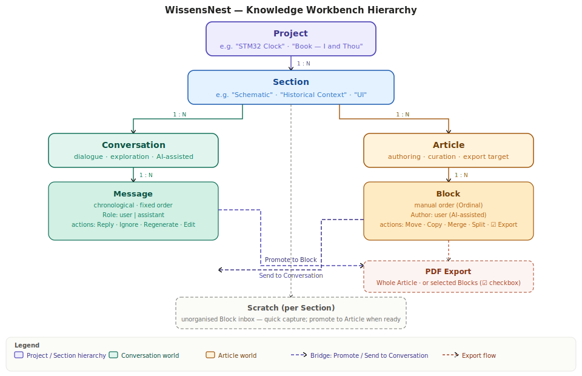
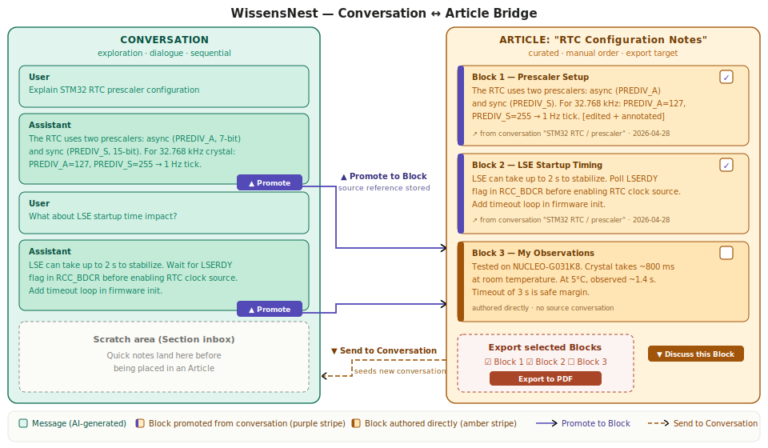

# WissensNest

## Knowledge Workbench — Sections, Articles, and Blocks

WissensNest started as a chat interface. Chat is good for exploration — you ask, the model answers, you go deeper. But chat is ephemeral. Good answers scroll away. Insights get lost. Notes taken elsewhere disconnect from the conversation that produced them.

The Knowledge Workbench extends the product with a second mode alongside chat: structured authoring. The two modes share the same project container and the same AI, but serve different purposes.

---

### The Problem Chat Alone Cannot Solve

| Need | Chat handles it? |
| --- | --- |
| Explore an idea with AI assistance | Yes |
| Keep a running log of findings | Poorly — scroll history only |
| Compose a structured document | No |
| Reuse a good AI response in a different context | No |
| Export a clean PDF of selected content | No |
| Move a piece of text between topics | No |

The workbench fills the gap. Conversations remain the place for dialogue. Articles become the place where knowledge crystallizes.

---

### Structure



The full hierarchy:

```text
Project
  └─ Section                    ← thematic subdivision of a project
       ├─ Conversations
       │    └─ Messages          ← dialogue, sequential, AI-generated or user-typed
       └─ Articles
            └─ Blocks            ← curated MD chunks, movable, selectable for export
```

**Project** — unchanged. The top-level container (e.g. "STM32 Clock", "Book — I and Thou").

**Section** — a thematic subdivision within a project. A project contains many sections. Examples for "STM32 Clock": *Use Cases*, *Schematic*, *Firmware*, *UI*. Examples for "Book — I and Thou": *Historical Context*, *Author's Life*, *Reader's Opinions*, *Citation Translations*. A Section groups both Conversations and Articles that share the same theme.

**Article** — a standalone MD document within a Section. The unit of authoring and export. Can be exported to PDF as a whole or in part. Conceptually equivalent to a Scrivener Document or a Jupyter Notebook — a container of ordered content chunks.

**Block** — the atomic unit inside an Article. An MD chunk in the book sense: may span many paragraphs, contain tables, lists, and code. Blocks can be reordered within an Article, moved or copied between Articles (even across Sections and Projects), merged with adjacent Blocks, split into two, and individually selected for PDF export via checkbox. Technically equivalent to a Message — an ordered element with MD content, a timestamp, an ID, and ownership metadata. The difference is in UI affordances, not data shape.

---

### Terminology notes

**Section** was chosen over *Domain* (carries DDD connotations), *Chapter* (implies linear book structure), and *Category* (too generic). Section is neutral, applies equally to engineering and humanities projects, and matches the mental model of a document divided into named parts.

**Block** was chosen over *Paragraph* (HTML ambiguity), *Fragment* (incomplete connotation), and *Note* (overloaded). Block is used by Notion and Roam for the same concept — a movable, self-contained content unit — making it recognizable to anyone familiar with modern knowledge tools.

---

### The Conversation–Article Bridge

The most important feature of the workbench is not the Article editor itself — it is the two-way link between Conversations and Articles.



**From Conversation to Article:**

A Message in a Conversation can be promoted to a Block. The promoted Block carries a reference back to its source Conversation and the date. This creates a knowledge refinement loop:

1. Chat with the AI to explore a topic
2. When the AI produces a good answer, promote it to a Block in a relevant Article
3. Edit the Block — trim, rephrase, annotate
4. The Article accumulates curated knowledge over many sessions

**From Article to Conversation:**

A Block in an Article can be sent to a Conversation as a seed message. This lets you:

- Ask the AI to critique, extend, or translate a Block
- Start a new Conversation pre-loaded with a specific piece of content
- Resume working on a topic from where the Article left off

**Scratch area:**

Quick ideas that have no Article home yet go into a Section-level *Scratch* area — an unsorted inbox of raw Blocks. Blocks are promoted from Scratch into Articles once their place becomes clear. This prevents forcing premature organization when capturing fast.

---

### Block operations

| Operation | Description |
| --- | --- |
| **Create** | Type in the Article editor, or promote from a Message |
| **Edit** | In-place MD editor (same as Message editing) |
| **Reorder** | Move up / Move down within the Article |
| **Move** | Transfer to another Article (same or different Section / Project) |
| **Copy** | Duplicate to another Article, keeping the original |
| **Merge** | Combine with adjacent Block into one |
| **Split** | Divide at cursor position into two Blocks |
| **Select** | Checkbox for batch operations (PDF export, bulk move) |
| **Promote to Conversation seed** | Send content to a new or existing Conversation |

---

### Export

Articles export to PDF. Two export modes:

**Whole Article export** — all Blocks in ordinal order, rendered as a single document. Triggered by clicking **PDF (all)** in the article header when export mode is active.

**Selective export** — each Block has a checkbox. Check the Blocks you want, then click **PDF (n)** to download a PDF containing only the selected content in article order. Good for extracting a conclusion from a long research Article, or assembling a handout from pieces of several Articles.

Export is implemented via:

- **QuestPDF** (MIT, pure C#, no native dependencies) — generates the PDF document layout
- **Markdig** — strips Markdown formatting to plain text for PDF rendering
- API endpoint `POST /articles/{id}/export` with optional `blockIds` array

The generated PDF contains the article title as a bold heading, each block rendered as a plain-text paragraph, thin dividers between blocks, and page numbers in the bottom-right corner. The file is named after the article title.

---

### Data model

Blocks and Messages share the same technical shape:

```csharp
// Conceptual — both live in separate DB tables but with the same columns
public class Block : BaseEntity
{
    public Guid    ArticleId      { get; set; }
    public int     Ordinal        { get; set; }  // position within Article
    public string  Content        { get; set; }  // raw Markdown
    public Guid?   SourceMessageId { get; set; } // set if promoted from a Message
    public bool    IsSelected     { get; set; }  // export checkbox state
}
```

Article is structurally parallel to Conversation:

| Concept | Conversation world | Article world |
| --- | --- | --- |
| Container | Conversation | Article |
| Atomic unit | Message | Block |
| Ordering | Chronological (fixed) | Manual (Ordinal) |
| Primary author | User + Assistant | User (AI-assisted) |
| Main action | Reply | Edit / Reorder |
| Export | Not primary | Core purpose |

Section extends the existing Project hierarchy with an optional new grouping layer. Conversations gain a nullable `SectionId` FK: null means the Conversation belongs directly to the Project (pre-workbench behavior, unchanged); a non-null value places it inside a Section. Articles always belong to a Section.

---

### New DB entities

```text
Sections table:  Id, ProjectId, Name, Description, Ordinal, CreatedAt, UpdatedAt, IsDeleted, DeletedAt
Articles table:  Id, SectionId, Title, Description, CreatedAt, UpdatedAt, IsDeleted, DeletedAt
Blocks table:    Id, ArticleId, Ordinal, Content, SourceMessageId (nullable FK → Messages),
                 IsSelected, CreatedAt, UpdatedAt, IsDeleted, DeletedAt
```

Conversations gain a nullable `SectionId` FK — null means the Conversation belongs directly to the Project (unchanged from pre-workbench behaviour). Messages have no SectionId.

---

### New API endpoints

Endpoints are grouped by implementation phase. ✓ = implemented, ○ = pending.

```text
── Sections ─────────────────────────────────────────────────────
✓  GET    /sections/{projectId}           list all sections in a project
✓  GET    /sections/{id}/info             single section by ID
✓  GET    /sections/{id}/scratch          get or create the Scratch article for a section
✓  POST   /sections                       create section (body: projectId, name, description?, ordinal)
✓  PATCH  /sections/{id}                  update name / description / ordinal
✓  DELETE /sections/{id}                  soft-delete

── Articles ─────────────────────────────────────────────────────
✓  GET    /articles/{sectionId}           list all articles in a section
✓  GET    /articles/{id}/info             single article by ID
✓  POST   /articles                       create article (body: sectionId, title, description?)
✓  PATCH  /articles/{id}                  update title / description
✓  DELETE /articles/{id}                  soft-delete

── Blocks ───────────────────────────────────────────────────────
✓  GET    /articles/{id}/blocks           list blocks in an article (ordered by ordinal, createdAt)
✓  POST   /articles/{id}/blocks           create block — body: { content, ordinal, sourceMessageId? }
                                          sourceMessageId links the block back to its origin message
✓  PATCH  /blocks/{id}                    update content
✓  PATCH  /blocks/{id}/ordinal            update ordinal (for reorder)
✓  DELETE /blocks/{id}                    soft-delete

── Phase D ───────────────────────────────────────────────────────
✓  PATCH  /blocks/{id}/move               body: { targetArticleId } — moves block to end of target
✓  POST   /blocks/{id}/copy               body: { targetArticleId } — copies block; original stays
✓  POST   /blocks/merge                   body: { firstId, secondId } — joins content, soft-deletes second
✓  POST   /blocks/{id}/split              body: { splitAtOffset } — splits at char offset; new block
                                          gets same ordinal (sorts after first via CreatedAt)

── Phase E ───────────────────────────────────────────────────────
✓  POST   /articles/{id}/export           body: { format: "pdf", blockIds?: Guid[] }
                                          no blockIds → whole article; with blockIds → selected only
```

> **Note — "Send to Conversation" has no API endpoint.** The bridge is implemented entirely client-side: the ArticleEditor sets block content as `ChatState.PendingSeedContent`, then navigates to `/chat`. Chat.razor consumes the seed and pre-fills the input. No server round-trip is needed because no message is created until the user actually sends.

---

### Implementation phases

```text
✓ Phase A — Data model
  Sections, Articles, Blocks DB entities + migration (20260429084822_AddKnowledgeWorkbench)
  Conversations gain nullable SectionId FK (backwards-compatible; null = project-level)
  ISectionRepository, IArticleRepository, IBlockRepository interfaces + SQLite implementations
  CRUD API endpoints for all three entity types

✓ Phase B — Article editor UI
  ConversationSidebar: project → section → article hierarchy, full CRUD inline
  ArticleEditor page (/article/{id}): block list, create/edit/delete, move up/down
  Markdown preview per block (Markdig rendering, same as chat)

✓ Phase C — Conversation ↔ Article bridge
  "→ Block" button on every persisted message toolbar
    — opens a section/article picker panel, loads lazily on first click
    — creates a Block via POST /articles/{id}/blocks with SourceMessageId back-link
    — shows brief "✓ Saved" feedback identical to the Copy button pattern
  "→ Chat" button on every block toolbar in ArticleEditor
    — sets block content as ChatState.PendingSeedContent
    — navigates to /chat; Chat.razor pre-fills _userInput with the seed
    — conversation is created normally when the user hits Send
  Scratch area per Section
    — GET /sections/{id}/scratch: find-or-create an Article titled "Scratch"
    — "📋 Scratch" entry shown at the top of each expanded section in the sidebar
    — opens in the standard ArticleEditor; blocks arrive via "→ Block" from chat

✓ Phase D — Advanced block operations
  Move block to different Article — ⋯ context menu → "Move to…" → article picker
  Copy block to different Article — ⋯ context menu → "Copy to…" → article picker
  Merge with next — ⊕ button in toolbar (hidden on last block); content joined with blank line
  Split at cursor — "Split here" button in edit mode; saves draft first, then splits at cursor offset
  Export mode toggle in article header — shows checkboxes on all blocks for batch selection
  SplitBlockResult DTO in WissensNest.Contracts/Models/BlockInfo.cs
  JS helper: getTextareaCursorPosition in wwwroot/js/interop.js

✓ Phase E — Export
  POST /articles/{id}/export — body: { format, blockIds? }
  PdfExporter service in WissensNest.API using QuestPDF + Markdig
  "PDF (all)" / "PDF (n)" button in ArticleEditor header (export mode only)
  ExportArticleAsync in IWissensNestClient and MyAiClient
  downloadFile JS helper — base64 data-URL trigger for browser download
  ExportArticleRequest DTO
```

Phase A is a pure backend change with no UI impact. Phase B gives the basic authoring surface. Phase C is the feature that differentiates the workbench from a generic notes tool — the bridge makes chat and documents mutually reinforcing rather than parallel silos.

```text
✓ Phase F — Block editor UX: expanded textarea + scroll navigation
  Problem: the block edit textarea was a small fixed-height box (rows="6"), making it
  uncomfortable to edit long blocks or Markdown with complex structure.

  Solution:
  — Textarea uses height: calc(100dvh - 22rem) when editing an existing block.
    100dvh is viewport-relative — the height recalculates automatically on window
    resize and sidebar-splitter drag (which changes only width, not height).
    min-height: 10rem provides a floor on very small screens.
    resize: vertical is preserved so the user can still drag to adjust manually.
  — The article scroll container is unchanged: other blocks remain visible by
    scrolling, and the ↑/↓ reorder buttons stay accessible.
  — Auto-scroll on edit entry: StartEditBlock() sets _scrollToEditingBlock = true;
    OnAfterRenderAsync() fires once after re-render and calls scrollToAnchor() with
    id="block-{blockId}" (added to every .block-item div).
  — "⊙ Editing" button appears in the article header whenever a block is being
    edited. Clicking it calls ScrollToEditingBlock() → scrollToAnchor(), returning
    to the editing block after the user has scrolled away to read other blocks.
  — The "Add block" form at the bottom retains rows="6" (no --expanded class) since
    it is always at the scroll bottom and does not need viewport-height sizing.

  Files changed:
    WissensNest.UI/Components/Pages/ArticleEditor.razor
    WissensNest.UI/wwwroot/app.css   (added .block-edit-textarea--expanded rule)
```
