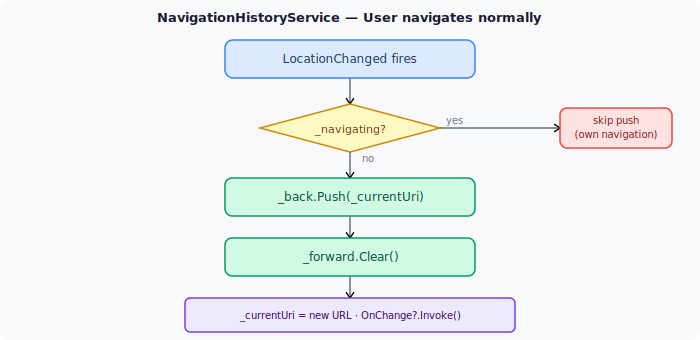
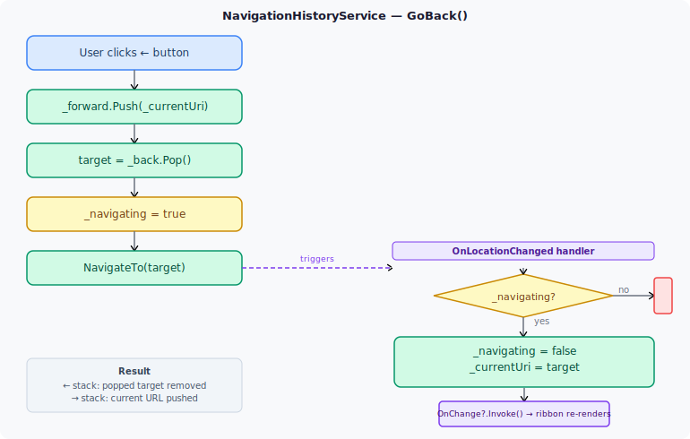
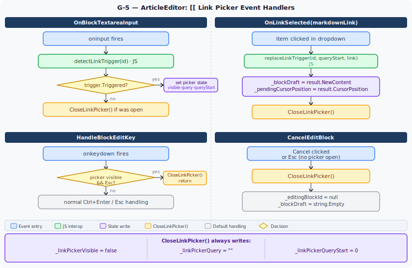

# 33 — Cross-References and Navigation History

Implemented in June 2026 as Stage 3.5-G (G-1 through G-5).

---

## Overview

Cross-references let article blocks and chat messages link to each other with standard Markdown links. Navigation history (← →) lets the user trace back after following links. Together they turn the Knowledge Workbench and the Chat interface into a hyperlinked knowledge graph.

---

## Architecture

### Link format

All internal links are standard Markdown: `[label](url)`. No custom syntax is stored in block content. The app-relative URL schemes are:

| Target | URL pattern |
| --- | --- |
| Article | `/article/{articleId}` |
| Block | `/article/{articleId}#block-{blockId}` |
| Message | `/chat?conversationId={conversationId}&highlight={messageId}` |

Blazor Server intercepts relative `<a>` clicks from rendered Markdown and handles them as in-app navigation via `NavigationManager`.

---

## G-1 — Navigation History Service

**File:** `Src/Services/WissensNest.UI/Services/NavigationHistoryService.cs`

Circuit-scoped (`AddScoped`). Subscribes to `NavigationManager.LocationChanged` at construction.

| Field | Type | Purpose |
| --- | --- | --- |
| `_back` | `Stack<string>` | Previous URLs (go back) |
| `_forward` | `Stack<string>` | Forward URLs — cleared on every user navigation |
| `_currentUri` | `string` | Last known URL, updated on every `LocationChanged` |
| `_navigating` | `bool` | Suppresses history push during `GoBack`/`GoForward` |

**Flow — user navigates normally:**



**Flow — GoBack():**



`RibbonToolbar.razor` subscribes to `OnChange → StateHasChanged()` and renders ← → buttons disabled when stacks are empty.

---

## G-2 — Message Anchors and Scroll-to-Highlight

**MessageBubble.razor** — outer `div` gets `id="msg-{Message.Id}"` when `Message.Id.HasValue`.

**Chat.razor** — two `[SupplyParameterFromQuery]` parameters:

- `QueryConversationId` (`conversationId`) — if set and ≠ current conversation, loads it in `OnParametersSetAsync`
- `HighlightMessageId` (`highlight`) — sets `_pendingHighlightId`; suppresses auto-scroll-to-bottom

`OnAfterRenderAsync` fires `scrollToAndHighlight($"msg-{id}")` when `_pendingHighlightId` is set.

**interop.js — `scrollToAndHighlight(id)`:**

```javascript
el.scrollIntoView({ behavior: 'smooth', block: 'center' });
el.classList.add('msg-highlight');
setTimeout(() => el.classList.remove('msg-highlight'), 2500);
```

**CSS — `@keyframes msg-highlight-pulse`:** amber `box-shadow` fades from `rgba(251,191,36,0.75)` to transparent over 2.5 s.

---

## G-3 — Copy Link Buttons

### Block toolbar (ArticleEditor.razor)

`CopyBlockLink(BlockInfo block)`:

1. Takes first non-empty line of `block.Content`, strips leading `#` (heading marker), truncates to 60 chars.
2. Falls back to `_article.Title` if content is empty.
3. Strips `[` `]` from label to avoid Markdown link corruption.
4. Builds `/article/{Id}#block-{block.Id}`.
5. Calls `copyToClipboard` JS.
6. Calls `ShowFeedback("✓ Link copied")` (existing 2.5 s auto-dismiss mechanism).

### Message toolbar (MessageBubble.razor)

`CopyMessageLink()`:

1. Takes first non-empty line of `Message.RawContent`, truncates to 80 chars.
2. Strips `[` `]`.
3. Builds `/chat?conversationId={ConversationId.Value}&highlight={Message.Id.Value}`.
4. Calls `copyToClipboard` JS.
5. Flips `_linkCopied = true` for 1.5 s (shows "✓" on button).

`ConversationId` is a new `[Parameter]` on `MessageBubble`. `Chat.razor` passes `ConversationId="@_conversationId"`. The button renders only inside `@if (ConversationId.HasValue)` so it is hidden for new conversations not yet saved.

---

## G-4 — Reference Search API

### DTO

`WissensNest.Contracts/Models/ReferenceSearchResult.cs`:

```csharp
record ReferenceSearchResult(
    string Kind,           // "article" | "block" | "message-user" | "message-assistant"
    Guid Id,
    string Label,          // first meaningful line, truncated
    string BreadcrumbPath, // "Project › Section › Article"
    string NavigateUrl     // ready-to-use relative URL
)
```

### Repository

`ReferenceSearchRepository` — three sequential EF queries (EF Core `DbContext` is not thread-safe):

```csharp
Articles: .Include(a => a.Section).ThenInclude(s => s.Project)
          .Where(a => a.Title.Contains(query)).Take(limit)

Blocks:   .Include(b => b.Article).ThenInclude(a => a.Section).ThenInclude(s => s.Project)
          .Where(b => b.Content.Contains(query)).Take(limit)

Messages: .Include(m => m.Conversation).ThenInclude(c => c.Project)
          .Where(m => m.OriginalContent.Contains(query) && !m.IsIgnored).Take(limit)
          // Kind = "message-user" or "message-assistant" based on m.Role
```

Global `HasQueryFilter(e => !e.IsDeleted)` handles soft-delete for all entities and their includes.

Results are round-robin interleaved (article, block, message, article, block, …) up to `limit`.

`NavigateUrl` values:

- Article: `/article/{a.Id}`
- Block: `/article/{b.ArticleId}#block-{b.Id}`
- Message: `/chat?conversationId={m.ConversationId}&highlight={m.Id}`

### Endpoint

`GET /references/search?q={query}&limit=10`

`limit` clamped to 1–20. Empty `q` returns `[]` immediately.

### Client

`IWissensNestClient.SearchReferencesAsync(string query, int limit, CancellationToken)` → `IReadOnlyList<ReferenceSearchResult>`

`MyAiClient` calls `GET /references/search?q={Uri.EscapeDataString(query)}&limit={limit}`.

---

## G-5 — `[[` Autocomplete in Block Textarea

### JS interop functions (interop.js)

**`detectLinkTrigger(elementId)`** — reads `el.selectionStart`, scans backwards for `[[`. Returns `{ triggered, queryStart, query }`. Returns `triggered: false` if a newline or `]]` is found between `[[` and the cursor.

**`replaceLinkTrigger(elementId, queryStart, insertText)`** — replaces `el.value[queryStart … selectionStart]` with `insertText`. Sets cursor after the inserted text. Returns `{ newContent, cursorPosition }`.

**`setTextareaCursor(elementId, position)`** — restores cursor position after Blazor re-renders the `value` attribute on the textarea.

### Blazor rendering issue and fix

`ArticleEditor.razor` uses `value="@_blockDraft" @oninput="OnBlockTextareaInput"` (manual binding) instead of `@bind="_blockDraft" @bind:event="oninput"`. This avoids event handler conflicts and gives explicit control over when `_blockDraft` is updated.

After `replaceLinkTrigger` returns:

1. C# sets `_blockDraft = result.NewContent` and `_pendingCursorPosition = result.CursorPosition`.
2. Blazor renders — sets `textarea.value = _blockDraft` (this may reset the cursor Blazor-side).
3. `OnAfterRenderAsync` calls `setTextareaCursor(id, position)` to restore the cursor.

### LinkPickerDropdown component

`WissensNest.UI/Components/LinkPickerDropdown.razor`

- Parameters: `bool Visible`, `string Query`, `EventCallback<string> OnLinkSelected`, `EventCallback OnDismiss`
- `OnParametersSetAsync`: guards `Query == _lastQuery` to avoid redundant searches; cancels previous `CancellationTokenSource`; debounces 300 ms; calls `AiClient.SearchReferencesAsync`
- Results: kind icon (📄 article / 🧱 block / 👤 user message / ✨ assistant message) + `Label` + `BreadcrumbPath`
- Click: `SelectResult` strips `[` `]` from label and invokes `OnLinkSelected($"[{label}]({result.NavigateUrl})")`
- `IDisposable` cancels and disposes CTS on circuit disconnect

### ArticleEditor integration



**CSS:** `.block-edit` gains `position: relative`. `.link-picker-dropdown` is `position: absolute; bottom: 3rem; left: 0; width: 400px; max-height: 280px; z-index: 50` — appears above the Save/Split/Cancel buttons, overlaying the lower portion of the textarea.

---

## File Summary

| File | Change |
| --- | --- |
| `WissensNest.Contracts/Models/ReferenceSearchResult.cs` | new DTO |
| `WissensNest.Contracts/Interfaces/Repo/IReferenceSearchRepository.cs` | new interface |
| `WissensNest.Contracts/Interfaces/IWissensNestClient.cs` | `SearchReferencesAsync` |
| `WissensNest.Persistent.SQLite/Repositories/ReferenceSearchRepository.cs` | new |
| `WissensNest.Persistent.SQLite/ServiceCollectionExtensions.cs` | register repo |
| `WissensNest.Client/MyAiClient.cs` | implement `SearchReferencesAsync` |
| `WissensNest.API/Program.cs` | `GET /references/search` route + handler |
| `WissensNest.UI/Services/NavigationHistoryService.cs` | new circuit-scoped service |
| `WissensNest.UI/Program.cs` | register `NavigationHistoryService` |
| `WissensNest.UI/Components/Layout/RibbonToolbar.razor` | inject service; ← → buttons; OnChange |
| `WissensNest.UI/Components/MessageBubble.razor` | `ConversationId` param; Link button; `CopyMessageLink` |
| `WissensNest.UI/Components/Pages/Chat.razor` | query params; `OnParametersSetAsync`; `ConversationId` to bubble |
| `WissensNest.UI/Components/Pages/ArticleEditor.razor` | Link button; `CopyBlockLink`; `[[` input handling; `LinkPickerDropdown` |
| `WissensNest.UI/Components/LinkPickerDropdown.razor` | new component |
| `WissensNest.UI/wwwroot/js/interop.js` | `detectLinkTrigger`, `replaceLinkTrigger`, `setTextareaCursor`, `scrollToAndHighlight` |
| `WissensNest.UI/wwwroot/app.css` | `msg-highlight` keyframe; `.link-picker-*` styles; `position: relative` on `.block-edit` |
