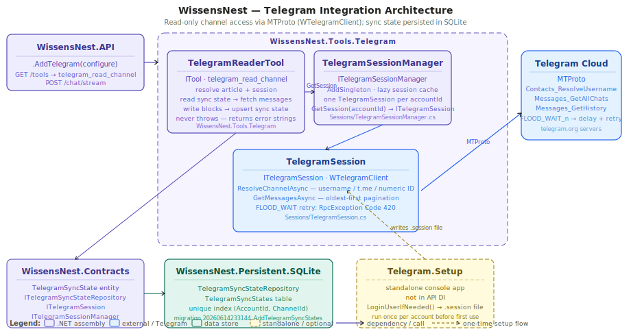
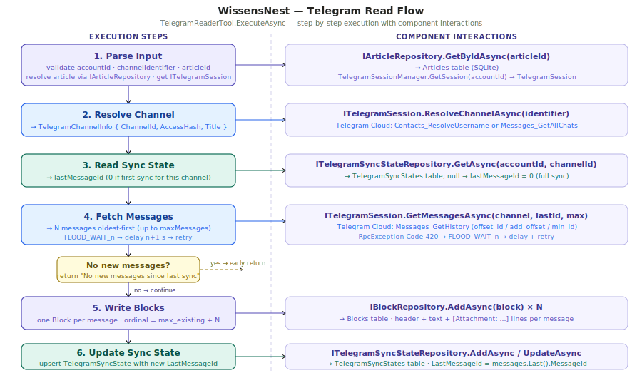

# WissensNest

## Telegram Integration — Reading Channels and Chats

The Telegram integration adds a `telegram_read_channel` tool that downloads messages from any Telegram channel or chat the configured user account has access to, and appends them as Blocks inside a Knowledge Workbench Article. A resumable sync state ensures only new messages are downloaded on subsequent calls. The design is deliberately read-only in Step 1; write-capable and Bot API paths are planned as separate extensions.

---

### Why MTProto (not Bot API)

Telegram offers two access models. The Bot API is the simpler path — but bots can only read messages in channels where they have been added as members, and they cannot retrieve historical message lists from group chats. MTProto user-account access (the full Telegram client protocol) has no such restriction: the authenticated user account can read any channel or group they have joined, including full message history, just as the Telegram app itself does.

`WTelegramClient` is a fully managed .NET MTProto implementation. It handles the low-level MTProto framing, encryption, and session persistence, exposing a high-level `TL` (TypeLanguage) API that mirrors the official Telegram client API directly.

The tradeoff is that MTProto requires an interactive first-time login (phone number + verification code + optional 2FA password). This is handled once by the Setup helper and is never needed again as long as the session file is intact.

---

### Assembly Overview



The integration lives in a single new assembly, `WissensNest.Tools.Telegram`, which depends only on `WissensNest.Contracts` and `WTelegramClient`. The domain entity and repository interface live in `WissensNest.Contracts` so that `WissensNest.Persistent.SQLite` can implement the repository without a circular dependency. A separate standalone console app, `WissensNest.Tools.Telegram.Setup`, handles the one-time interactive login and is never referenced by the API.

---

### Session Layer

#### ITelegramSession

`ITelegramSession` is a deliberately narrow, read-only interface. It exposes only two methods:

```csharp
Task<TelegramChannelInfo> ResolveChannelAsync(string identifier, CancellationToken ct);
Task<IReadOnlyList<TelegramMessage>> GetMessagesAsync(
    TelegramChannelInfo channel, long afterMessageId, int limit, CancellationToken ct);
```

The interface contains no `Send*`, `React*`, or `Upload*` members. The planned `TelegramParticipantTool` (Step 2) will use a separate `ITelegramWriteSession` interface, keeping read-only code paths provably isolated.

#### TelegramSession

`TelegramSession` wraps `WTelegramClient.Client`. On construction it is not yet connected; connection is established lazily on the first call. The implementation handles three channel identifier shapes:

- `@username` or a bare username (no `@`) — resolved via `Contacts_ResolveUsername`
- `t.me/<username>` link — the username portion is extracted and resolved the same way
- Numeric channel ID (as a string) — resolved by scanning the account's full chat list via `Messages_GetAllChats`

**Pagination.** `Messages_GetHistory` returns messages newest-first by default. To produce oldest-first output starting after a known `afterMessageId`, `TelegramSession.GetMessagesAsync` uses the `offset_id` / `add_offset` / `min_id` combination supported by the Telegram API. It pages in batches and accumulates results until it has collected up to `limit` messages that are newer than `afterMessageId`.

**FLOOD_WAIT handling.** When Telegram's rate limiter triggers, the server returns an `RpcException` with `Code == 420` and `Message` in the form `FLOOD_WAIT_<n>`. The session catches this exception, parses `n`, sleeps for `n + 1` seconds, and retries the same call once. If the retry also triggers FLOOD_WAIT, the exception propagates upward and becomes an error string in `ExecuteAsync`.

**Session not authorized.** If the session file is missing or the account has been logged out, Telegram will ask for a `verification_code` or `password`. `TelegramSession` detects these prompts and throws a clear `InvalidOperationException` explaining that the Setup helper must be run. `TelegramReaderTool` catches this and returns the message as an error string.

#### TelegramSessionManager

`TelegramSessionManager` implements `ITelegramSessionManager` and is registered as a singleton. It holds a `Dictionary<string, TelegramSession>` keyed by account ID. Sessions are created lazily on the first `GetSession(accountId)` call and cached indefinitely for the lifetime of the API process. Session files are not shared between accounts — each account gets its own `SessionPath` from configuration.

---

### Sync State

`TelegramSyncState` is a domain entity in `WissensNest.Contracts/Entities`:

```csharp
public class TelegramSyncState : BaseEntity
{
    public string AccountId    { get; set; } = string.Empty;
    public long   ChannelId    { get; set; }
    public long   LastMessageId { get; set; }
}
```

`ITelegramSyncStateRepository` extends the base `IRepository<TelegramSyncState>` with a single lookup method:

```csharp
Task<TelegramSyncState?> GetAsync(string accountId, long channelId, CancellationToken ct);
```

The SQLite table `TelegramSyncStates` has a unique index on `(AccountId, ChannelId)`, enforcing one sync record per account-channel pair. Migration `20260614233144_AddTelegramSyncStates` creates both the table and the index.

When `GetAsync` returns `null`, the tool treats it as first-ever sync for that channel and sets `afterMessageId = 0`, which causes `GetMessagesAsync` to return the oldest available messages up to `limit`. After blocks are written, the tool upserts the record: `AddAsync` on a null result, `UpdateAsync` on an existing one, then `SaveChangesAsync`.

---

### TelegramReaderTool



#### Parameters

| Parameter | Type | Required | Default | Description |
| --- | --- | --- | --- | --- |
| `accountId` | string | yes | — | Named account key from `Telegram:Accounts` config |
| `channelIdentifier` | string | yes | — | Username, `@handle`, `t.me/` link, or numeric channel ID |
| `articleId` | string (GUID) | yes | — | Target Knowledge Workbench Article to append blocks to |
| `maxMessages` | integer | no | 200 | Maximum number of new messages to download in one call |

#### Execution Flow

`ExecuteAsync` parses the input JSON, runs the steps shown in the flow diagram above, and returns a summary string or an error string. The method never throws — all exceptions are caught and returned as descriptive text.

1. Parse and validate `accountId`, `channelIdentifier`, `articleId`. Resolve the target `Article` via `IArticleRepository.GetByIdAsync`; return an error if not found.
2. Obtain the `ITelegramSession` from `TelegramSessionManager.GetSession(accountId)`; return an error if the account ID is not configured.
3. Call `session.ResolveChannelAsync(channelIdentifier)` to get a `TelegramChannelInfo` with `ChannelId`, `AccessHash`, and `Title`.
4. Call `syncStateRepo.GetAsync(accountId, channelId)` to find the resume point. If null, `afterMessageId = 0`.
5. Call `session.GetMessagesAsync(channel, afterMessageId, maxMessages)`. The result is ordered oldest-first.
6. If the result is empty, return "No new messages since last sync" immediately (no writes occur).
7. Fetch the existing blocks for the article via `IBlockRepository.GetByArticleAsync(articleId)` to compute the starting ordinal (maximum existing ordinal + 1). For each message, build the block content string and call `blockRepo.AddAsync`.
8. Call `blockRepo.SaveChangesAsync()`.
9. Upsert `TelegramSyncState` with `LastMessageId = messages.Last().MessageId`; call `syncStateRepo.SaveChangesAsync()`.
10. Return `"Downloaded {N} message(s) from '{channel.Title}' (IDs {first}–{last}) into Article '{article.Title}'."`.

#### Block Content Format

Each imported message becomes a single Block. The content string follows this format:

```
**Telegram #{id}** — {date:yyyy-MM-dd HH:mm} UTC — *{author}*

{message text}

[Attachment: {filename}, {size} bytes, file_id={fileId}, message_id={msgId}, account_id={accountId}]
```

Attachment lines are repeated for each attached file and omitted entirely when the message has no attachments. The `{message text}` portion is used verbatim from `TelegramMessage.Text`; it may be empty for media-only messages (in which case only the header and attachment lines appear).

#### Attachment Metadata and FileId

`TelegramAttachmentInfo.FileId` is a JSON blob that encodes the four fields Telegram requires to re-fetch a document without re-scanning history:

```json
{ "id": 1234567890, "access_hash": -9876543210, "file_reference": "<base64>", "dc_id": 4 }
```

This blob is stored verbatim in the block content so that a future `TelegramAttachmentTool` can parse it and download the file on demand. No files are downloaded during `telegram_read_channel` execution.

---

### First-Time Setup

`WissensNest.Tools.Telegram.Setup` is a standalone console app that must be run once per account before `telegram_read_channel` can be used. It is not referenced by `WissensNest.API` and must not be started as a background service.

```bash
dotnet run --project Src/Tools/WissensNest.Tools.Telegram.Setup -- personal
```

The app:

1. Loads `appsettings.json` and `appsettings.Telegram.json` from the API project directory.
2. Binds `TelegramOptions` to get `ApiId`, `ApiHash`, `PhoneNumber`, and `SessionPath` for the named account.
3. Instantiates `WTelegramClient.Client` with the same session file path used by the API.
4. Calls `LoginUserIfNeeded()`, which drives the MTProto login handshake. The app prompts `Console.ReadLine` for the verification code and, if 2FA is enabled, the password.
5. On success, the session file at `SessionPath` is written and the process exits.

After this, the session file is valid indefinitely (until the Telegram account is logged out from all devices or the session is revoked in Telegram settings). Run the Setup helper again if the session becomes invalid.

---

### Configuration

Non-secret configuration belongs in `appsettings.json` (committed to version control):

```json
"Telegram": {
  "Accounts": {
    "personal": {
      "SessionPath": "/Users/ksk-work/Projects/AI/WissensNest/Data/telegram/personal.session"
    }
  }
}
```

Secrets — `ApiId`, `ApiHash`, and `PhoneNumber` — belong in `appsettings.Telegram.json` in the same directory as `appsettings.json`. This file is listed in `.gitignore` and is never committed:

```json
"Telegram": {
  "Accounts": {
    "personal": {
      "ApiId": 12345678,
      "ApiHash": "abc...",
      "PhoneNumber": "+..."
    }
  }
}
```

`WissensNest.API/Program.cs` loads the secrets file via:

```csharp
builder.Configuration.AddJsonFile("appsettings.Telegram.json", optional: true);
```

The merged configuration is bound to `TelegramOptions` by `AddTelegram(configure)`. `.gitignore` additionally excludes `Data/telegram/*.session` to prevent accidental session file commits.

---

### Planned Extensions

**Step 2 — TelegramParticipantTool:** Read/write access via MTProto using a separate `ITelegramWriteSession` interface. Adds the ability to send messages and reactions from the assistant, with a configurable send delay for safety.

**Step 3 — TelegramBotTool:** Bot API access for push notifications and home-automation triggers. Operates under a bot token rather than a user account session; managed independently from the MTProto sessions.

**Step 4 — Multi-account support:** Additional named accounts are already supported at the configuration and session management level. Remaining work is per-account tool selection in the UI.

---

### Referenced Files

| File | Role |
| --- | --- |
| [TelegramReaderTool.cs](../../Src/Tools/WissensNest.Tools.Telegram/TelegramReaderTool.cs) | `telegram_read_channel` — main tool implementation |
| [TelegramSession.cs](../../Src/Tools/WissensNest.Tools.Telegram/Sessions/TelegramSession.cs) | MTProto session: channel resolution, pagination, FLOOD_WAIT retry |
| [TelegramSessionManager.cs](../../Src/Tools/WissensNest.Tools.Telegram/Sessions/TelegramSessionManager.cs) | Singleton lazy session cache per account |
| [ITelegramSession.cs](../../Src/Tools/WissensNest.Tools.Telegram/Sessions/ITelegramSession.cs) | Read-only session interface |
| [ITelegramSessionManager.cs](../../Src/Tools/WissensNest.Tools.Telegram/Sessions/ITelegramSessionManager.cs) | Session manager interface |
| [TelegramOptions.cs](../../Src/Tools/WissensNest.Tools.Telegram/Configuration/TelegramOptions.cs) | `TelegramOptions` + `TelegramAccountOptions` config binding |
| [TelegramMessage.cs](../../Src/Tools/WissensNest.Tools.Telegram/Models/TelegramMessage.cs) | Message model with attachment list |
| [TelegramChannelInfo.cs](../../Src/Tools/WissensNest.Tools.Telegram/Models/TelegramChannelInfo.cs) | Channel resolution result |
| [TelegramAttachmentInfo.cs](../../Src/Tools/WissensNest.Tools.Telegram/Models/TelegramAttachmentInfo.cs) | Attachment metadata including FileId JSON blob |
| [ServiceCollectionExtensions.cs](../../Src/Tools/WissensNest.Tools.Telegram/ServiceCollectionExtensions.cs) | `AddTelegram(configure)` DI registration |
| [TelegramSyncState.cs](../../Src/Foundation/WissensNest.Contracts/Entities/TelegramSyncState.cs) | Domain entity — sync state per account+channel |
| [ITelegramSyncStateRepository.cs](../../Src/Foundation/WissensNest.Contracts/Interfaces/Repo/ITelegramSyncStateRepository.cs) | Repository interface |
| [TelegramSyncStateRepository.cs](../../Src/Foundation/WissensNest.Persistent.SQLite/Repositories/TelegramSyncStateRepository.cs) | SQLite repository implementation |
| [Program.cs (Setup)](../../Src/Tools/WissensNest.Tools.Telegram.Setup/Program.cs) | Standalone first-time login helper |
| [16_Tools.md](./16_Tools.md) | Tool framework — ITool, ParametersSchema, ExecuteAsync contract |
