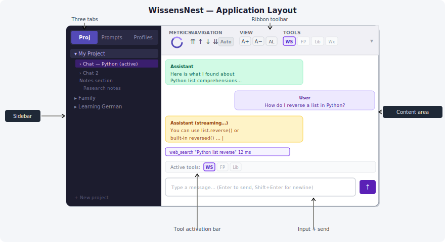
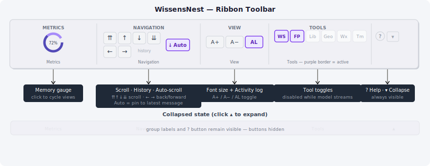

# WissensNest — Getting Started

## What is WissensNest?

WissensNest is a privately-hosted AI assistant that runs entirely on your local machine.
It connects to language models through Ollama — no data leaves your network, no accounts are needed,
and every conversation is stored in a local database.

It is designed for family use across different languages and topics: history, biology, cooking,
embedded programming, language learning. Everyone in the household uses the same service from
their own browser — nothing to install on client devices.

---

## Opening the App

Open the address in your browser. Ask whoever set up the service for the exact URL and port
(typically something like `http://192.168.x.x:5100` on your local network).

The app is a web application — it works in any modern desktop browser.

---

## The Application Layout {#app-layout}

The screen has three areas:

| Area | Description |
| --- | --- |
| **Sidebar** (left, dark) | Navigation. Three tabs switch between Projects, Prompts, and Profiles. |
| **Ribbon toolbar** (top, above content) | Metrics, navigation controls, font size, tool toggles. Can be collapsed. |
| **Content area** (right) | The active page: a conversation, an article editor, or a prompt/profile page. |

---

## Your First Conversation

1. In the sidebar, the **⊞ Projects** tab is active by default.
2. Click **+ New project** at the bottom of the sidebar. Type a project name (e.g. *General*) and press **Enter**.
3. A new project is created and an empty chat opens automatically in the content area.
4. Type your question in the input box at the bottom of the content area.
5. Press **Enter** to send. The assistant's response streams in line by line.
6. Ask follow-up questions as many times as you like — the model remembers the whole conversation.

That is all you need to get started.

---

## The Sidebar Tabs {#sidebar-tabs}

| Tab | Icon | What is here |
| --- | --- | --- |
| **Projects** | ⊞ | Projects, conversations, sections, and articles — everything you create |
| **Prompts** | ✎ | Reusable text snippets (instructions, context, personas) organized by category |
| **Profiles** | ◈ | Named presets that bundle prompts and tool selections together |

Click any tab icon or label to switch panels. You will spend most time in the **Projects** tab.

---

## Projects, Conversations, Sections, Articles

The **Projects** tab organizes everything:

- **Projects** — top-level groupings. One per topic area, e.g. *Work*, *Family*, *German practice*.
- **Conversations** — individual chats inside a project. Each has its own history.
- **Sections** — optional thematic subdivisions of a project. A section can hold both conversations and articles.
- **Articles** — structured documents built from blocks, inside a section. See [Knowledge Workbench](03_Knowledge_Workbench.md).

Expand a project by clicking its name or the **▸** chevron. Direct conversations appear first; sections appear below them.

---

## The Ribbon Toolbar {#ribbon-toolbar}

The ribbon runs above the content area on every page. Click **▾** in the top-right corner of the ribbon to collapse it; click **▴** to expand.

Four groups from left to right:

| Group | Controls |
| --- | --- |
| **Metrics** | Memory gauge — click the gauge to cycle between Donut, Bars, and Dashboard views |
| **Navigation** | ⇈ scroll to top · ↑ page up · ↓ page down · ⇊ scroll to bottom · **← back** · **→ forward** · **Auto** keeps the view pinned to the latest message |
| **View** | **A+** / **A−** increase / decrease font size · **AL** toggle the tool activity log visibility |
| **Tools** | One toggle button per registered tool; click to enable or disable; disabled while the model is streaming |

The **← back** and **→ forward** buttons work like a browser history: every time you navigate between pages (chat, articles, home), the previous location is remembered. Click **←** to go back, **→** to go forward. The buttons are greyed out when there is nowhere to go.

---

## Tools {#tools}

Tools extend what the model can do beyond generating text. When at least one tool is registered,
toggle buttons appear in both the ribbon and the tool activation bar directly above the chat input.

Enable any tool to make it available to the model for the current conversation. The model decides
independently when to call a tool — you do not direct it; you only choose which tools it may use.

For a full guide to available tools and the library workflow, see [Using Tools](04_Tools.md).

---

## Changing the Conversation Language

The model is instructed to always reply in the language the user writes in.
Start your message in Russian, German, English, or any other language — the response will follow.

---

## Where to Go Next

| Guide | Topics |
| --- | --- |
| [Chat Interface](02_Chat.md) | Messages, editing, stale messages, ignored messages, context prompt |
| [Knowledge Workbench](03_Knowledge_Workbench.md) | Sections, articles, blocks, export to PDF |
| [Using Tools](04_Tools.md) | Enabling tools, tool activity log, local document library |
| [Prompts and Profiles](05_Prompts_and_Profiles.md) | Reusable prompts, three-layer system, profiles |
| [Quick Reference](06_Quick_Reference.md) | Keyboard shortcuts and button cheat-sheet |
