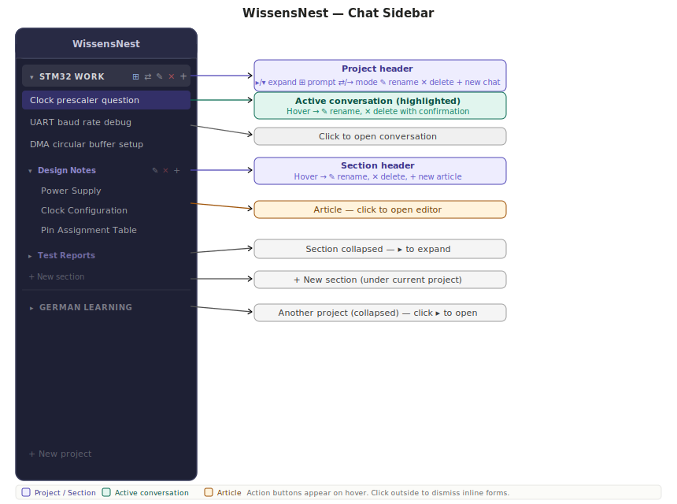
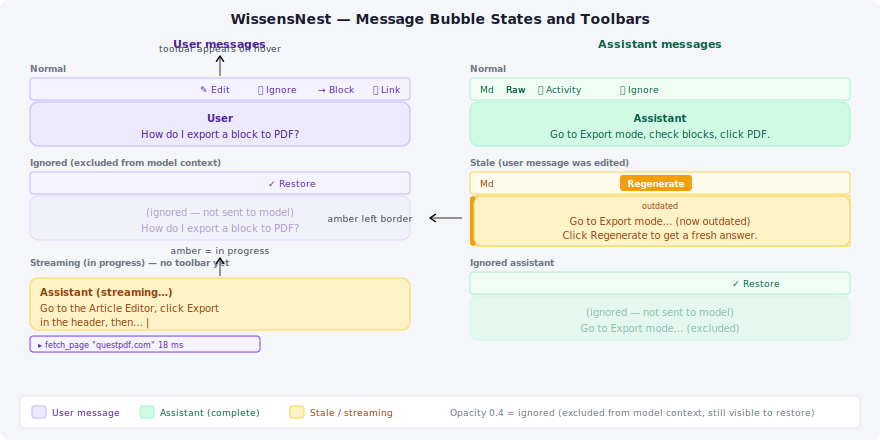

# WissensNest — Chat Interface

## Overview

The chat interface is the primary way to interact with the local AI. The window is split into two panels:

- **Sidebar** (left, dark) — projects, conversations, and sections with articles.
- **Chat area** (right, light) — the active conversation, message history, and input.



---

## The Sidebar {#sidebar}

### Projects {#sidebar-projects}

All conversations belong to a project. A project groups related conversations and can carry a default prompt and a context mode.

Each project appears as a row in the sidebar with a **▸/▾ chevron** on the left. Click the project name to collapse or expand its contents.

When the project is expanded you see:

- Direct conversations (any conversation not inside a section)
- Sections (if any have been created)
- A **+ New section** button at the bottom of the project

**Project action buttons** appear when you hover over the project row:

| Button | Action |
| --- | --- |
| ⊞ | Open the prompt picker — set or clear the project's default prompt |
| ⇄ / → | Toggle context mode between multi-turn (⇄) and single-turn (→) |
| ✎ | Rename the project inline — press Enter to confirm, Escape to cancel |
| ✕ | Delete the project (a confirmation prompt appears first) |
| + | Start a new conversation inside this project |

#### Context mode

- **Multi-turn ⇄** — the full conversation history is sent to the model with every message. The AI can refer back to anything said earlier. This is the default.
- **Single-turn →** — each message is sent without history. The AI treats every message as a fresh question. Useful for quick one-off lookups where you do not want the earlier context to interfere.

#### Project default prompt

Click **⊞** to open an inline dropdown. Select a prompt collection from the list, or choose *— None —* to clear it. When set, the prompt is automatically prepended to every new conversation created in this project.

---

### Conversations {#sidebar-conversations}

Each conversation appears as a line under its project (or inside a section).

- **Click** a conversation to open it in the chat area.
- The currently open conversation is highlighted with a purple background.
- **Hover** over a conversation to reveal two buttons:
  - **✎** — rename inline (Enter to confirm, Escape to cancel)
  - **✕** — delete (an inline *Delete?* confirmation appears; click Yes or No)

To start a new conversation in a project, click the **+** button in the project header.

---

### Sections {#sidebar-sections}

Sections group conversations and articles inside a project. They appear below the direct conversations in the project list.

Each section shows:

- A **§** symbol and its name, with a **▸/▾ chevron** to expand or collapse.
- Hover to reveal action buttons:
  - **✎** — rename inline
  - **✕** — delete (confirmation required)
  - **+** — create a new article inside this section

A collapsed section shows only its header. Click **▸** to expand it and see its articles.

To create a new section, click **+ New section** at the bottom of the expanded project. Type a name and press Enter (or click ✓) to confirm. Press Escape to cancel.

---

## The Chat Area {#chat-area}

### Sending a message {#chat-send}

Type in the input box at the bottom. Press **Enter** to send. Press **Shift+Enter** to insert a line break without sending.

### Tools {#chat-tools}

If any tools are registered, a row of icon buttons appears **above the input box**. Click a tool icon to toggle it on or off. An active tool shows a **highlighted (purple) border**. Hover over an icon to see the tool's name and description in a tooltip.

Only active tools are offered to the model. The model decides when to call them — you never instruct it directly.

**Tool activity log:** while the model uses tools during a response, a collapsible activity panel appears inside the assistant bubble showing each call (tool name, key argument, duration). After the response is complete, the **👁** button in the bubble toolbar toggles the log on and off.

For a full guide to available tools and the library workflow, see [03_Tools.md](./03_Tools.md).

### Message bubbles {#chat-bubbles}



- **User messages** appear on the right with a purple background.
- **Assistant messages** appear on the left with a green background.
- An **in-progress** assistant message (still streaming) shows an orange background.

Hover over any bubble to reveal the **toolbar** in the bubble header:

| Button | Available on | Action |
| --- | --- | --- |
| Raw / Md | Assistant | Toggle between raw text and rendered Markdown view |
| 👁 | Assistant | Show / hide the tool activity log |
| ✎ | User only | Edit the message content |
| 🚫 / ✓ | Both | Toggle ignore — greys out the bubble and excludes it from the model context |
| Regenerate | Stale assistant | Delete this message and all following ones, then re-run the last user message |

### Editing a user message {#chat-edit}

Click **✎** on a user bubble. The bubble switches to edit mode:

- The text appears in a resizable textarea.
- Press **Ctrl+Enter** to save, or **Escape** to cancel without saving.
- Saving marks all subsequent messages as **stale** (amber left border + "outdated" badge), because the model's earlier responses are now based on a different input.

### Stale messages and Regenerate {#chat-stale}

After editing a user message, the assistant responses that follow it become stale. They remain visible (greyed out on the left) so you can read them, but the model will not see them in the next request.

A stale assistant bubble shows a **Regenerate** button in its toolbar. Click it to:

1. Soft-delete that bubble and all messages after it.
2. Re-stream a new response from the last user message.

### Ignored messages {#chat-ignore}

Click **🚫** on any bubble to ignore it. The bubble becomes translucent and is excluded from the history sent to the model. Click **✓** to restore it. Ignored messages always remain visible in the UI so they can be un-ignored.

### Copying a link to a message {#message-link}

Every persisted message bubble shows a **Link** button in its toolbar (visible on hover). Clicking it copies a Markdown-formatted link to the clipboard:

```markdown
[First line of message text](/chat?conversationId=…&highlight=…)
```

Paste this link into any article block. When someone reads the article and clicks the link, the app navigates to that conversation and scrolls to the exact message, pulsing it with a brief amber highlight so it is easy to find.

The **Link** button only appears when a conversation is loaded — it is hidden for in-flight messages that have not yet been saved.

### Temperature {#chat-temperature}

**Temperature** is one of the key parameters that controls how a language model generates
text. It determines the balance between **predictability and creativity** in every response.

#### How it works

When the model generates an answer, it does not simply pick the single most probable next
word. Instead, it calculates a **probability distribution** over all possible words (tokens)
at every step and samples from that distribution. Temperature modifies the shape of this
distribution before the model samples:

- A **low temperature** sharpens the distribution — high-probability words become even more
  dominant and the model reliably picks the most likely continuation.
- A **high temperature** flattens the distribution — lower-probability words get a bigger
  relative weight and the model is more likely to take unexpected turns.

In plain terms: temperature controls how "risky" the model is willing to be with each word it chooses.

#### Temperature ranges and their effects

| Range | Character | Best for |
| --- | --- | --- |
| **0.0 – 0.3** | Deterministic, conservative | Summarisation, factual Q&A, code generation, translation |
| **0.4 – 0.7** | Balanced | General conversation, explanations, most everyday tasks |
| **0.8 – 1.2** | Creative, varied | Creative writing, brainstorming, story ideas, poetry |
| **1.3 – 2.0** | Highly random | Experimental; risk of incoherence and hallucinated facts increases significantly |

**Low temperature (0.0–0.3)**
The model picks the most probable token at each step. Responses are logical, consistent,
and repeatable — run the same prompt twice and you will get nearly identical answers.
The trade-off is that the output can feel formulaic or repetitive.

**Medium temperature (0.4–0.7)**
The model considers several plausible continuations, not just the single best one. This
produces natural-sounding text with some variation between runs, without sacrificing
coherence. The Ollama built-in default of **0.8** sits at the high end of this zone and
is a reasonable starting point for most tasks.

**High temperature (0.8–1.2)**
The model assigns meaningful weight to lower-probability tokens. Responses become more
original and surprising. The risk of logical gaps or confidently stated incorrect facts
("hallucinations") rises noticeably above ~1.0.

**Very high temperature (1.3–2.0)**
Useful mainly for deliberate experimentation. Text may be creative but can lose
coherence quickly. Use with care.

> **Note on ranges.** Ollama's temperature scale runs from 0 to 2. Many other AI APIs cap
> at 1.0, so advice such as "use 0.7 for creative tasks" from external sources maps to
> roughly 0.35 on this slider. The shape of the effect is the same; only the scale differs.

#### Using the slider

The temperature row sits just above the message input:

1. Uncheck **default** to activate the slider.
2. Drag the slider left (cooler) or right (warmer). The current value is shown at the right
   end in the format `0.80`.
3. Check **default** again to return to the model's built-in temperature (0.8).

The setting takes effect on the next message you send. It is not retroactive — messages
already in the conversation are not affected.

#### Where the value is shown

After a response completes, a small **T: 0.80** badge appears in the header of both the
user bubble and the assistant bubble. If the default was used, no badge is shown.
The badge is saved to the database, so it remains visible when you revisit the conversation.
This makes it easy to compare responses you generated at different temperatures.

---

### Model thinking {#chat-thinking}

Some AI models reason step-by-step before writing the answer. When this feature is active, you can watch the model's reasoning live and review it afterwards.

#### Enabling thinking

Click the **lightbulb icon** in the **View** group of the ribbon toolbar. The button highlights when thinking mode is on. It stays on until you click it again. The setting applies to the current browser session only — it is not stored per-conversation.

> **Model requirement.** Thinking only works with models that support it
> (`qwen3`, `deepseek-r1`, `phi4-reasoning`, `gemma4:e4b`, etc.). With the default model
> `qwen2.5:14b` the toggle is silently ignored and no thinking panel appears.

#### During a response

While the model is generating, a dark panel with a scrolling **brainwave line** appears above the assistant bubble. The panel shows the model's live reasoning as it arrives. You can scroll the panel independently of the answer below it.

#### After the response

The streaming panel disappears and a collapsed **"Thought for X.Xs"** entry appears above the completed assistant bubble. Click it to expand and read the full reasoning.

The header also has a **Copy** button — click it to copy the entire reasoning text to the clipboard so you can paste it into notes or share it.

#### On subsequent visits

The reasoning is saved to the database together with the message. When you reopen the conversation later, every assistant message that has thinking content shows the same collapsed "Thought for…" entry. Expand it to read the reasoning again.

---

### Voice input and TTS {#chat-voice}

Two small icon buttons sit between the textarea and the Send button.

#### Mic button (speech-to-text)

| State | Appearance | Action |
| --- | --- | --- |
| Idle | Light purple border, mic icon | Click to start recording |
| Recording | Red border + pulse animation | Click to stop and transcribe |
| Transcribing | Amber border | Processing — wait a moment |
| Error | Red border, error in tooltip | Hover to read the error message |

When you click to stop, the recording is converted from the browser's audio format to WAV,
sent to the local Whisper server, and the resulting transcript is inserted into the chat
input. You can edit the text before sending.

The transcription runs in the background so the page remains responsive during the
(potentially slow) Whisper inference.

> **Requirement:** the browser must be able to access a microphone. Microphone access
> requires HTTPS or `localhost`. Accessing WissensNest from another device on the LAN
> requires an HTTPS setup (e.g. Caddy with a self-signed certificate).
>
> **Startup:** Whisper must be running. Start the app with `./CICD/prod-execute.sh --voice`
> to launch both Whisper and Piper automatically alongside the API and UI.

#### Speaker button (text-to-speech)

Click the speaker button to toggle TTS on or off. When active the button shows an indigo
highlight. After each assistant response completes, the full text is sent to the local Piper
TTS server and played back through the browser's audio output.

TTS runs in the background — the chat is immediately interactive while Piper synthesizes the
audio. If synthesis fails the mic button turns red with the error in its tooltip.

> **Voice model:** the default voice is `en_US-bryce-medium`. Additional voices (Russian
> `ru_RU-irina-medium`, German `de_DE-thorsten_emotional-medium`) can be selected by setting
> `PIPER_DEFAULT_VOICE` before starting `piper-server.py`.

---

### Context prompt (new conversations only) {#chat-context-prompt}

Before sending the first message in a new conversation, an **Add context** dropdown appears above the input. Select a prompt collection to apply a one-off prompt to this conversation. It is combined with the project's default prompt (if any). The combined prompt is stored with the conversation and applied to every subsequent request automatically — you cannot change it after the first message.

---

## Creating a Project

Click **+ New project** at the bottom of the sidebar.

1. A text input appears — type a project name and press Enter (or click ✓).
2. The project is created and a new conversation is started inside it automatically.
3. Press Escape to cancel without creating anything.
