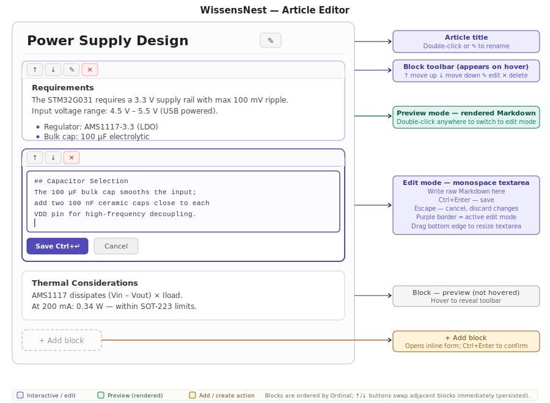

# WissensNest — Knowledge Workbench (Articles)

## Overview

The Knowledge Workbench is the authoring side of WissensNest. Where conversations are ephemeral dialogue with the AI, articles are structured documents you build deliberately — capturing, organizing, and refining knowledge.

The hierarchy is:

```text
Project
  └── Section
        ├── Conversations (dialogue)
        └── Articles
              └── Blocks  (atomic Markdown chunks)
```

A **Section** is a thematic subdivision of a project. A **Article** is a document inside a section. A **Block** is one atomic Markdown chunk inside an article — the unit you write, edit, reorder, and eventually export.

---

## Sections {#sections}

### Creating a section

1. Expand a project in the sidebar (click its name or chevron).
2. Click **+ New section** at the bottom of the project.
3. An inline input appears — type a section name and press **Enter** (or click ✓).
4. Press **Escape** to cancel.

The new section appears collapsed (▸) below the project's direct conversations.

### Expanding a section

Click the section's **▸** chevron or its name to expand it. The chevron turns to **▾** and the article list appears below.

### Renaming a section

Hover over the section row — action buttons appear on the right:

- Click **✎** to start inline editing.
- Type the new name, then press **Enter** to confirm or **Escape** to cancel.

### Deleting a section

Hover over the section and click **✕**. An inline confirmation prompt appears. Click **Yes** to delete, **No** to cancel.

> **Note:** Deleting a section permanently soft-deletes the section and all its articles and blocks. Conversations that belonged to the section are not deleted — they move back to the project level.

---

## Articles {#articles}

### Creating an article

1. Hover over a section in the sidebar.
2. Click the **+** button that appears in the section's action row.
3. The section expands (if it was collapsed) and an inline input appears.
4. Type the article title and press **Enter** (or click ✓).
5. The article editor opens immediately in the main panel.

### Opening an article

Click any **📄 Article title** in the sidebar. The article editor opens in the main panel, replacing the chat view. The article remains selected in the sidebar (highlighted) while you are editing it.

### Renaming an article

Hover over the article in the sidebar and click **✎**. Type the new title and press **Enter** to confirm or **Escape** to cancel.

You can also rename from inside the article editor — see *Editing the article title* below.

### Deleting an article

Hover over the article in the sidebar and click **✕**. Confirm with **Yes**. If the article is currently open in the editor, the editor navigates back to the home page.

---

## The Article Editor {#article-editor}



Opening an article shows the **Article Editor** — a full-width page with the article title at the top and a vertical list of blocks below.

### Editing the article title

- **Double-click** the title, or click the **✎** button to the right of it.
- The title becomes an editable text field.
- Press **Enter** to save the new title.
- Press **Escape** to cancel without saving.

---

## Blocks {#blocks}

A block is a self-contained piece of Markdown content. Blocks are ordered manually — you control the sequence with ↑/↓ buttons.

### Preview mode

By default every block shows its **rendered Markdown output** — headings, lists, tables, code blocks, etc. are fully formatted.

Hover over a block to reveal the **toolbar** in a thin bar above the content:

| Button | Action |
| --- | --- |
| ↑ | Move this block one position up (disabled at top) |
| ↓ | Move this block one position down (disabled at bottom) |
| ✎ | Switch to edit mode |
| ⊕ | Merge this block with the one directly below (hidden on last block) |
| ⋯ | Open context menu (Move to… / Copy to…) |
| → Chat | Send block content to a new conversation as seed text |
| **Link** | Copy a Markdown link to this block to the clipboard |
| ✕ | Delete this block |

### Edit mode {#block-edit}

Click **✎** in the toolbar, or **double-click** anywhere in the block's preview area.

The block switches to **edit mode**:

- Content appears in a **monospace textarea** — raw Markdown.
- The textarea expands to fill most of the viewport height so you have a large, comfortable editing area even for long blocks.
- Drag the bottom edge of the textarea to resize it manually if needed.
- Press **Ctrl+Enter** to save and return to preview mode.
- Press **Escape** to cancel and discard any unsaved changes.
- Click **Save**, **Split here**, **+ SVG**, or **Cancel** below the textarea.

The article page scrolls normally while you are editing — you can scroll up or down to read other blocks without leaving edit mode.

**Navigating back to the editing block:**

When a block is in edit mode, a **⊙ Editing** button appears in the article header. Click it at any time to scroll the page back to the block you are currently editing. This is useful after you have scrolled away to re-read earlier content.

> The block border turns purple while in edit mode to make it easy to see which block is active.

### Moving blocks (reorder within article)

Click **↑** or **↓** in the block toolbar to move the block one position up or down in the article. The new order is persisted immediately — there is no separate "save" step.

Both adjacent blocks update their ordinals in a single operation. The ↑ button is disabled on the first block; ↓ is disabled on the last.

### Moving a block to another article

Click **⋯** in the toolbar to open the context menu, then choose **Move to…**.

A picker panel opens inside the block, showing all sections and articles in the current project. Click any article title to move the block there. The block disappears from the current article immediately — it is appended to the end of the target article.

A brief **"Moved."** confirmation appears below the article title and dismisses automatically.

### Copying a block to another article

Click **⋯** → **Copy to…**. Works identically to Move, but the original block stays in place. The copy is appended to the end of the target article.

A brief **"Copied."** confirmation appears.

> The article picker is loaded once per editor session and cached. If you add new articles and want the picker to reflect them, reload the page.

### Merging blocks {#block-merge}

Click **⊕** in the toolbar to merge the current block with the block immediately below it.

The two blocks' Markdown content is joined with a blank line between them. The merged result replaces the first block; the second block is deleted. The merge is applied immediately with no confirmation step.

### Splitting a block {#block-split}

1. Click **✎** (or double-click) to enter edit mode.
2. Place the cursor in the textarea at the point where you want to split.
3. Click **Split here**.

The block's current content is saved, then split at the cursor position. The text before the cursor becomes the first block; the text after becomes a new block inserted immediately below. Both parts are trimmed of leading/trailing whitespace. You are returned to preview mode.

> If the cursor is at the very start or very end of the text, Split here does nothing — splitting there would produce an empty block.

### Deleting a block

Click **✕** in the toolbar. An inline confirmation bar appears inside the block:

- Click **Yes** to permanently delete the block.
- Click **No** to cancel.

Deletion is immediate and cannot be undone.

### Adding a new block

Click **+ Add block** at the bottom of the block list. An inline form opens:

- Write Markdown content in the textarea.
- Press **Ctrl+Enter** to confirm and add the block at the end of the article.
- Press **Escape** to cancel without adding anything.

The new block is appended after the last existing block. Use **↑** afterwards to move it into position if needed.

---

## Export mode {#export-mode}

Click the **Export** button in the article header to enter export mode.

In export mode:

- All block toolbars are permanently visible (no hover required).
- A **checkbox** appears as the first item in every toolbar.
- Check any number of blocks by clicking their checkboxes. Selected blocks are highlighted with a purple border.
- A **PDF button** appears to the left of the Export toggle, showing either **PDF (all)** or **PDF (n)** depending on whether any blocks are checked.

### Exporting to PDF

| Button label | What it exports |
| --- | --- |
| **PDF (all)** | All blocks in the article, in ordinal order |
| **PDF (n)** | Only the *n* checked blocks, in their article order |

Click the PDF button to generate and download a PDF file. The file is named after the article title (e.g. `Key Findings.pdf`).

The PDF contains the article title as a bold heading, followed by each block's content converted from Markdown to readable plain text, with thin dividers between blocks and page numbers in the bottom-right corner.

While the export is in progress the button label changes to **Exporting…** and the button is disabled to prevent double-submission. On completion the browser's standard file-save dialog opens (or the file is saved to the Downloads folder, depending on browser settings).

Click **Export** again to exit export mode and clear all block selections.

An **Export SVGs** button also appears in the article header (to the left of the Export toggle) whenever the article contains at least one SVG image. Click it to download a `.zip` archive of all the SVGs referenced in the article. See [SVG Images](08_SVG_Images.md#export-svgs) for details.

---

## Cross-References {#cross-references}

Articles and chat messages can link to each other. Links are stored as standard Markdown inside block content — they work in preview and can be clicked to navigate directly to the target.

### Copying a link to a block {#block-link}

Hover over any block and click **Link** in the toolbar. The clipboard receives a Markdown-formatted link:

```markdown
[First line of block content](/article/{articleId}#block-{blockId})
```

Paste it into any other block's content (or a chat message) to create a navigable cross-reference. When someone clicks the link, the app opens the target article and scrolls to the exact block.

### Copying a link to a conversation message

In the chat view, hover over any message bubble and click **Link**. This works the same way — a Markdown link is copied that navigates to that specific message with a highlight animation on arrival. See [Chat Interface — Copying a link to a message](02_Chat.md#message-link).

### Inserting links with the `[[` autocomplete {#link-autocomplete}

While editing a block, type `[[` anywhere in the textarea. A floating search dropdown appears immediately below the edit area.

1. Type a few words — the dropdown searches articles (by title), blocks (by content), and messages (by text) as you type, with a 300 ms debounce.
2. Each result shows a kind icon, the item's label, and a breadcrumb path (e.g. *Project › Section › Article*):
   - 📄 — article
   - 🧱 — knowledge block
   - 👤 — your message (user turn)
   - ✨ — assistant reply
3. **Click any result** to insert a complete Markdown link at the cursor position and close the dropdown.
4. Press **Escape** to close the dropdown and continue editing without inserting anything.

The inserted link uses the same standard Markdown format as the "Link" button. The cursor is placed immediately after the inserted link so you can continue typing.

> **Tip:** You can also paste links copied from other blocks or messages directly into the textarea — the `[[` shortcut is just a faster way to find and insert them without switching pages.

---

## SVG Images in Blocks

Blocks can contain inline SVG diagrams and illustrations. While editing a block, click **+ SVG** in the action bar to open the image picker. You can paste SVG XML, upload a file, or pick an existing image from the library.

SVG images render inline in the block preview, constrained to the block width.

For full details — inserting, replacing, the SVG Library page, bulk import, and more — see **[SVG Images](08_SVG_Images.md)**.

---

## Markdown in Blocks

Blocks support standard Markdown plus:

- **Tables** — pipe-separated columns
- **Task lists** — `- [ ] item` and `- [x] item`
- **Emphasis extras** — strikethrough (`~~text~~`), subscript, superscript

Any Markdown you write is stored as plain text and rendered on display. Editing always shows the raw source, so what you write is exactly what is stored.

---

## Workflow Example

A typical research session using Articles alongside Chat:

1. Start a conversation in the project — ask the AI about a topic, explore ideas.
2. Create a section *"Notes"* and an article *"Key Findings"*.
3. In the chat, click **→ Block** on a useful AI answer — it lands in the article as a block.
4. Open the article editor, edit the block, add more blocks as knowledge accumulates.
5. Use **⊕** to merge two closely related blocks, or **Split here** to break a long block into parts.
6. Use **⋯ → Move to…** to send a block to a more specific article as the structure evolves.
7. Click **Export** to enter export mode, check the best blocks, and click **PDF (n)** to download a focused PDF of just the selected content.

The chat and the article exist side by side in the same project — switching between them is a single click in the sidebar.

You can also cross-link: click **Link** on any block to copy a link, paste it into another block, and navigate directly between them. Use the **← back** button in the ribbon to return to where you came from after following a link.
