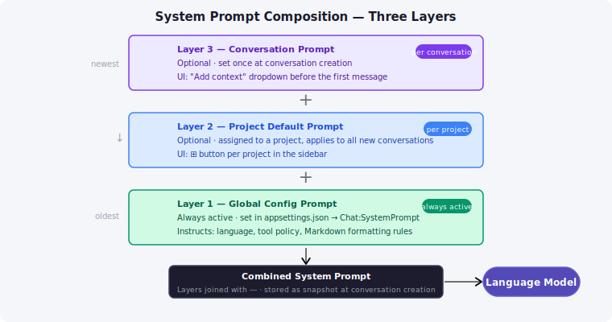

# WissensNest — Prompts and Profiles

## Overview

Prompts and Profiles are the customization layer of WissensNest.
They let you define reusable text instructions and named configuration presets
so you don't have to retype context every time you start a conversation.

- **Prompts** — individual reusable text snippets organized into categories. A prompt might say
  *"Answer concisely, in three sentences or fewer"*, or contain a reference document, a persona
  description, or background facts about a project.
- **Profiles** — named presets that bundle an ordered list of prompts together and specify which
  tools should be active.

---

## Prompts {#prompts}

### Navigating the prompt library

Click the **✎ Prompts** tab in the sidebar.

The panel shows **categories** (expandable groups) with prompts nested inside. Click a category
name or its **▸** chevron to expand it. Click again to collapse.

### Creating a category

Click **+ New Category** at the bottom of the Prompts panel. Type a name and press **Enter**
(or click Add). Categories are for organization only — they have no effect on prompt behaviour.

### Creating a prompt

1. Hover over a category row — a **+** button appears on the right.
2. Click **+**. An inline input appears inside the category.
3. Type the prompt name and press **Enter**.
4. The prompt is created with empty content and opens immediately in the editor.

### Editing a prompt {#prompt-editor}

Click any prompt name in the sidebar to open the **Prompt Editor**.

The editor displays the prompt content in a single block with a toolbar:

| Button | Action |
| --- | --- |
| **MD** | View content as rendered Markdown |
| **Raw** | View raw text |
| **✎ Edit** | Enter edit mode |
| **Category** | (edit mode only) move this prompt to a different category |
| **Save** | Save changes — also **Ctrl+Enter** |
| **Cancel** | Discard changes — also **Escape** |

Double-click the prompt title (the heading above the block) to rename it inline. Press **Enter** to confirm.

In edit mode the content textarea supports full Markdown, rendered in MD view.

If you navigate away with unsaved changes, a confirmation dialog appears.

### Deleting a prompt

Hover over the prompt name in the sidebar and click **✕**. Confirm with **✓**.

### Deleting a category

Hover over the category header and click **✕**. Confirm with **Yes**.

> Deleting a category permanently deletes all prompts inside it.

---

## How Prompts Reach the Model — Three Layers {#prompt-layers}

Every request to the model includes a **system prompt** assembled from up to three layers:

| Layer | Source | How to set |
| --- | --- | --- |
| **1 — Global** | `appsettings.json → Chat:SystemPrompt` | Set by the system administrator; applies to every conversation |
| **2 — Project default** | A prompt collection assigned to the project | Click **⊞** on a project in the sidebar → pick a prompt collection |
| **3 — Conversation** | A prompt collection chosen at conversation creation | Use the **Add context** dropdown before sending the first message |

The three layers are joined with `---` separators and sent together as the system prompt.
If a layer is absent it is simply skipped.

The combined prompt is stored with the conversation at creation time.
It does not change after the first message — switching the project's default prompt later
does not affect existing conversations.

---

## Profiles {#profiles}

### What is a Profile?

A **Profile** is a named preset that holds:

- An ordered list of **prompts** drawn from your prompt library
- A set of **enabled tools** (web search, weather, library, etc.)

Use profiles when you often start conversations with the same combination of instructions and tools.

**Examples:**

- *Embedded Dev* — includes a prompt with hardware specs and pinout notes; Library and Web Search enabled.
- *Language Tutor* — includes a German-correction prompt; no tools enabled.
- *History for Kids* — includes a prompt asking for simple explanations; no tools.

> **Note:** Profiles are not yet automatically applied when starting a new conversation.
> The Profile editor lets you compose and save presets; the integration with the conversation
> flow is still being developed.

### Navigating profiles

Click the **◈ Profiles** tab in the sidebar.

Profiles are organized in **folders**, similar to how prompts are organized in categories.
Click a **▸ folder name** to expand it and see its profiles.

### Creating a folder

Click **+ New Folder** at the bottom of the Profiles panel. Type a name and press **Enter**.

### Creating a profile

1. Hover over a folder — a **+** button appears.
2. Click **+**, type a profile name, and press **Enter**.
3. The profile is created and opens immediately in the editor.

### The Profile Editor {#profile-editor}

The editor has three sections:

#### Name

Double-click the title or click **✎** in the header to rename. Press **Enter** to confirm.

#### Description

A free-text note visible only in the editor — not sent to the model.
Double-click the description area or click **✎** to edit. Press **Ctrl+Enter** to save, **Escape** to cancel.

#### Assigned Prompts

The ordered list of prompts this profile composes:

| Action | How |
| --- | --- |
| Add a prompt | Select from the dropdown (grouped by category) and click **+ Add** |
| Expand to preview | Click **▶** next to a prompt name |
| Reorder | Click **↑** / **↓** |
| Remove | Click **✕** |

When the profile is applied, its prompts are composed in the listed order (top = first).

#### Tools

A checkbox per registered tool. Checked tools are the defaults when this profile is active.

### Deleting a profile

Hover over the profile in the sidebar and click **✕**. Confirm with **✓**.

### Deleting a folder

Hover over the folder header and click **✕**. Confirm with **Yes**.
