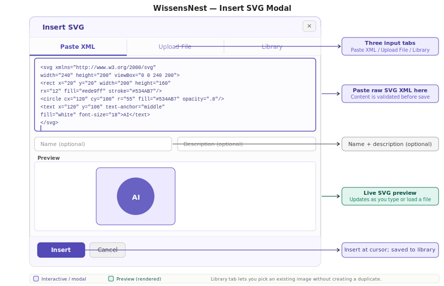
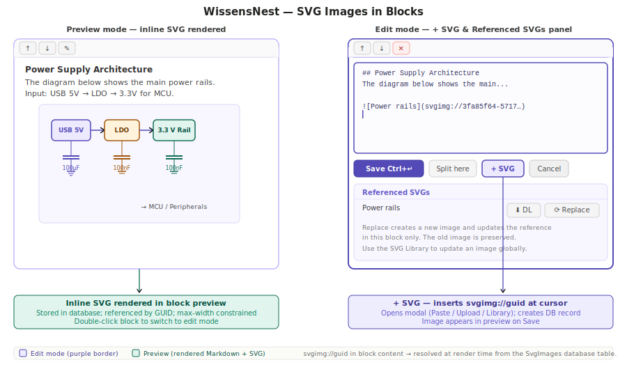
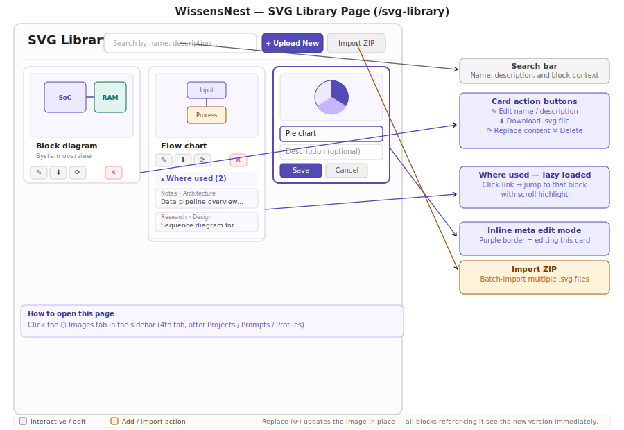

# WissensNest — SVG Images

## Overview {#svg-overview}

SVG images let you embed diagrams, flowcharts, circuit schematics, and any other vector graphic directly inside article blocks. Images are stored in the WissensNest database and referenced from block content — so you can reuse the same image in multiple articles and manage your entire illustration library in one place.

Key characteristics:

- An SVG image lives in the **SVG Library** — one central store for the whole application.
- Inside a block, an image appears as a short reference (``) in the raw Markdown, and renders as a full inline graphic in the preview.
- Replacing an image in the library updates every block that uses it, immediately.
- Replacing an image from within a block editor creates a private copy — only that block's reference changes; all other blocks keep the original.

---

## Inserting an SVG into a block {#insert-svg}



### Opening the picker

1. Open any block for editing (click **✎** or double-click the block).
2. Place the cursor where you want the image to appear.
3. Click **+ SVG** in the action bar below the textarea (next to Save and Split here).

The **Insert SVG** modal opens. It has three tabs.

### Paste XML tab {#paste-xml}

Type or paste raw SVG XML into the text area. As you type, a live preview renders below the field — you can check proportions and colours before saving.

Optionally add a **Name** and **Description** to make the image discoverable in the library later. The name also becomes the alt text of the inserted link.

Click **Insert** to save the image to the library and place the reference in your block at the cursor position.

> **Tip:** Most drawing applications (Inkscape, Figma, Affinity Designer, etc.) let you export or copy as SVG. Paste the result directly into this field.

### Upload File tab {#upload-file}

Click the file selector and choose any `.svg` file from your disk. The file is read immediately and its content loads into the editor — the name field is auto-filled from the filename.

Review the preview, optionally adjust the name, then click **Insert**.

### Library tab {#library-tab}

If the SVG you need is already in the library, use this tab to reuse it without creating a duplicate.

1. Type a few words in the search field — the library searches by name, description, and the text surrounding image references in blocks.
2. Click any thumbnail to select it (highlighted with a purple border).
3. Click **Insert** — no new record is created; the existing image is referenced.

---

## SVG images in block preview {#svg-in-preview}



After saving the block, the image appears rendered inline within the block's Markdown content. It is constrained to the block width and centred.

The raw Markdown stored in the block looks like this:

```markdown

```

This is standard Markdown image syntax — the `svgimg://` prefix tells WissensNest to fetch the image from the database rather than a URL.

> If an image cannot be found (for example, it was deleted from the library while the article was open), a grey *[SVG not loaded]* placeholder appears instead. Reload the article to refresh.

---

## Managing SVGs within a block {#block-svg-management}

When a block is in **edit mode** and its content contains one or more SVG references, a **Referenced SVGs** panel appears below the action buttons. Each row shows the image name and two buttons.

| Button | Action |
| --- | --- |
| **⬇** | Download this image as a `.svg` file |
| **⟳** | Replace — opens the Insert SVG modal pre-loaded; creates a new image (copy-on-edit); only this block's reference is updated |

### Downloading an SVG from a block

Click **⬇** next to any referenced image. The browser downloads the raw SVG file, named after the image's name (or a short ID prefix if unnamed).

### Replacing an SVG in a block (copy-on-edit)

Click **⟳** next to any referenced image to open the Insert SVG modal in **Replace** mode.

Choose Paste XML or Upload File and provide the updated SVG. Click **Insert**.

What happens:

- A **new** `SvgImage` record is created in the library with the new content.
- The reference in the current block is updated to point to the new record.
- The **original** image record is untouched — any other block still referencing the old image continues to show the original.

This copy-on-edit approach means you can safely revise an image in one block without accidentally changing all other articles that use it.

> To update an image globally (all references at once), use the SVG Library page instead — see *Replacing an image in-place* below.

### Exporting all SVGs from an article {#export-svgs}

In the **article header**, an **Export SVGs** button appears whenever the article contains at least one SVG reference.

Click it to download a `.zip` archive containing all SVGs referenced anywhere in the article's blocks, named by image name. This is useful for backing up diagrams, sharing them with collaborators, or loading them into a drawing application for revision.

---

## The SVG Library page {#svg-library}



### Opening the library

Click the **⬡ Images** tab in the sidebar — it is the fourth tab, after Projects, Prompts, and Profiles.

The library page opens as a full-width page showing all SVG images in a thumbnail grid.

### Searching the library {#library-search}

Type in the search bar at the top of the page. The search runs against:

- Image **name** and **description**
- The **text surrounding** image references in blocks — so you can find an image by the topic it illustrates, even if you never gave it a name

Results update automatically with a short debounce as you type. Clear the field to return to the full library.

### Editing image metadata {#edit-metadata}

Hover over any card and click **✎**. The card switches to inline edit mode with fields for name and description.

- Press **Save** (or Tab into the next field) to confirm.
- Press **Cancel** to discard.

Keeping images named makes the library searchable and the `[[` autocomplete in block editors more useful — names appear as the alt text in inserted links.

### Downloading an image {#download-image}

Hover over any card and click **⬇**. The raw `.svg` file is downloaded, named after the image's name.

### Replacing an image in-place {#replace-inplace}

Hover over any card and click **⟳**. The **Update SVG** modal opens (Paste XML or Upload File tab — the Library tab is hidden because it makes no sense to replace an image with itself).

Provide the new SVG content and click **Update**. The image record is updated immediately — **all blocks in all articles that reference this image now show the new version** without any further action.

This is the right approach when you have improved or corrected a diagram and want the change to propagate everywhere. Use the block-editor ⟳ button instead if you only want to update one specific usage.

> **Thumbnail regeneration:** after an in-place replace, the thumbnail in the library grid updates to show the new image on the next page load.

### Where used {#where-used}

Below the action buttons on each card, click **▾ Where used** to see a list of all blocks that reference this image. Each result shows:

- The article breadcrumb path (*Project › Section › Article*)
- The first line of the block's content

Click any result to navigate directly to that article and scroll to the exact block (highlighted with a brief amber pulse). Click **▴ Where used** again to collapse the list.

The list is loaded on first expand and cached for the session.

### Deleting an image {#delete-image}

Hover over any card and click **✕**. An inline confirmation appears.

- If the image is referenced in any block, the delete is refused and a notice explains where it is still used. Resolve the references first (delete or replace them in the blocks), then try again.
- If the image is not referenced anywhere, deletion proceeds and the card is removed from the grid immediately.

Deletion is a soft-delete — the record is hidden from the UI but not permanently removed from the database.

---

## Bulk import from a ZIP archive {#bulk-import}

In the library page header, click **Import ZIP**. Choose a `.zip` file from your disk.

Each `.svg` file inside the archive is extracted and saved as a separate `SvgImage` record. The image name is taken from the filename (without extension). Thumbnails are generated automatically for all imported images.

After the import completes, the new images appear at the top of the library grid.

> **Notes:**
> - Only `.svg` entries are processed; other file types inside the ZIP are ignored.
> - The ZIP can have any internal folder structure — only the filename (not the path) is used as the name.
> - Maximum ZIP size: 50 MB.

---

## Workflow examples

### Documenting a circuit design

1. Draw the schematic in KiCad or Inkscape and export as SVG.
2. Open an article block in edit mode, position the cursor, click **+ SVG → Upload File**.
3. Select the exported SVG. Add a short name (*"STM32 power tree"*). Click **Insert**.
4. Add explanatory text above and below the image in the same block, or split the block and put the image in its own block for easy reordering.
5. When the schematic is updated, open the SVG Library page, find the card by name, and click **⟳ Replace** to update everywhere at once.

### Reusing a company logo or recurring diagram

1. Upload the SVG once via **+ Upload New** on the library page.
2. In every article that needs it, enter block edit mode, click **+ SVG → Library**, search by name, click the thumbnail, click **Insert**.
3. Only one record exists in the database — all articles share the same image.
4. If the branding changes, replace it once in the library; every article updates simultaneously.

### Migrating existing SVG files

1. Collect all your `.svg` files into a single ZIP archive.
2. Click **Import ZIP** on the SVG Library page.
3. Review the imported images, add names and descriptions via **✎**.
4. Open the relevant article blocks and use **+ SVG → Library** to attach the right images.
