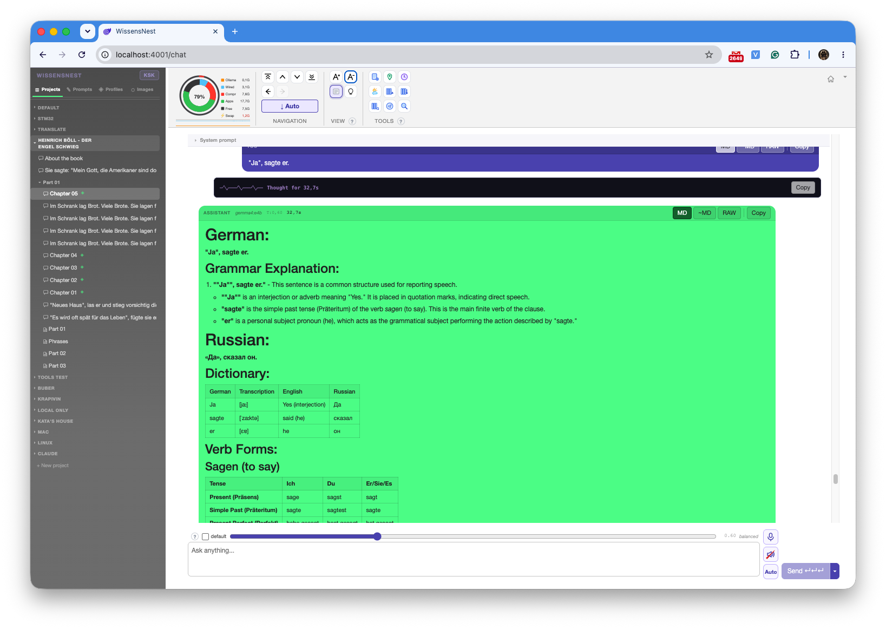
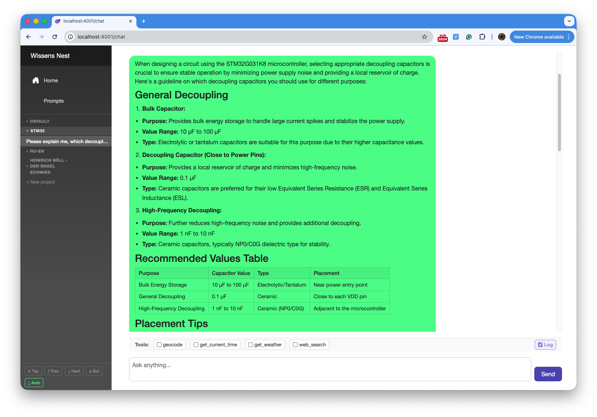
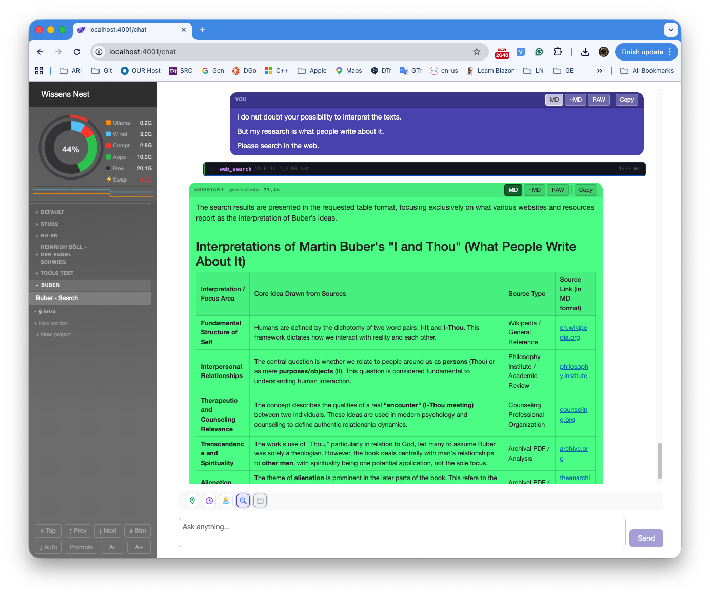
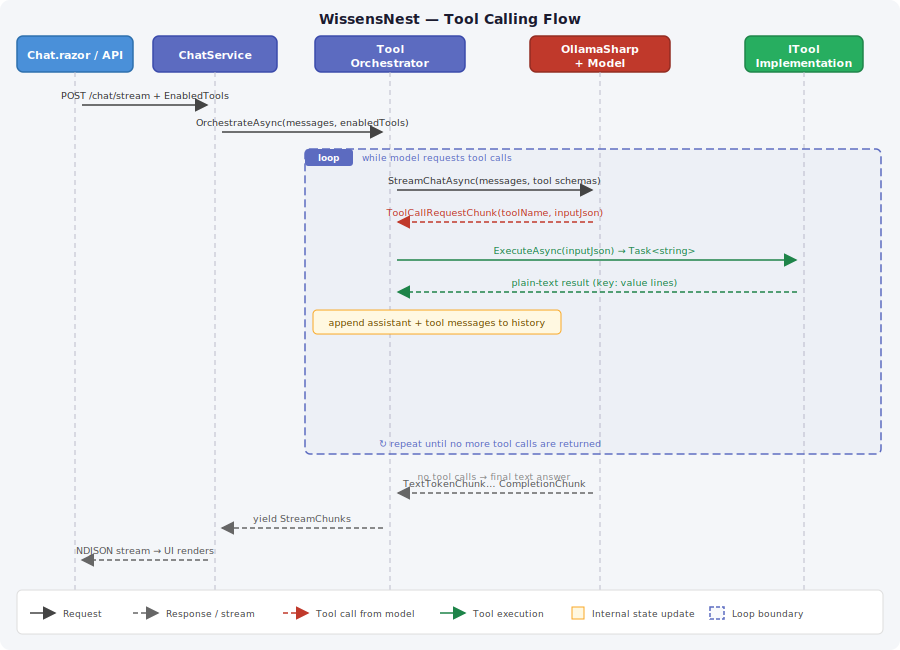

# WissensNest — A Local AI Assistant Research Project

[Back to the main page](../../README.md)

**Development period:** 2026.04–ongoing

**Starting question:** Can a language model actually help with real daily work if it runs entirely on local hardware?[^1]

---

## How It Started

I had been using ChatGPT on and off. Sometimes genuinely useful, always a black box. I knew the rough shape of the technology — transformer architecture, next-token prediction, trained on large text corpora — but that's like knowing a car has a combustion engine. It doesn't tell you how it drives.

So I built one. Not from scratch — training from scratch requires data centers. But I set up local inference with Ollama, wrote an API layer, built a browser-based UI, wired in tools, and started using the results for actual daily work. The goal was to learn by doing.

A few months in, the system has grown in ways I didn't plan, and some of what I've found is more interesting than I expected.

---

## The Case for Local

Cloud AI services are excellent. The models are larger, the infrastructure is managed, the latency is low. I'm not arguing against them.

But they have a structural property worth thinking about: every prompt you type goes somewhere. It gets processed on someone else's hardware, may be logged, may be used for training, and is subject to whatever that company's policies turn out to be over the next decade. For casual use, that's fine. For work notes, engineering questions, family conversations, or anything sensitive — it's a different calculation.

WissensNest runs entirely on my hardware. The models run locally through Ollama. The conversation database is a SQLite file on my machine. Nothing leaves unless a tool explicitly reaches out — and I control which tools are available per conversation.

That last part is the interesting design: the system can do web search, fetch web pages and PDFs, and query my local document library — all while keeping the conversation and all data local. The *reasoning* happens here. The *reaching out* is selective and explicit.

This is not a product. It is a research project. But the pattern — local inference, selective external access, full data ownership — seems like it could be the right shape for a privacy-first AI assistant that organizations or individuals could actually trust.

---

## What It Does

### Language Learning

You're reading a book in German. You encounter a sentence you can't parse. Paste it in, and the assistant:

- builds a word-by-word glossary with usage notes
- explains the grammatical constructions (Konjunktiv II, Passiv, Modalpartikeln)
- conjugates the verbs
- answers follow-up questions about usage or context

The whole session is saved under the relevant project. Next week, you can come back and review. The conversation is also the study notes.

**Fig. 1** The German Book Reader project. The project has a system prompt that shapes how the assistant responds to German text — it provides translation and grammatical breakdown automatically, without being asked each time, because the instructions are baked into the project context.

---

### Engineering Work

The assistant is part of my regular workflow for embedded development: explaining register configurations, working through SPI/I²C timing constraints, reading datasheet excerpts. It is not infallible — the model knows only what it was trained on — but it gets me to the right section of the datasheet faster, and it handles the routine questions well enough that I spend less time on them.

**Fig. 2** An embedded development conversation. The project context is set up to assume the embedded systems domain, which shapes the model's default assumptions about what I'm asking.

---

### Reaching into the Real World

A language model is frozen in time and blind to its environment. WissensNest closes some of those gaps through a tool system.

Ask *"What's the weather in Munich right now?"* — the model decides, without being told, to call the **Geocoding** tool to resolve "Munich" to coordinates, then the **Weather** tool to fetch current conditions from open-meteo.com. It calls them silently. The answer looks like the model just knows the weather.

Ask *"What do people say about Martin Buber's concept of dialogue?"* — the model calls the **WebSearch** tool, scrapes DuckDuckGo, and synthesizes the results.

Point it at a PDF from my local library — a datasheet, a research paper, a technical manual — and the **Library** tools handle it: search by keyword, read specific pages, and summarise. By default, the model calls `library_search` before `web_search`, so local sources take priority.

For web documents, **FetchPage** fetches HTML or PDF content directly and passes it to the model for reading.

**Fig. 3** Research on the Web for the specific subject (Martin Buber works). The assistant uses web search to gather sources and synthesizes the results into a structured answer. The tool calls happen silently — no prompt required.

The tools run as isolated .NET assemblies, each implementing a single `ITool` interface. Adding a new one means implementing that interface and registering it in DI. The routing, tool selection, streaming, and persistence all pick it up automatically.

**Fig. 4** The tool-calling sequence. The model decides which tools to call; the orchestrator executes them; results flow back into the model's context. The loop continues until the model has everything it needs and returns a final text answer.

---

### Knowledge Workbench

This evolved from a practical problem. Conversations are good for exploration. But they are linear and don't accumulate. After a few months, I had useful material — explanations, summaries, reference answers — scattered across dozens of threads with no structure.

The Knowledge Workbench adds a second mode alongside the chat: **Articles**. An article is a curated Markdown document made of movable blocks. You can take a message from any conversation — something the assistant explained well, a summary you asked it to write — and promote it to a block in an article. From there you can reorder it, split it, merge it with adjacent blocks, move it to a different article, or export the article as PDF.

The hierarchy is: Project → Section → Article → Block.

**Fig. 5** The full hierarchy. Conversations and Articles live side by side within a Section. The bridge — Promote to Block, Send to Conversation — lets you move material in both directions between exploratory dialogue and curated writing.

The flow I find useful: explore a topic in conversation, promote the useful parts to a Scratch area, then organise them into an article when the structure becomes clear. The conversation stays as the working record; the article is the distillation.

---

### Voice

The most recent addition is voice input and output in the browser UI.

It uses **whisper.cpp** (large-v3 model, Metal-accelerated on the M3) for speech-to-text and **Piper TTS** for text-to-speech, with separate Russian, German, and English voice models. The mic button records, sends audio to the local Whisper instance over HTTP, transcribes, and fills the input field. The response can be played back through Piper.

Everything runs on-device. No speech data leaves the machine.

The next intended step is a headless version on a Raspberry Pi: a small box listening for a wake word, processing speech locally, and talking back — without any cloud dependency in the loop.

---

## Architecture

The system follows a layered architecture with strict dependency boundaries. The language model, the database, and each tool are separate assemblies. The core logic never knows which model is in use — it calls `ILanguageModelClient`. The tools never know about each other.

**Fig. 6** Current system structure. All components run on local hardware. External service calls happen only through explicit tool invocations.

The main data flow for a chat request:

1. UI streams the request to the API over HTTP/SSE
2. API loads the conversation's stored prompt snapshot and the list of enabled tools
3. ChatService builds the full system prompt and passes it to the ToolOrchestrator
4. ToolOrchestrator loops: call the model → if a tool is requested, execute it → append the result to message history → repeat until the model returns pure text
5. Text tokens stream back through the API to the UI in real time
6. Voice interfaces currently connected to the Web UI. In future it should be not only Web UI feature but also separated chat flow.

Streaming is handled as Server-Sent Events. A `StreamingService` in the UI manages circuit-safe token accumulation, so switching conversations mid-stream doesn't cause exceptions or data loss.

The three-layer prompt system is worth mentioning: a global system prompt in config, a project-level prompt assigned per project, and a conversation-level prompt set at conversation creation. All three layers compose at request time. This is what lets the German reader project behave differently from the engineering project without any special-case code.

---

## What I Found Along the Way

The most surprising discovery was not technical.

I expected something that matches patterns. What I kept encountering is something that jokes. During a debugging session, it noticed I was asking the same question twice and mentioned it with mild humour, then accepted "I am debugging the UI" as a perfectly reasonable answer and moved on. No code path produces "mild humour on repeat questions." It emerged from the model having been trained on enough human text to recognize the social shape of that situation.

I find this easier to think about through a framing I've settled on over the months. I distinguish what I call a *Chemical computer* — fast, associative, pattern-driven, the kind of thinking that fires under pressure or in automatic mode — from a *Logical computer* — deliberate, structured, step-by-step. A language model is a Chemical computer. The architecture around it — the project structure, the prompt layers, the tool system — is the Logical computer. Neither is sufficient alone. The combination handles a wider range of problems than either could.

That is still a hypothesis. Testing it is part of why the project continues.

---

## Where It Goes Next

The things I know are interesting and haven't built yet:

**Persistent memory.** The model doesn't know who you are across sessions. Injecting extracted facts from past conversations into future ones would change the character of the tool significantly — closer to a genuine assistant than a stateless oracle.

**Home automation.** A `HomeControl` tool talking to Home Assistant. Voice interface on a Raspberry Pi plus lights that respond to spoken commands — a legitimate ambient assistant with no cloud dependency anywhere in the chain.

**Reasoning models.** The streaming layer already handles `ThinkingChunk` tokens for models that expose chain-of-thought reasoning (Qwen3, DeepSeek-R1, and similar). Turning on thinking produces visibly better results on multi-step problems. This is already working; the question is how much it matters in practice.

**Document retrieval.** The library tools do keyword search over PDFs. The natural next step is embedding-based retrieval — proper RAG — for larger document collections.

None of these require new infrastructure breakthroughs. They require time.

---

## Technical Notes

**Stack:** .NET 10, Blazor Server, EF Core + SQLite, Ollama (qwen2.5:14b default, phi4 for speed), OllamaSharp

**Tools implemented:** GetCurrentTime, GetWeather (open-meteo.com), Geocoding (open-meteo.com), WebSearch (DuckDuckGo HTML scraping via AngleSharp), FetchPage (HTML + PDF, with byte cache), Library (search / read / describe — local PDF and Markdown files)

**Voice:** whisper.cpp (large-v3, Metal-accelerated), Piper TTS (RU/DE/EN voices), ffmpeg for browser audio format conversion

**Knowledge:** Sections → Articles → Blocks hierarchy, PDF export via QuestPDF, SVG image library with thumbnail generation

**Hardware:** MacBook Pro M3, 36 GB RAM

**Development tools:** VS Code, Claude Code.

---

## Documentation

The sections above are the narrative. Everything below is the underlying project documentation, mirrored here in full.

### Published (in-app encyclopedia)

See [Pub/](./Pub/index.md) for the user guide and architecture reference that is also served as the in-app help system.

| Section | Contents |
| --- | --- |
| [User Guide](./Pub/User/) | Getting started, chat, articles, tools, prompts, quick reference |
| [Architecture](./Pub/Architecture/) | System overview, data model, tool framework, streaming, Knowledge Workbench design, voice roadmap |

### Developer notes (internal)

`Dev/` contains implementation diaries, architecture decision records, and design explorations written during development — the unfiltered build log behind the polished narrative above.

| File | Topic |
| --- | --- |
| [00_Prerequisites](./Dev/00_Prerequisites.md) | Ollama install and configuration |
| [01_Architecture](./Dev/01_Architecture.md) | Early top-level architecture notes |
| [02_Assemblies](./Dev/02_Assemblies.md) | Assembly purposes and dependency diagram |
| [03_ChatService](./Dev/03_ChatService.md) | Chat implementation notes |
| [04_Concepts](./Dev/04_Concepts.md) | AI assistant concepts |
| [05–10 Persistence](./Dev/05_Persistence.md) | Persistence design, entities, interfaces, serialization, reading to UI |
| [11_SidebarUI](./Dev/11_SidebarUI.md) | Sidebar implementation notes |
| [12–15 Context / Prompts](./Dev/12_ProjectContext.md) | Project context, conversation mode, prompt collections |
| [13_MessageEditing](./Dev/13_MessageEditing.md) | Message editing and stale-message flow |
| [16_Tools](./Dev/16_Tools.md) | Tool framework implementation |
| [17_RagAndAdr](./Dev/17_RagAndAdr.md) | RAG concepts and ADRs |
| [18_StreamingService](./Dev/18_StreamingService.md) | StreamingService decoupling from Blazor lifecycle |
| [19_WebSearch](./Dev/19_WebSearch.md) | DuckDuckGo HTML scraping implementation |
| [20_FamilyAccess](./Dev/20_FamilyAccess.md) | LAN sharing |
| [21_SystemMetrics](./Dev/21_SystemMetrics.md) | MemoryGauge and ribbon metrics |
| [22_Voice](./Dev/22_Voice.md) | Voice interface design |
| [23_KnowledgeWorkbench](./Dev/23_KnowledgeWorkbench.md) | Knowledge Workbench full design |
| [24_FetchPage](./Dev/24_FetchPage.md) | FetchPage tool implementation |
| [25_LibrarianTool](./Dev/25_LibrarianTool.md) | Library tools implementation |
| [99_Useful_Hints](./Dev/99_Useful_Hints.md) | Developer hints and gotchas |

---

[^1]: Personal research project. Long-term ambitions include home automation (KiCad design assistance, sensor integration), a headless voice assistant on Raspberry Pi, and whatever else turns out to be tractable on local hardware.
