# All Projects - Chronological list

## [2026. Windows Explorer - Like File System Navigation Tool](./39_Shell/Article.md)

This software helps me to feel comfortable after migrating from Windows to Mac. It gave me the possibility to navigate through the Mac File Tree, view directory contents, modify text files, and use the terminal comfortably.

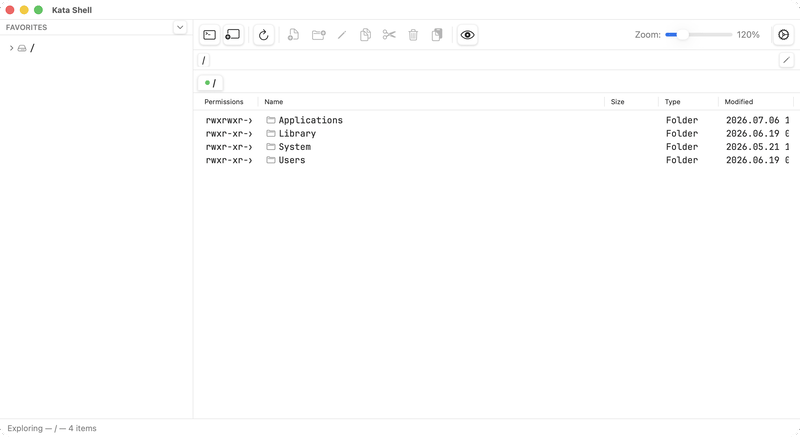

## [2026. Font Rasterization Service](./38_EmbeddedFonts/Article.md)

Embedded Font Generator is a SaaS that rasterizes TTF fonts into C header files for small monochrome displays — SSD1306 OLED, e-ink, ST7735. Users can pick a font, set the cell dimensions, trim the character set to what the firmware actually needs, manually fix any pixels, preview on an emulated display, and download a ready-to-compile `.h` file.

It is the actual working site, which can serve the needs of embedded developers right now at **[embedded-font.com](https://embedded-font.com/)** — for free, runs in the browser, no account needed.

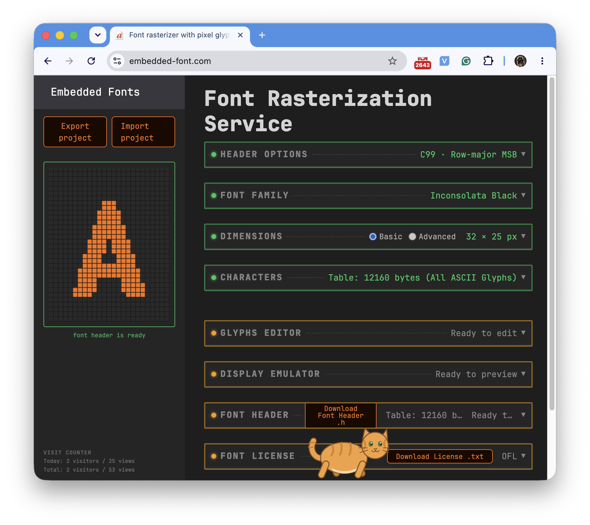

## [2026. AI Assistant](./37_LocalAI/Article.md)

In this project, I'm experimenting with language models to assist me in my daily activities.

TI just started working on this project, and the description will grow here.

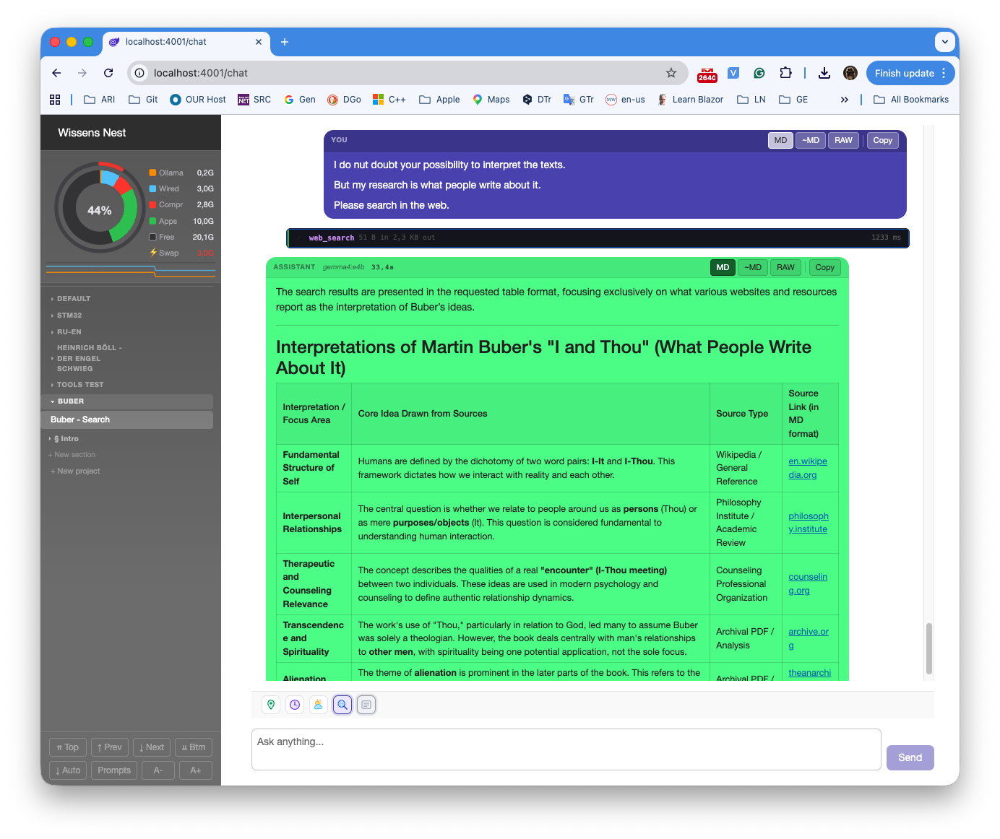

## [2026. Interop Communication Example](https://github.com/K-S-K/Interop)

Sometimes, when I work on hardware-related projects, I see that some tasks are better implemented in C++ than in C#. The reasons are performance-, compatibility-, and culture-related. On the other hand, some functionality, such as web services or database communication, is more efficiently implemented in C#. And I got curious: how easy or difficult is it to integrate the benefits of both technologies into a single solution? And, is it possible to debug the control flow transparently through the border between them, as if it were one homogeneous piece of code?

This project is the result of a series of experiments in this direction. It can also serve as a boilerplate for developing a native C++ DLL and a C# client EXE in a single Visual Studio solution.

## [2024-2026 The Software Digital Twin of Gaia telescope Attitude and Orbit Control System](./36_GaiaSDT/Article.md)

During my work at the Astronomisches Rechen-Institut of Heidelberg University, I developed a physics-based Software Digital Twin of the Gaia telescope Attitude and Orbit Control System. It is a tool for testing and tuning spacecraft attitude control algorithms, originally prototyped in Python and Java by my colleagues.
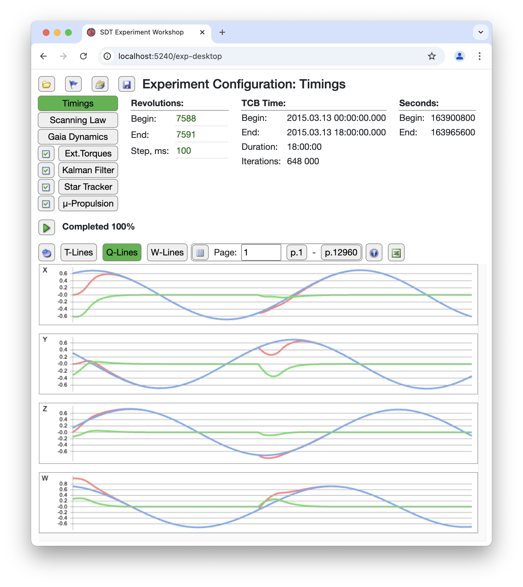

## [2025. The FreeRTOS-based timer working on RP2350](https://github.com/K-S-K/Pico-Timer-2)

Through this project, I gained experience with FreeRTOS and embedded development, and some embedded development aspects, including:

- FreeRTOS Queues as a signaling carrier inside the system;
- State machine as a configurable abstract menu controller;
- Rotary Encoder as the only input of a User Interface;
- Screen abstraction layer, which potentially allows the use of different types of displays;
- I2C communication with Display and Real-Time Clock Module;
- Raspberry PI Pico FreeRTOS toolchain setup.

## [2025 Simple 3V3 LMR50410 DC-DC Converter](https://github.com/K-S-K/PWR-LMR50410-Simple)

Just a first CAD-based PCB design experience as part of passing the Fedevel course.

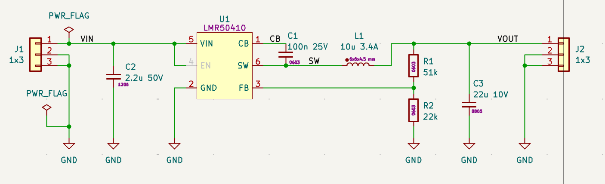

## [2024-2025. The Experiment with .NET and Raspberry PI](https://github.com/K-S-K/RPIDBClock)

Through this project, I touched the I2C devices from the .NET code and found it easy and convenient. .NET provides all necessary tools in the "System.Device.Gpio" NuGet library to build any communication API at the GPIO level, and also to work with "I2cDevice" and just exchange data with devices at byte resolution. I also made a desk clock that shows the current date and time, as well as the two closest trains on my commute route. The development process was fun and attractive.

## [2024. Data exchange between Docker containerized applications](https://github.com/K-S-K/CCCS)

These days, I started relearning C++ and learning Linux to prepare for my new job at the Astronomisches Rechen-Institut, a branch of Heidelberg University. That's how I created this project.

The purpose of this project is to adjust the approach to creating multiple projects in separate Docker containers and to allow them to communicate via sockets. The project can be used as a template for creating more complex projects.

- IDE: VSCode.
- Programming language: C++.
- Development environment: Linux (Ubuntu).
- Deployment environment: Linux (Ubuntu) on Raspberry PI.

## [2023-2024. Prototype Board CAD](./30_BBCAD/Article.md)

The prototyping board project development software is a simple editor for planning prototype board wiring, with effective file storage in a version-management-friendly format. The project is written in C# for use in a web environment. It is written in C# for .NET 7. It works on both Windows and Linux. It contains a pipeline for deploying to an AWS virtual machine.

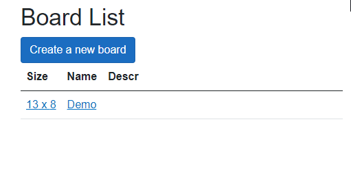

## [2023. LCD Screen driver for ESP Microcontroller](https://github.com/K-S-K/ESP32-02-OLed-SSD1366)

## [2021. Trading Toy](./28_TradeToy/Article.md)

It is a weekend home project dedicated to experimenting, researching, and having fun, focusing on trading automation with the Binance exchange.

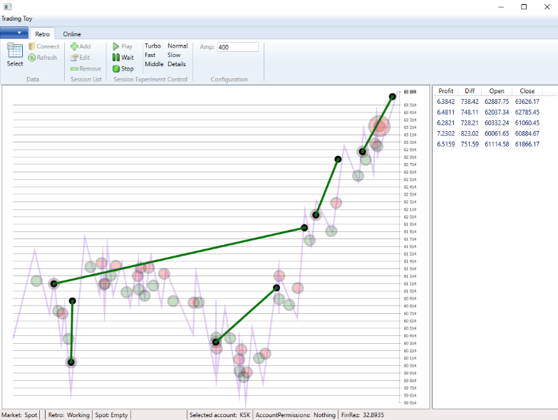

## [2021. Binance Copy Trading](./27_CopyTrading/Article.md)

The copy trading project for the Binance Cryptocurrency exchange.

## [2017-2022. Automated Trading System](./04_TDATrading/Article.md)

It was a long R&D project dedicated to trading automation. We experimented with different trading algorithms for years, achieving some success, great excitement, and much experience.

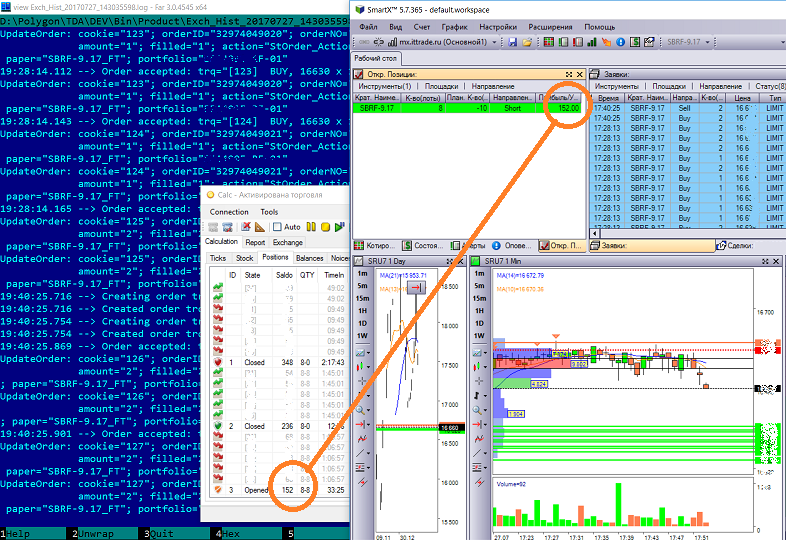

## [2012-2017. Reliability Analysis System](./05_EWReliability/Article.md)

It is a distributed system that collects software application diagnostics data, calculates its availability factor, draws diagrams, and monitors software health status. It was also used as a tool for investigating the evolution of accident history.

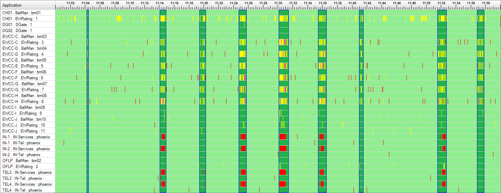

## [2010-2011. Pubmed article editor](./06_PubMedDesktop/Article.md)

It is a small desktop application that I created for my customer. This tool allows to create XML files for submitting articles to the PubMed server.

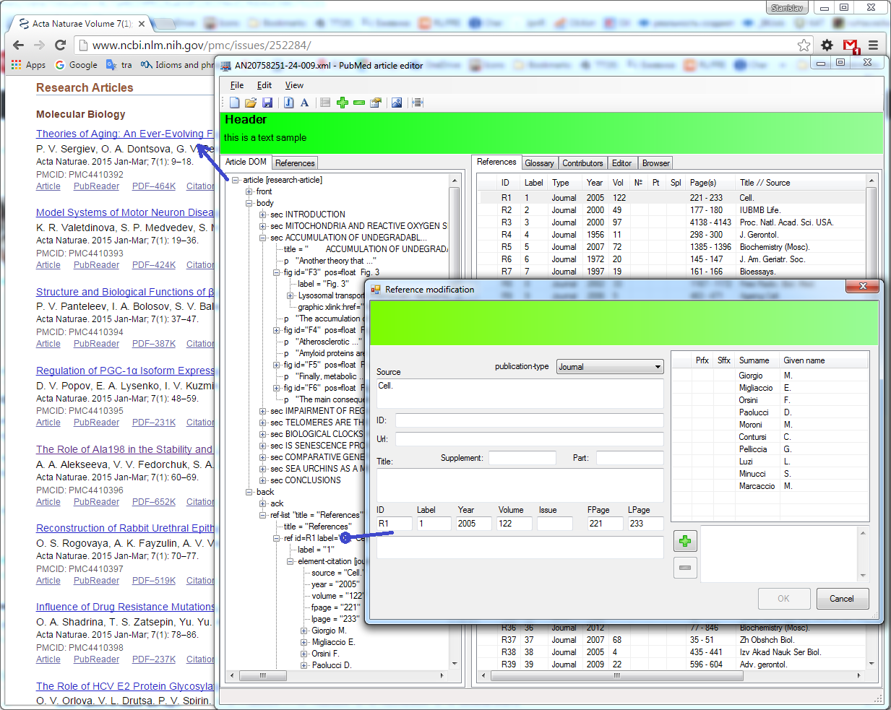

## [2009-2010. SMS Station](./02_SMSS/Article.md)

It is a desktop application dedicated to sending and broadcasting SMS messages via an SMS user terminal connected to the computer. It may be my Best UI project.

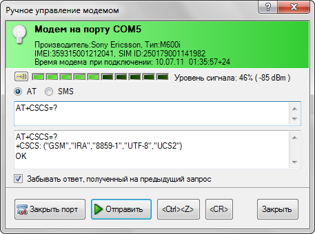

## [2001-2007. Electric power billing project](./03_ESphere/Article.md)

It is part of a large software and hardware project dedicated to collecting data from power meters, storing billing data regarding power grid topology, calculating aggregate parameters, and creating billing reports.

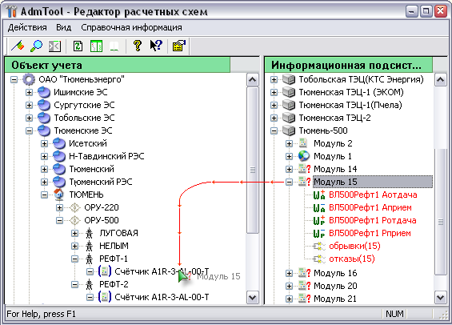

## [1999. Railway Black Box Data Viewer](./01_Railway_BB/Article.md)

Initially, it was an interesting project for analyzing railway black box data files. After the project ended, I rewrote it from BCB to MSVC to learn a better development environment and, for fun, as I found this project beautiful.

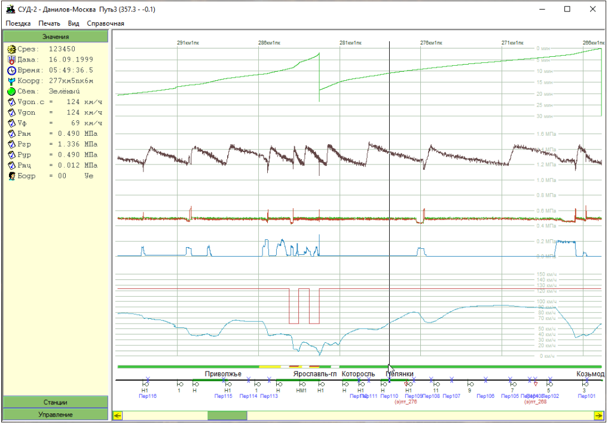
