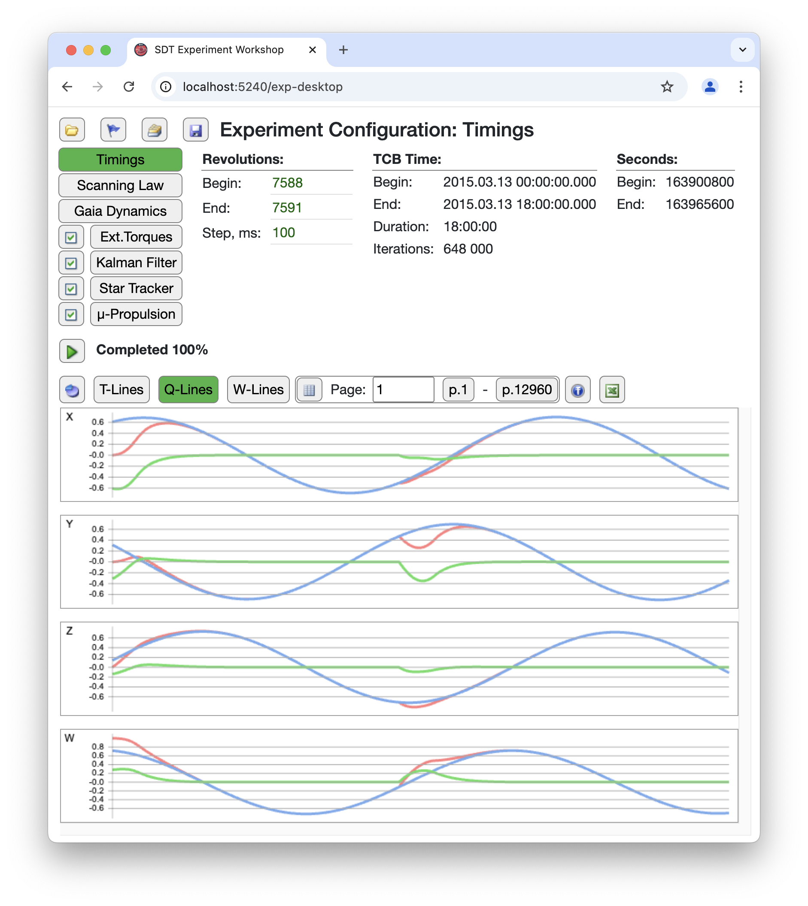
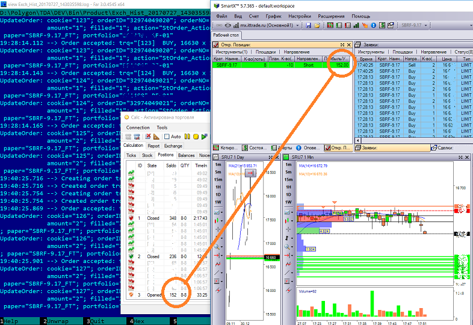
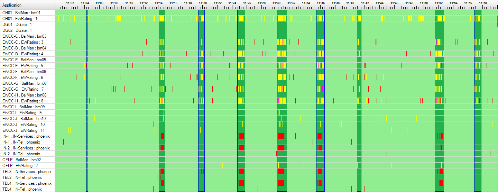
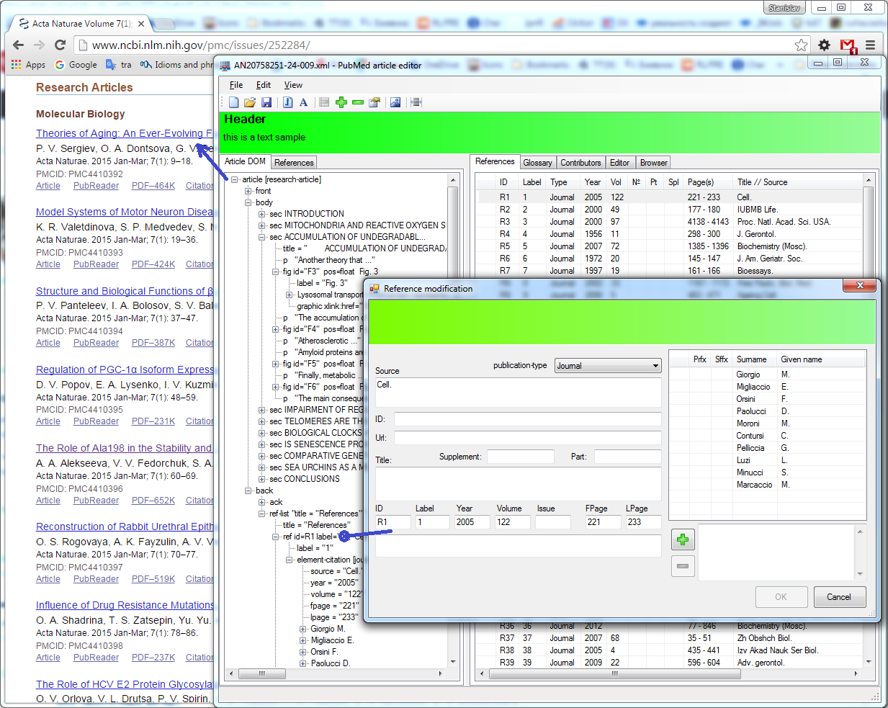
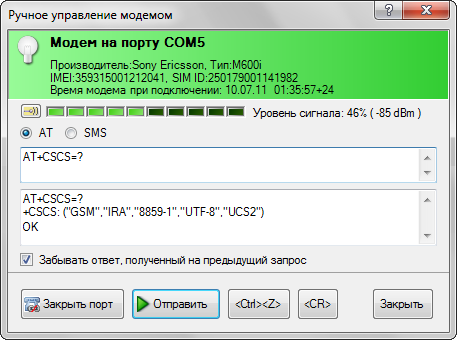
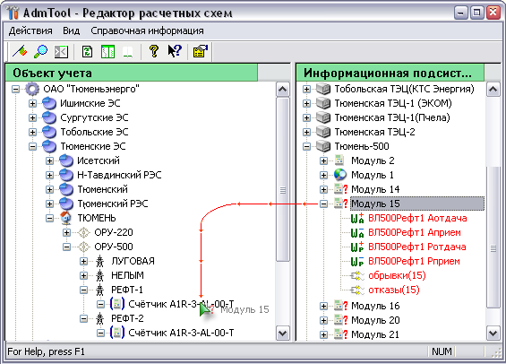
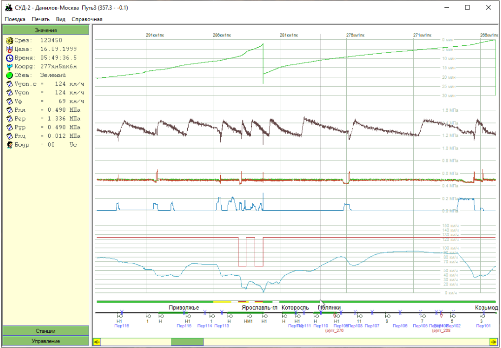

# Employment-Based Projects

These are some of the projects that I worked on during my employment in different places.

## [2024-2026 The Software Digital Twin of Gaia telescope Attitude and Orbit Control System](./36_GaiaSDT/Article.md)

During my work at the Astronomishes Rechen Institut of the Heidelberg University, I develop a physics-based Software Digital Twin of Gaia telescope Attitude and Orbit Control System. It is a tool for testing and tuning spacecraft attitude control algorithms, originally prototyped in Python and Java by my colleagues.

## [2021. Binance Copy Trading](./27_CopyTrading/Article.md)

The copy trading project for the Binance Cryptocurrency exchange.

## [2017-2022. Automated Trading System](./04_TDATrading/Article.md)

It was a long R&D project dedicated to trading automation. We experimented with different trading algorithms for years, achieving some success, great excitement, and much experience.

## [2012-2017. Reliability Analysis System](./05_EWReliability/Article.md)

It is a distributed system that collects software application diagnostics data, calculates its availability factor, draws diagrams, and monitors software health status. It was also used as a tool for investigating the evolution of accident history.

## [2010-2011. Pubmed article editor](./06_PubMedDesktop/Article.md)

It is a small desktop application that I created for my customer. This tool allows to create XML files for submitting articles to the PubMed server.

## [2009-2010. SMS Station](./02_SMSS/Article.md)

It is a desktop application dedicated to sending and broadcasting SMS messages via an SMS user terminal connected to the computer. It may be my Best UI project.

## [2001-2007. Electric power billing project](./03_ESphere/Article.md)

It is part of a large software and hardware project dedicated to collecting data from power meters, storing billing data regarding power grid topology, calculating aggregate parameters, and creating billing reports.

## [1999. Railway Black Box Data Viewer](./01_Railway_BB/Article.md)

Initially, it was an interesting project for analyzing railway black box data files. After the project ended, I rewrote it from BCB to MSVC to learn a better development environment and, for fun, as I found this project beautiful.

