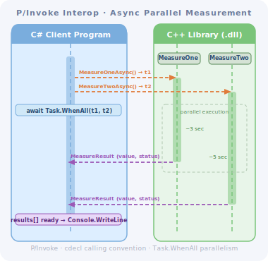
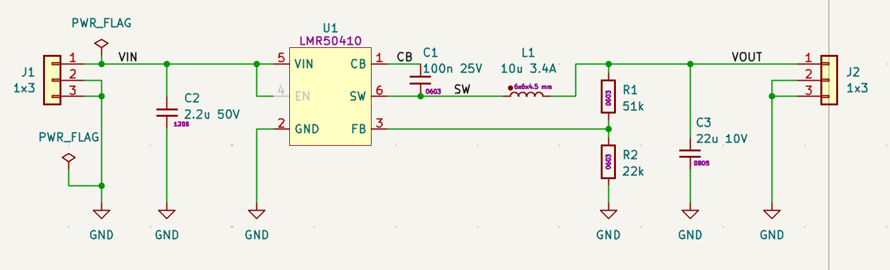
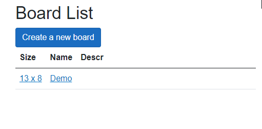
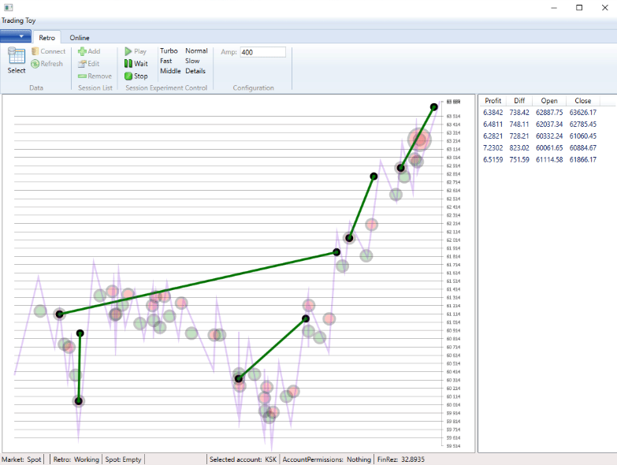

# Experimental Projects

These are some of the projects I've created out of curiosity or for experimental and educational purposes.

## [2026. Interop Communication Example](https://github.com/K-S-K/Interop)

Sometimes, when I work on hardware-related projects, I see that some tasks are better implemented in C++ than in C#. The reasons are performance-, compatibility-, and culturally related. On the other hand, some functionality, such as web services or database communication, is more efficiently implemented in C#. And I got curious: how easy or difficult is it to integrate the benefits of both technologies into a single solution? And, is it possible to debug the control flow transparently through the border between them, as if it were one homogeneous piece of code?

This project is the result of a series of experiments in this direction. Also, it can serve as a boilerplate for developing a native C++ DLL and a C# client EXE in a single Visual Studio solution.

## [2025. The FreeRTOS-based timer working on RP2350](https://github.com/K-S-K/Pico-Timer-2)

Through this project, I gained experience with FreeRTOS and embedded development, and some embedded development aspects, including:

- FreeRTOS Queues as a signaling carrier inside the system;
- State machine as a configurable abstract menu controller;
- Rotary Encoder as the only input of a User Interface;
- Screen abstraction layer, which potentially allows the use of different types of displays;
- I2C communication with Display and Real Time Clock Module;
- Raspberry PI Pico FreeRTOS toolchain setup.

## [2025 Simple 3V3 LMR50410 DC-DC Converter](https://github.com/K-S-K/PWR-LMR50410-Simple)

Just a first CAD-based PCB design experience as a part of passing the Fedevel course.

## [2024-2025. The Experiment with .NET and Raspberry PI](https://github.com/K-S-K/RPIDBClock)

Through this project, I touched the I2C devices from the .NET code, and found it easy and convenient. .NET provides all necessary tools in the "System.Device.Gpio" NuGet library to build any communication API at GPIO level, and also to work with "I2cDevice" and just exchange data with devices with byte resolution. Also, I've made a desk clock that shows the current date and time, as well as the two closest trains on my commute route. The development process was funny and attractive.

## [2024. Data exchange between Docker containerized applications](https://github.com/K-S-K/CCCS)

These days, I started relearning C++ and learning Linux to prepare for my new job at the Astronomisches Rechen-Institut, a branch of Heidelberg University. That's how this project was created.

The purpose of this project is to adjust the approach to creating multiple projects in separate Docker containers and to allow them to communicate via sockets. The project can be used as a template for creating more complex projects.

- IDE: VSCode.
- Programming language: C++.
- Development environment: Linux (Ubuntu).
- Deployment environment: Linux (Ubuntu) on Raspberry PI.

## [2023-2024. Prototype Board CAD](./30_BBCAD/Article.md)

The prototyping board project development software is a simple editor for planning prototype board wiring, with effective file storage in a version-management-friendly format. The project is written in C# for use in a web environment. It is written in C# for .NET 7. It works on both Windows and Linux. It contains a pipeline for deploying to an AWS virtual machine.

## [2023. LCD Screen driver for ESP Microcontroller](https://github.com/K-S-K/ESP32-02-OLed-SSD1366)

## [2021. Trading Toy](./28_TradeToy/Article.md)

It is a weekend home project dedicated to experimenting, researching, and having fun, focusing on trading automation with the Binance exchange.

