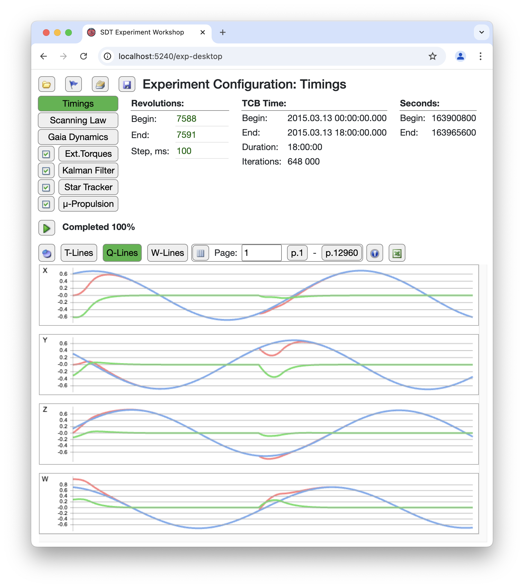

# About me

## Introduction

I am a .NET software developer with 25 years of software development experience who still likes software development.
Throughout my life, I have worked on numerous projects across various areas. Some of them were interesting. Some of them were exciting.

**What I can and want to propose:**

- C# (14);
- .NET Core (10);
- Dotnet development for Linux;
- T-SQL (Not hands-on, but have a lot in my past);
- FreeRTOS (the subject I am currently learn at tiny hardware projects).

**What I've experienced in (currently):**

- .NET development for Linux-based platforms, including:
- - Scientific applications with a lot of calculations;
- - Monolith and distributed architecture with HTTP communications;
- - Applications that can work on the developer machine, also in the local Docker network, and also on a distributed hardware architecture;
- - Applications for lightweight hardware platforms to communicate with equipment (Raspberry PI, I2C devices communications)
- FreeRTOS development for Raspberry Pi Pico platforms:
- - Development of the hardware level abstractions (I2C-connected DIsplay, Rotary Encoder);
- - Development of UI abstractions (Main screen, Menus, Configuration screen pages);

**What I've experienced in (memorable past):**

- Windows Desktop Development, including:
- - WinForms - a lot of;
- - WPF - some as MVC and direct;
- - MFC - many years ago, not actual, but it was interesting;
- Database development (MS SQL), including:
- - DB Architecture development;
- - DDL, DML including SP, UDF, Triggers, etc.;
- - ORMless communications between application and DB due to performance and more exact dealing with DBMS;
- Network, Web, and Distributed software development, including distributed on MS cluster monitoring system;
- .NET Web Applications - several projects.

**What do I want to practice in:**

- Microservice architecture;
- Cloud-distributed auto-scaling architecture;
- Azure API automation;
- AWS deployment infrastructure;
- AWS IoT infrastructure with ESP32;
- Microcontroller programming in C and C++ (currently experimenting with Raspberry PI and Pico; previously experimented with PIC and ESP32).

**What do I want to deal with:**

- Ideally - real-life applications regarding natural things - science, nature, industry, etc.

**The domains that I've experienced in:**

- Creating the software for modeling the spacecraft attitude control;
- Creating the electric energy billing software (electricity is my professional domain);
- Creating the software for monitoring the quality of other software working (for the cell operator billing software);
- Creating the exchange automatic trading software (several years of participation in this kind of project);
- Creating the crypto-exchange software (initially, it was an exciting challenge, but it was also an interesting project);
- Participation in the railway black box analysis project (a long time ago, my first real project, it was very exciting).

**The content of my bookshelf:**

- Jörg Rippel. FPGAs. Einsteig, Schaltungen,  Projekte;
- Andrew Lock. ASP.NET Core in Action, Third Edition;
- Ronald Mak. Object-Oriented Software Design in C++;
- Naomi Ceder. The Quick Python Book.

**What did I study recently:**

- FreeRTOS in my home projects;
- Some amazing Astronomy things as a domain of my current job;
- Linux C++ development - sometimes at home;
- Embedded C++ development - sometimes at home;
- FPGA - just for curiosity now, by reading a book in German with Google Translate.

**What did I study in the software development area:**

- MongoDB on my little projects;
- FreeRTOS on home weekend projects;
- Amazon AWS on home weekend projects;
- MS Azure on Microsoft and the LinkedIn platforms;
- T-SQL in my professional practice in different projects;
- Software development in C# for many years in practical projects;
- Software development in C++ for Windows during my job on several big projects;
- Programming in Assembler, C, and C++ during my education at the university.

**What are my out-of-job interests:**

- Family;
- Photography;
- Traveling around;
- Microcontrollers for home and industrial automation.

## Project gallery

### [2025. The FreeRTOS-based timer working on RP2350](https://github.com/K-S-K/Pico-Timer-2)

Through this project, I gained experience with FreeRTOS and embedded development. I've also had a lot of fun working on this project because I genuinely enjoy it.

### [2024-... The modeling of the Gaia telescope Attitude and Orbit Control System](Articles/36_GaiaSDT/Article.md)

During my current job, I develop a physics-based software digital twin of Gaia telescope Attitude and Orbit Control System for testing and tuning spacecraft attitude control algorithms, originally prototyped in Python and Java by my colleagues.

### [2024. Data exchange between Docker containerized applications](https://github.com/K-S-K/CCCS)

These days, I started to relearn C++ and to learn Linux for the sake of preparation for my new job in Astronomisches Rechen-Institut, the branch of Heidelberg University. That's how this project was created.

The purpose of this project is to adjust the approach of creating several projects in different Docker containers and let them communicate with each other via sockets. The project can be used as a template for creating more complex projects.

- IDE: VSCode.
- Programming language: C++.
- Development environment: Linux (Ubuntu).
- Deployment environment: Linux (Ubuntu) on Raspberry PI.

### [2023-2024. Prototype Board CAD](Articles/30_BBCAD/Article.md)

The prototyping board project development software is a simple editor for prototype board wiring planning with effective storage of files in a version-management-friendly format. The project is written in C# for use in a web environment. It is written in C# for .NET 7. It works on both Windows and Linux. It contains a pipeline for the deployment to the AWS virtual machine. 

#### [2023. LCD Screen driver for ESP Microcontroller](https://github.com/K-S-K/ESP32-02-OLed-SSD1366)

It was my [first steps](https://github.com/K-S-K/ESP32-02-OLed-SSD1366/blob/master/docs/Ch01_LostBits.md) in this direction.

### [2021. Trading Toy](Articles/28_TradeToy/Article.md)

It is a weekend home project dedicated to experimenting, researching, and having fun, focusing on trading automation with the Binance exchange.

### [2021. Binance Copy Trading](Articles/27_CopyTrading/Article.md)

The copy trading project for the Binance Cryptocurrency exchange.

### [2021-2023. Pubmed article editor](Articles/06_PubMedDesktop/Article.md)

It is a small desktop application that I use to create XML files for submitting articles to the PubMed server.

### [2012-2017. Reliability Analysis System](Articles/05_EWReliability/Article.md)

It is a distributed system that collects software application diagnostics data, calculates its availability factor, draws diagrams, and monitors software health status. It was also applied as a tool for investigating accident evolution history.

### [2011-2019. Automated Trading System](Articles/04_TDATrading/Article.md)

It was a long R&D project dedicated to trading automation. We experimented with different trading algorithms for eight years, achieving some success, great excitement, and much experience.

### [2009-2010. SMS Station](Articles/02_SMSS/Article.md)

It is a desktop application dedicated to sending and broadcasting SMS messages via an SMS user terminal connected to the computer. It may be my Best UI project.

### [2001-2007. Electric power billing project](Articles/03_ESphere/Article.md)

It is part of a large software and hardware project dedicated to collecting data from the power meters, storing billing data regarding power grid topology, calculating aggregate parameters, and creating billing reports.

### [1999. Railway Black Box Data Viewer](Articles/01_Railway_BB/Article.md)

Initially, it was an interesting project for the railway black box data file analysis. After the project ended, I rewrote it from BCB to MSVC to learn a better development environment and, for fun, as I found this project beautiful.

## Documents

[General CV, pdf](Documents/cv-2026-en.pdf)

[Extended CV, pdf](Documents/cv-2026-en-ext.pdf)
