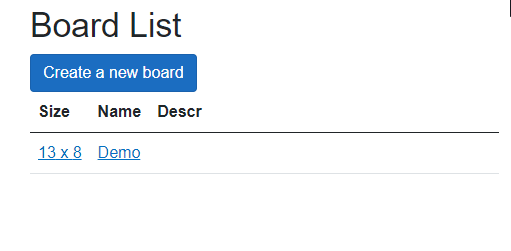

# Introduction
I am a .Net software developer with 25 years of software development experience who still likes software development.
During my professional life, I worked on several projects in several areas. Some of them were interesting. Some of them were exciting.
Sometimes, projects get completed. Sometimes, projects evolve to their complete state, and a software developer cannot develop himself inside it, and the time comes to move on. 

What I can and want to propose:
- C#, 
- .Net, 
- Net Core / .Net 5+(.Net 7), 
- T-SQL.

What I've experienced in the rememberable past:
- Windows Desktop Development, including:
- WinForms - a lot of;
- WPF - some as MVC and direct;
- MFC - many years ago, not actual, but it was interesting;
- Network, Web, and Distributed software development, including distributed on MS cluster monitoring system;
- .Net Web Applications - several projects in the past, currently experimenting to learn.

What do I want to practice in:
- Microservice architecture;
- Cloud-distributed auto-scaling architecture;
- Azure API automation;
- AWS deployment infrastructure;
- AWS IoT infrastructure with ESP32;
- Microcontroller programming in C and C++ (currently experimenting with ESP32, want to touch PIC).

What do I want to touch:
- Ideally - real-life applications regarding natural things - nature, industry, etc.

What am I experienced in:
- Creating the electric energy billing software (electricity is my professional domain);
- Creating the software for monitoring the quality of other software working;
- Creating the exchange automatic trading software (several years of participation in this kind of project);
- Creating the crypto-exchange software (initially, it was an exciting challenge, but also it was an interesting project)
- Participation in the railway black box analysis project (a long time ago but very exciting)

The content of my bookshelf:
- Andrew Lock. ASP.NET Core in Action, Third Edition;
- Michael and Ruth Haephrati. Learning C++;
- Ronald Mak. Object-Oriented Software Design in C++;
- Naomi Ceder. The Quick Python Book.

What did I study recently:
- Linux C++ development;
- MongoDB on my little projects;
- FreeRTOS on home weekend projects;
- Amazon AWS on home weekend projects;
- MS Azure on Microsoft and the Linked In platforms.

What are my out-of-job interests:
- Family;
- Photography;
- Traveling around;
- Microcontrollers, home automation.

# Project gallery

## [2024. Data exchange between docker containerized applications](https://github.com/K-S-K/CCCS)
The purpose of this project is to adjust the approach of creating several projects in different docker containers and let them communicate with each other via sockets. The project can be used as a template for creating more complex projects. Programming language: C++. Development environment: Ubuntu. Deployment environment: Ubuntu. IDE: VSCode.

## [2023-2024. Prototype Board CAD](Articles/30_BBCAD/Article.md)
The prototyping board project development software is a simple editor for prototype board wiring planning with effective storage files in a version-management-friendly format. The project is written in C# for use in a web environment. It is written in C# for .Net 7. It can work on Windows and Linux. It contains a pipeline for the deployment to the AWS virtual machine. 

## [2021. Trading Toy](Articles/28_TradeToy/Article.md)
It is a weekend home project for experiments, research, and fun, dedicated to trading automation with the Binance exchange.

## [2021. Binance Copy Trading](Articles/27_CopyTrading/Article.md)
The copy trading project for the Binance Cryptocurrency exchange.

## [2021-2023. Pubmed article editor](Articles/06_PubMedDesktop/Article.md)
It is a small desktop application that I use to create XML files for submitting articles to the Pubmed server

## [2012-2017. Reliability Analysis System](Articles/05_EWReliability/Article.md)
It is a distributed system that collects software application diagnostics data and calculates its availability factor, draws diagrams, helps to monitor software health status, and helps to investigate accident evolve history.

## [2011-2019. Automated Trading System](Articles/04_TDATrading/Article.md)
It was a big RnD project dedicated to trading automation. We experimented with different trading algorithms for eight years and had some success, great excitement, and much experience.

## [2009-2010. SMS Station](Articles/02_SMSS/Article.md)
It is a desktop application dedicated to sending and broadcasting SMS messages via SMS user terminal connected to the computer. It may be my Best UI project.

## [2001-2007. Electric power billing project](Articles/03_ESphere/Article.md)
It is part of the big software and hardware project dedicated to collecting data from the power meters, storing billing data regarding power grid topology, calculating aggregate parameters, and creating billing reports.

## [1999. Railway Black Box Data Viewer](Articles/01_Railway_BB/Article.md)
Initially, it was an interesting project for the railway black box data file analysis. But after the project ended, I rewrote it from BCB to MSVC to learn a better development environment and also for fun because it was a beautiful project.

# Documents:
[General CV, pdf](Documents/cv-2023-en.pdf): 
[Fintech oriented CV, pdf](Documents/cv-2023-en-ft.pdf): 
[Electric Power oriented CV, pdf](Documents/cv-2023-en-pw.pdf): 
[Embedded and IoT targeted CV, pdf](Documents/cv-2023-en-mcu.pdf): 
